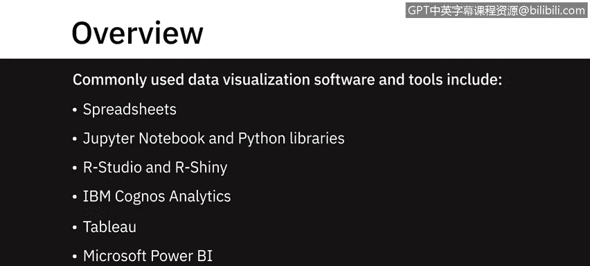
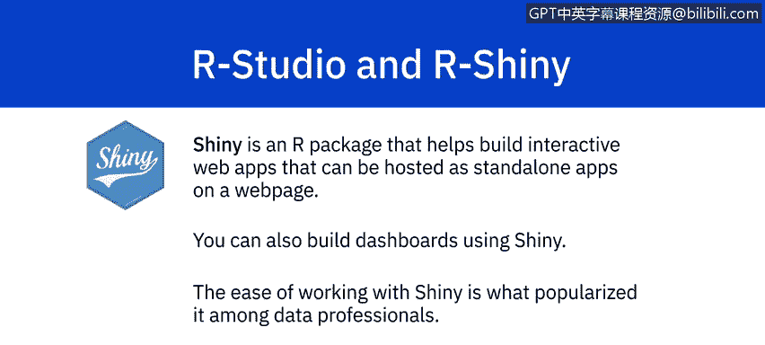
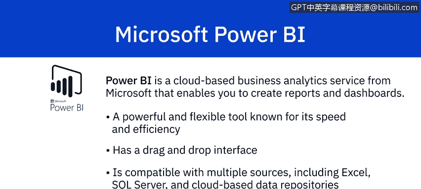

# 034：可视化和仪表板软件介绍 📊

在本节课中，我们将学习一些最常用的数据可视化软件和工具。这些工具包括电子表格、Jupyter Notebook、Python库、RStudio、IBM Cognos Analytics、Tableau和Microsoft Power BI。其中一些是端到端的数据分析解决方案，另一些则专门用于数据可视化，涵盖了从免费开源工具到商业解决方案的广泛选择。

## 电子表格软件 📈

上一节我们介绍了课程概述，本节中我们来看看最基础的可视化工具——电子表格。Microsoft Excel和Google Sheets可能是最常用于制作数据集图形表示的软件。它们易于学习，并且有大量在线文档和视频教程可供参考。

以下是Excel提供的主要图表类型：
*   **基础图表**：条形图、折线图、饼图、数据透视表。
*   **高级图表**：散点图、趋势线、甘特图、瀑布图。
*   **组合图表**：可以将多种图表类型组合在一起。

Excel还会根据你的数据集推荐最佳的可视化表示方式。为了使图表更具表现力，你可以添加图表标题、更改元素颜色以及为数据添加标签。Google Sheets也提供类似的图表类型，尽管Excel拥有更多基于公式的内置选项。与Excel一样，Google Sheets可以帮助你选择正确的可视化方式，只需高亮显示要可视化的数据并点击图表按钮，即可获得最适合你数据的建议图表列表。

当底层数据发生变化时，Excel和Google Sheets中的图表和报告都会自动更新。在需要多用户协作的场景下，Google Sheets通常比Excel更受青睐。

## Jupyter Notebook与Python库 🐍

上一节我们介绍了电子表格工具，本节中我们来看看基于代码的可视化工具。Jupyter Notebook是一个开源的Web应用程序，为探索数据和创建可视化提供了绝佳的方式。使用Jupyter Notebook并不需要你是Python专家。

Python提供了大量用于数据可视化的库。以下是几个主要的库：

*   **Matplotlib**：这是一个广泛使用的Python数据可视化库。它提供不同类型的2D和3D绘图，并具有以多种方式创建绘图的灵活性。使用Matplotlib，只需几行代码即可创建高质量的交互式图形和图表。作为一个开源工具，它拥有庞大的社区支持和跨平台兼容性。
*   **Bokeh**：该库以提供交互式图表和绘图而闻名，尤其擅长处理大型或流式数据集的高性能交互。Bokeh在应用交互、布局和不同样式选项以实现可视化方面提供了灵活性。它还可以转换使用其他Python库（如Matplotlib、Seaborn和ggplot）编写的可视化。
*   **Dash**：这是一个用于创建基于Web的交互式可视化的Python框架。使用Dash，你可以用Python代码构建高度交互的Web应用程序。虽然了解HTML和JavaScript会有所帮助，但并非必需。Dash易于维护，支持跨平台且适配移动端。

## RStudio与Shiny 📊

上一节我们探讨了Python生态中的可视化工具，本节我们将目光转向R语言。使用RStudio，你可以创建从基础到高级的各种可视化。

以下是RStudio支持的可视化类型：
*   **基础可视化**：直方图、条形图、折线图、箱线图、散点图。
*   **高级可视化**：热力图、马赛克图、3D图形、相关图。

Shiny是一个R包，可帮助构建交互式Web应用程序，你可以将其作为独立应用程序托管在网页上。这些Web应用可以无缝显示R对象（如绘图和表格），并且可以设置为实时访问，允许任何人查看。你也可以使用Shiny构建仪表板。其易用性使其在数据专业人士中广受欢迎。

## 端到端分析解决方案 🏢

上一节我们介绍了R语言的可视化工具，本节我们来看看功能更全面的商业分析平台。IBM Cognos Analytics是一个端到端的分析解决方案。

以下是Cognos提供的一些可视化功能：
*   **导入自定义可视化**。
*   **预测功能**：提供时间序列数据建模，并基于相应可视化中呈现的数据进行预测。
*   **根据数据推荐可视化方案**。
*   **条件格式设置**：允许你查看数据分布并突出显示异常数据点，例如，突出显示超过特定阈值的高销售额和低销售额。

Cognos以其卓越的可视化效果以及利用地理空间能力将数据叠加到物理世界而闻名。

## Tableau与Microsoft Power BI 🚀

上一节我们介绍了IBM Cognos，本节我们来看看另外两个流行的商业智能工具。Tableau是一家生产交互式数据可视化产品的软件公司。

使用Tableau产品，你可以通过拖拽手势，以仪表板和工作表的形式创建交互式图形和图表。Tableau还提供以“故事”形式发布结果的选项。你可以在Tableau中导入R和Python脚本，并利用其远优于其他语言的可视化功能。Tableau的可视化功能易于使用且直观。它兼容Excel文件、文本文件、关系数据库以及Google Analytics和Amazon Redshift等云数据库源。

Power BI是微软提供的一项基于云的业务分析服务，使你能够创建报告和仪表板。它是一个强大而灵活的工具，以其速度、效率以及易于使用的拖放界面而闻名。Power BI兼容多种数据源，包括Excel、SQL Server和基于云的数据存储库，这使其成为数据专业人士的绝佳选择。

Power BI提供了安全地协作和共享定制仪表板及交互式报告的能力，甚至在移动设备上也可以。Power BI的仪表板由单个页面上的多个可视化元素组成，帮助你讲述数据故事。这些被称为“磁贴”的可视化元素被固定到仪表板上。仪表板是交互式的，这意味着一个磁贴的变化会影响其他磁贴。

## 工具选择考量 🤔

上一节我们介绍了多种强大的可视化工具，本节我们来总结如何选择。在决定使用哪种工具时，你需要考虑易用性以及可视化的目的，同时权衡可用工具及其提供的可视化能力。记住一个原则：只要你能想象出来，你就能创建出来。

## 总结 📝

本节课我们一起学习了多种主流的数据可视化和仪表板软件。我们从基础的电子表格（Excel, Google Sheets）开始，了解了基于代码的工具（Jupyter Notebook, Python的Matplotlib/Bokeh/Dash库，R的RStudio/Shiny），最后探讨了功能强大的商业端到端解决方案（IBM Cognos Analytics, Tableau, Microsoft Power BI）。每种工具都有其特点和适用场景，选择时应根据具体需求、数据复杂度、团队技能和协作要求来决定。掌握这些工具将为你有效传达数据洞察奠定坚实基础。