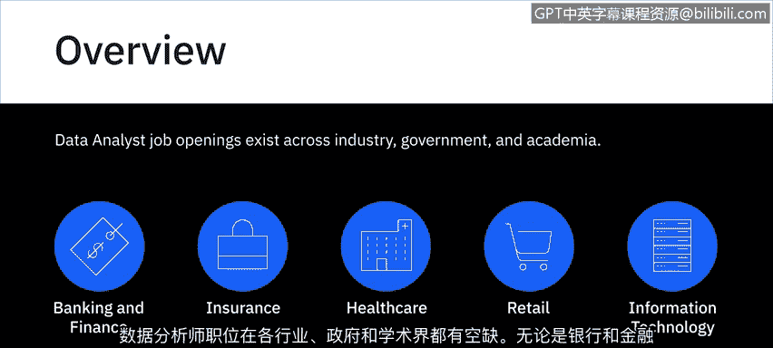
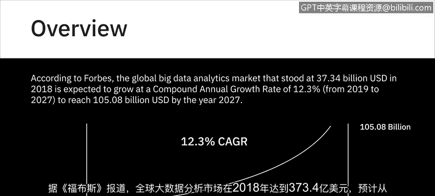
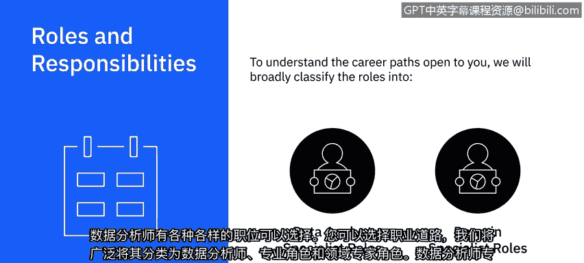
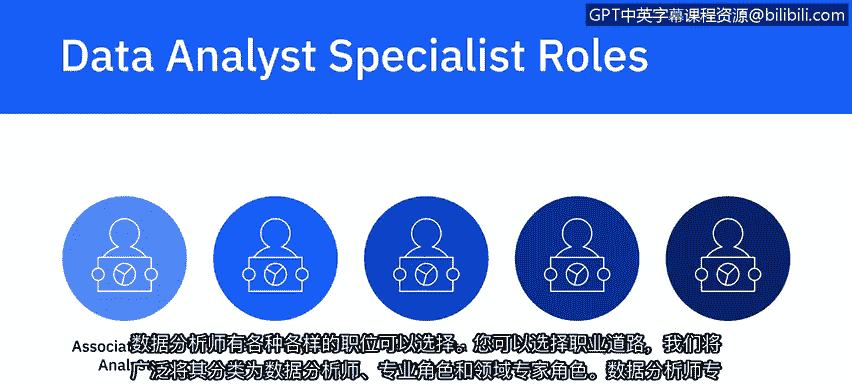
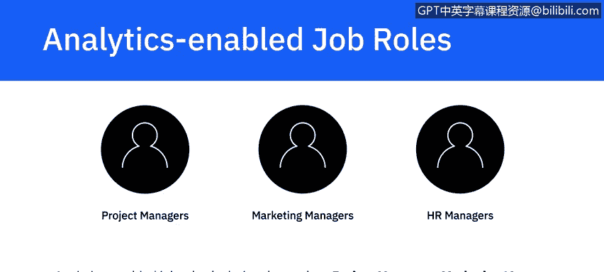
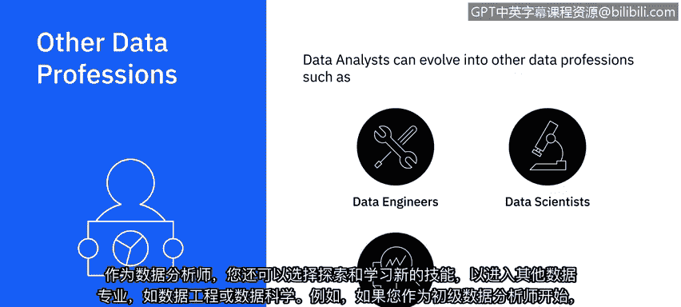
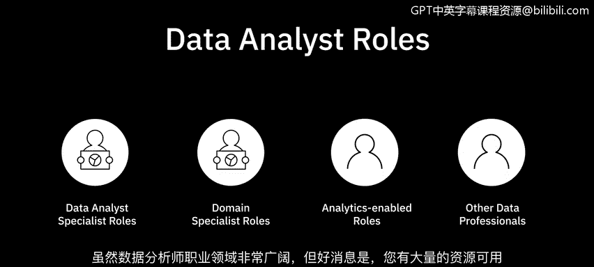

# 036：数据分析的职业机会

在本节课中，我们将探讨数据分析师广阔的就业前景、职业发展路径以及如何规划你的职业生涯。我们将了解不同行业的需求、职业角色的分类以及如何通过技能提升实现职业成长。

---

数据分析师的职位空缺遍布各行各业，包括工业界、政府和学术界。无论是银行金融、保险、医疗保健、零售还是信息技术行业，都需要熟练的数据分析师。这些角色在大型企业和初创公司中同样受到追捧。

根据《福布斯》的数据，全球大数据分析市场在2018年达到373.4亿美元，预计在2019年至2027年间将以12.3%的复合年增长率增长，到2027年将达到1050.8亿美元。目前，市场对熟练数据分析师的需求远大于供给，这意味着公司愿意支付更高的薪酬来聘请技能娴熟的数据分析师。

为了帮助你理解向你开放的职业道路，我们将广泛地将数据分析相关角色分为两大类：**数据分析专家角色**和**领域专家角色**。

---

## 🎯 数据分析专家角色

上一节我们了解了数据分析师的整体市场需求，本节中我们来看看专注于技术和职能发展的职业路径。

数据分析专家角色适合那些希望在其角色的技术和职能方面保持专注并不断成长的数据分析师。在这条路径上，你可以从助理或初级数据分析师开始职业生涯，然后逐步晋升为分析师、高级分析师、首席分析师和首席分析师。

这些角色之间的界限、晋升到下一级别所需的经验年限以及需要获得的经验性质，可能因行业、组织规模和团队规模而异。例如，在较小的团队中，你可能会在短时间内获得数据分析所有方面的经验，从收集数据一直到向利益相关者可视化和呈现你的发现。而在较大的团队和组织中，角色通常根据活动进行划分，这意味着在进入下一阶段之前，你可能会在流程的某个特定阶段积累经验。这有助于你在进入下一阶段之前，磨练流程中某一部分的技能。

在你的职业生涯中，从助理数据分析师晋升到首席或首席数据分析师，你将持续提升你的技术、统计和分析技能，从基础水平到专家水平。你将展示自己使用广泛工具和平台、处理数据分析流程不同方面以及应对各种用例的能力。

以下是技术技能发展的一个典型路径：

*   **初级阶段**：你可能只掌握一种查询工具和编程语言，一种类型的数据仓库或有限的几种可视化工具。
*   **随着经验积累**：你被期望学习并展示自己能够使用越来越多的工具、语言、数据仓库和新技术。

此外，你的沟通技巧、演示技巧、利益相关者管理技巧和项目管理技巧都需要逐步磨练和提升。作为首席或首席分析师，你可能还需要负责在团队中建立流程，为团队应使用的软件和工具提出建议，提升团队技能，并扩大团队以纳入更多角色。在一些组织中，这些职责可能由一位经理级别的人员承担，他通过晋升来管理一个数据分析师团队。

---

## 🧑‍⚕️ 领域专家角色

上一节我们探讨了技术专家的成长路径，本节中我们来看看另一种重要的职业方向。

领域专家，也称为职能分析师，是在特定领域（如人力资源、医疗保健、销售、财务、社交媒体或数字营销）获得专长并被视作该领域权威的分析师。他们可能不是技术最娴熟的人。这些角色的头衔包括人力资源分析师、营销分析师、销售分析师、医疗保健分析师或社交媒体分析师。

---

## 🔄 数据分析赋能型职位

除了专门的分析师角色，数据分析技能还能赋能许多其他职位。

然后是数据分析赋能型职位。这些包括项目经理、营销经理和人力资源经理等角色。在这些工作中，数据分析技能能带来更高的效率和效果。相当一部分数据分析师职位空缺属于数据分析赋能型，因为越来越多的组织依赖数据做决策。

---

## 🛤️ 职业发展与横向拓展

了解了主要的职业角色分类后，我们来看看数据分析师职业发展的多样性和可能性。

作为一名数据分析师，你也有机会探索和学习新技能，从而进入其他数据专业领域，如数据工程或数据科学。例如，如果你从初级数据分析师起步，并且非常喜欢使用数据湖和大数据仓库，你可以进一步获取这些技术的专业知识，将你的职业发展成大数据工程师。如果业务方面的事情更让你兴奋，你同样可以探索横向转入业务分析或商业智能分析所需的技能。

虽然数据分析师的职业前景非常广阔，但好消息是，你有大量资源可以帮助你成长。要在你的数据分析师之旅中取得成功，你只需要抓住你想要追求的机会或出现在你面前的机会，并在此过程中不断学习。

---

## 📝 课程总结

本节课中，我们一起学习了数据分析师职业机会的全貌。我们了解到数据分析师在各行各业都有旺盛需求，市场增长迅速。职业路径主要可分为专注于技术深度的**数据分析专家**和深耕特定业务的**领域专家**。此外，数据分析技能还能赋能许多传统管理岗位。最后，数据分析师的职业发展具有高度灵活性，可以纵向深入技术，也可以横向拓展至数据工程、数据科学或业务分析等领域。关键在于持续学习，抓住机遇，在实践中成长。