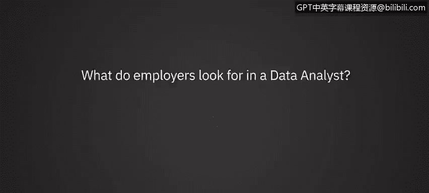
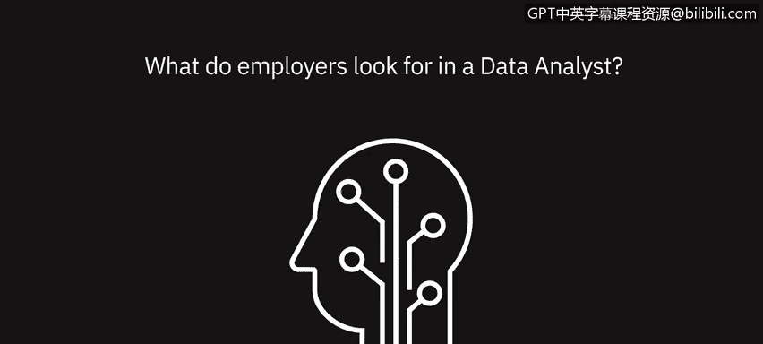

# 038：雇主在数据分析师中寻求什么 👔

在本节课中，我们将聆听数据专业人士的分享，了解雇主在招聘数据分析师时最看重哪些素质和技能。

---

上一节我们探讨了数据分析的基本流程，本节中我们来看看雇主对数据分析师的具体期望。多位行业专家分享了他们的观点。

**诚信**是雇主首要看重的品质。在招聘过程中，面试官可能会提出一个经典问题：“如果只能选一个，你是选择按时交付，还是选择得出正确答案？”理想的候选人会优先确保信息的准确性。因为错过截止日期，其危害远小于公司基于错误信息做出数百万美元的决策，或因报告不准确而导致他人失业。因此，**诚信远比单纯守时更重要**。

除了诚信，**清晰的沟通能力**是另一项关键技能。即使你完成了世界上最出色的分析，但如果无法向外部利益相关者清晰地传达你的发现，那么这项分析就毫无价值。因此，这项技能备受雇主青睐。

---

在专业技能方面，雇主对数据分析师有多项明确要求。

以下是雇主普遍寻求的核心能力：

*   **数字敏感性与分析能力**：对数字的敏感度、理解复杂分析的能力、理解A/B测试及其结果含义的能力。
*   **扎实的SQL技能**：强大的SQL技能正变得越来越重要。
*   **成长型思维与学习意愿**：由于行业变化极快，拥有成长型思维和持续学习的意愿至关重要。
*   **编程技能**：包括Python或R等编程语言能力。
*   **解决问题的能力**：如果向数据分析师提出一个问题，他们应该知道如何利用各种格式的数据来解决它，能够分析数据并呈现可解决问题的见解。

---

除了技术硬技能，个人特质和软技能同样关键。

作为雇主，在招聘时还会关注候选人的性格特质。我们寻找的人是注重细节的，并且是那种追求超越的人。他们不只想完成眼前的任务，更希望走得更远。

以下是雇主看重的关键个人特质：

*   **注重细节**：对工作精益求精。
*   **有抱负且能跳出框架思考**：不满足于简单执行指令（例如，如果要求做A、B、C，他们不仅会完成，还会进一步思考并提供备选方案）。
*   **具备解决问题和故障排除的能力**：当出现问题时，他们不会停滞不前或只会上报，而是能够主动思考，提出可能的解决方案，推动工作和公司继续前进。
*   **动态适应能力**：如果突然面对一个与以往截然不同的数据集，他们需要能够快速适应这种变化。因此，**动态性和适应性**非常重要。
*   **快速学习技术技能的能力**：例如，在一个环境中使用一种SQL范式，需要能快速切换到另一种范式；或者熟悉Python但需要快速掌握R Studio。

---

本节课中我们一起学习了雇主在招聘数据分析师时看重的多方面素质。总结来说，一名优秀的数据分析师不仅需要**诚信**的品格和**清晰沟通**的能力，还需具备**数字敏感性、扎实的SQL与编程技能**，以及**强大的问题解决能力**。在个人特质上，**注重细节、能跳出框架思考、具备成长型思维、能动态适应变化并快速学习**，这些综合能力共同构成了雇主所寻求的理想候选人画像。