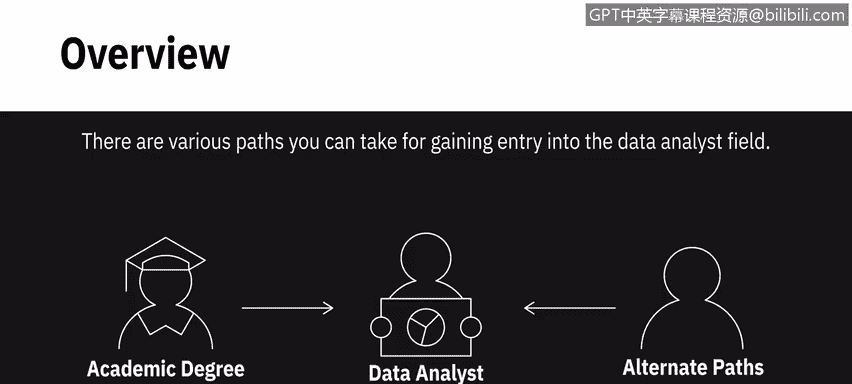
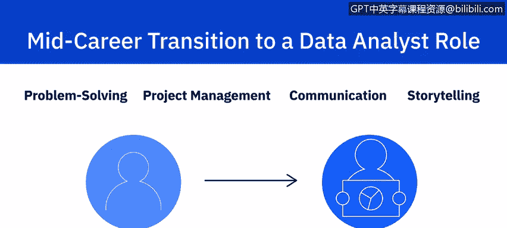
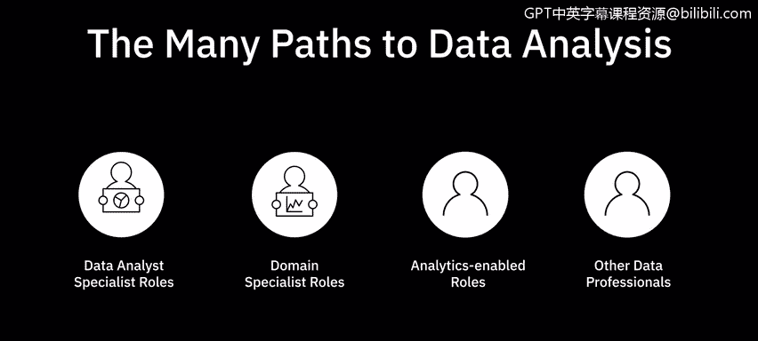

# 039：数据分析的多条路径 🛤️

在本节课中，我们将探讨进入数据分析领域的多种可能路径。无论你目前的教育背景或工作经验如何，都有机会开启数据分析师的职业生涯。

---

## 学术学位路径 🎓

最直接的路径之一是获得相关领域的学术学位。数据分析、统计学、计算机科学、管理信息系统或信息技术管理等专业的学位，能为你提供一个坚实的起点和优势。

**公式示例：** 学术学位路径 ≈ 相关专业学位 + 基础知识体系

---

## 在线培训与专业课程路径 💻

如果你没有相关学术学位，可以选择在线培训项目来获取所需的知识和技能。许多学习平台提供了全面的数据分析多课程专项项目。

以下是主要的在线学习平台：
*   **Coursera**
*   **edX**
*   **Udacity**

这些课程由全球顶尖的领域专家设计和讲授。它们通常包含实践性的作业和项目，让你能体验知识和技能在真实世界中的应用，这些项目甚至可以成为你作品集的一部分。

---

## 跨行业转型路径 🔄

上一节我们介绍了通过系统学习入行的路径，本节中我们来看看如何从其他行业转型进入数据分析领域。如果你已在其他领域工作数年并希望转行，只要规划得当，成功转型的可能性很高。

由于数据分析领域广阔，建议你先进行调研，明确所需的知识技能、可用的工作机会以及目标路径上的发展前景。你可以利用在线资源、论坛和人脉网络，与业内人士交流，获取对真实工作场景的洞察。

根据你当前的角色，可以考虑不同的切入点：

**如果你目前从事非技术类工作**，可以考虑向**领域专家**或**职能分析师**的方向发展。例如，如果你在销售部门，可以利用行业经验优势，将自己定位并培养为销售分析师，同时补充学习统计学和编程等技能。

**公式示例：** 转型路径 = 现有行业经验 + 目标岗位所需技术技能（如 `Python`, `SQL`）

**如果你目前从事技术类工作**，你通常能更快掌握数据分析角色所需的工具和软件。同时，你对所在领域或行业的深刻理解也是一大优势。对于问题解决、项目管理、沟通和叙事等软技能，你可能已在现有工作中有所应用，可以通过培训、在线课程和实践社区来进一步提升。

---

## 总结 📝

本节课中我们一起学习了进入数据分析领域的多条路径。数据分析是一个快速发展的领域。关键在于保持好奇心、乐于学习新事物并对该领域充满热情。无论你认为自己缺少何种正式资质，都能找到前进的道路。

**核心总结：**
*   路径一：获取相关**学术学位**。
*   路径二：完成**在线专业课程**与认证。
*   路径三：基于现有**行业或技术经验**进行**战略转型**。

无论选择哪条路，持续学习和积累实践经验都是成功的关键。