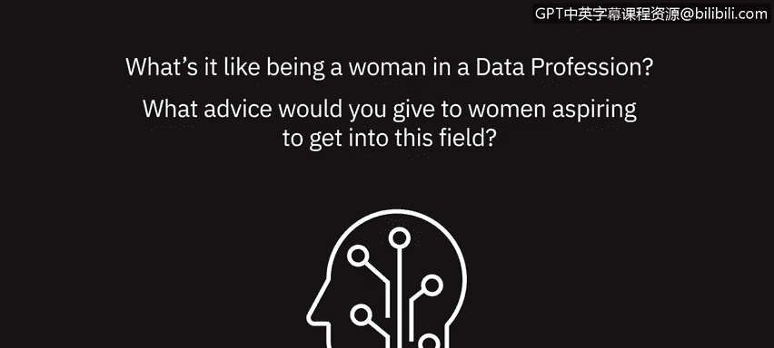

# 042：数据专业中的女性观点 👩💻

在本节课中，我们将聆听几位女性数据专业人士分享她们在该领域的亲身经历，以及她们对有志进入此领域的女性所提出的建议。

---

上一节我们探讨了数据分析的基本概念，本节中我们来看看几位行业先驱者的真实故事与见解。

作为一名数据科学领域的女性，我仍然会遇到“这是男性工作”的刻板印象。我曾走进会议室，看到人们流露出失望或困惑的表情。我将此视为一个证明他们错误的机会。这并非仅仅是男性的工作。它属于那些具备洞察力、能力和动力去完成任务的人。只要你拥有这些技能，那么无论你是谁，都没有理由不能做到你决心要做的事。无论你是男性还是女性，无论你的肤色如何，你都有机会通过你产出的工作来证明人们的错误。

我想说，这可能会很艰难，但你必须找到自己的声音，并且不要害怕使用它。很多时候，作为女性，我们无法找到自己的声音或不敢发声，或者我们害怕如果我们发声，人们会如何对待我们。但你要知道，更重要的是你被听到、被看见——不是靠大声喧哗或犯错，而是如果你有数据支持，有好的内容和想法想要表达，不要害怕举手，让人们知道你是一个思考者，并且你能完成工作。因为随着你的进步，这将变得非常重要。而真正取得进步的唯一途径就是驱动力，如果你太安静，人们就不知道你有这种驱动力。所以，如果你只是安静地在角落里工作，很多时候人们是看不到的。因此，要大声说出来，确保你的声音被听到，确保你被看作一个懂得如何在数据科学领域成长和做出贡献的女性。

当我开始时，尤其是在研究生院，我的班级里大部分是男性。但现在我看到，数据团队，包括数据科学和数据工程团队，也有很多女性。因此，我建议女性继续提升技能。这样，如果她们对编程、数据和解决问题的职业感兴趣，她们就应该继续构建自己的技术技能组合。以便她们能够在数据专业领域中尽可能有力地展现自己。

不要让你的性别成为借口。依然要全力以赴，投入工作，向世界展示你惊人的才华。没有任何角色是为特定性别预留的。如果你有幸从事一份你非常热爱的职业，那就勇敢地去追求它。

---

本节课中，我们一起学习了来自数据科学领域女性的宝贵经验与建议。核心观点在于：**成功的关键在于个人能力、驱动力与勇于发声，而非性别**。她们鼓励所有有志者持续学习技术技能（如 `编程` 与 `数据分析`），自信地展现自己，用扎实的工作成果来定义自己的职业道路。数据领域欢迎并需要多元化的声音与才华。