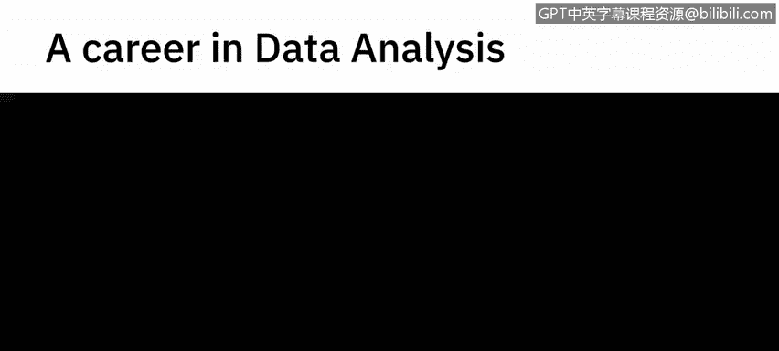
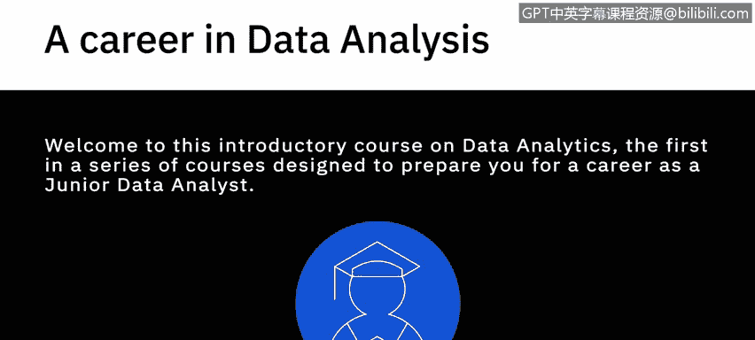
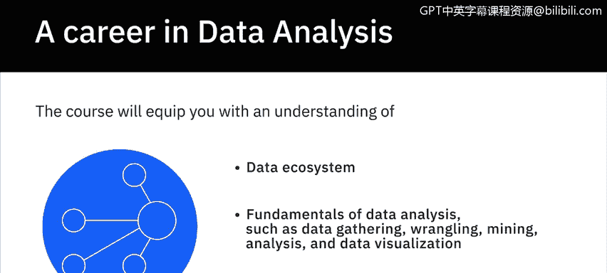
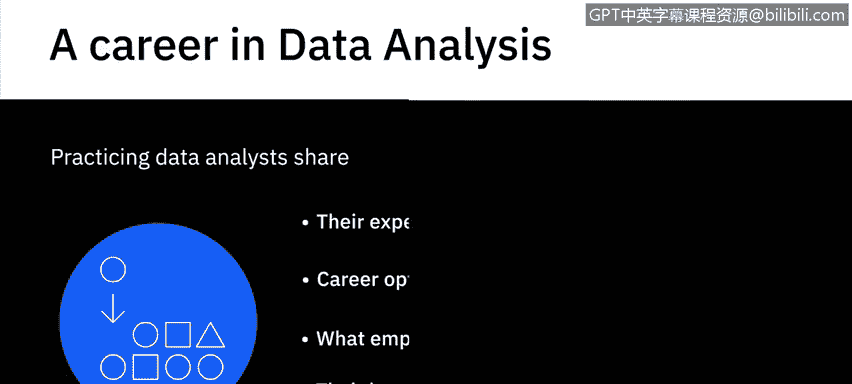
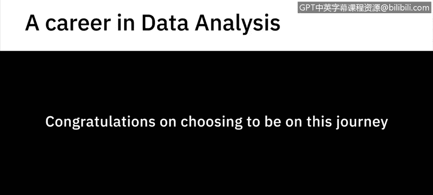

# 043：《数据分析简介》｜课程介绍

在本节课中，我们将要学习《数据分析简介》这门课程的整体框架与学习目标。这门课程是成为初级数据分析师系列课程中的第一门，旨在为你打下坚实的数据分析基础。

---

## 🎯 课程概述

欢迎来到数据分析入门课程。这是系列课程中的第一门，旨在为你成为一名初级数据分析师做好职业准备。

为了说明数据在商业转型中的力量，这里引用一份福雷斯特咨询公司的报告：当今企业认识到数据及其分析中蕴含的未开发价值，这是商业竞争力的关键因素。为了推动其数据和分析计划，公司正在招聘和提升员工技能。他们正在扩大团队并建立卓越中心，以便在组织内建立多管齐下的数据和分析实践。与此同时，熟练的数据分析师存在显著的供需不匹配，这使其成为一个备受追捧且高薪的职业。

你可以选择将掌握数据分析作为职业道路，或者将其作为跳板，扩展到其他数据专业领域，例如数据科学、数据工程、业务分析和商业智能分析。

如果你是一名任何专业的应届毕业生、考虑职业中期转型的在职专业人士、数据驱动的决策者，或任何与数据分析相关的角色，那么这门课程都适合你。

本课程将向你介绍进入数据分析领域所需的核心概念、流程和工具，甚至可以帮助你强化当前作为数据驱动决策者的角色。它将使你了解数据生态系统和数据分析的基础知识，例如数据收集、整理、挖掘、分析和数据可视化。你还将体验数据分析师的日常工作。

---

## 👥 实践分享与职业路径

上一节我们介绍了课程的整体目标，本节中我们来看看课程中包含的宝贵实践经验。

以下是课程中你将获得的来自行业专家的见解：

*   实践中的数据分析师将分享他们进入该领域的经验。
*   你将了解可以考虑的职业选择和学习路径。
*   你将知道雇主在寻找数据分析师时看重哪些素质。
*   他们还将分享关于数据分析过程某些方面的知识和最佳实践。

---

## 🚀 展望未来

对于数据分析领域以及作为数据分析师的你来说，前方的道路确实令人兴奋。因此，祝贺你选择踏上这段旅程，并祝你好运。

---

## 📝 课程总结

本节课中我们一起学习了《数据分析简介》课程的核心内容。我们了解到数据分析在现代商业中的关键作用、本课程的目标受众，以及课程将涵盖的核心技能与职业见解。这为你后续深入学习数据分析的具体方法和工具奠定了良好的基础。