# 044：现代数据生态系统 🚀

在本节课中，我们将要学习现代数据生态系统的构成。我们将了解数据如何从多样化的源头产生，经过采集、组织和管理，最终被不同的用户和应用所使用。同时，我们也会探讨云计算、机器学习和大数据等新兴技术如何塑造并扩展了数据生态系统的可能性。

---

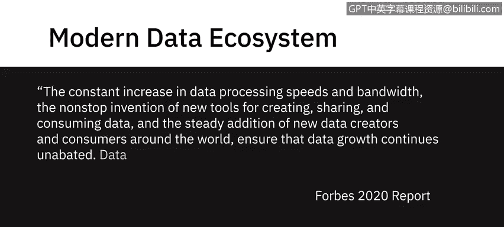

根据《福布斯》2020年一份关于未来十年数据的报告，数据处理速度和带宽的持续提升、用于创建、共享和消费数据的新工具不断涌现，以及全球范围内新的数据创建者和消费者的稳定增加，共同确保了数据的增长势头不减。

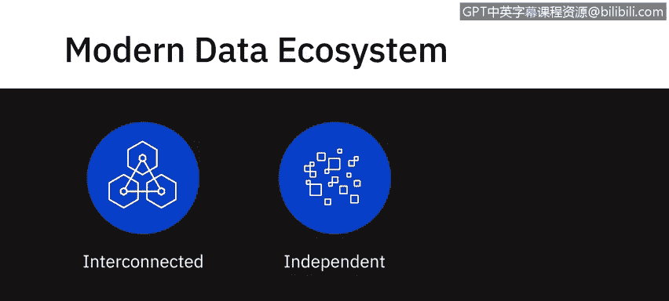

**数据在持续的良性循环中催生出更多数据。**

一个现代数据生态系统包含一个由相互关联、独立且不断演进的实体组成的完整网络。

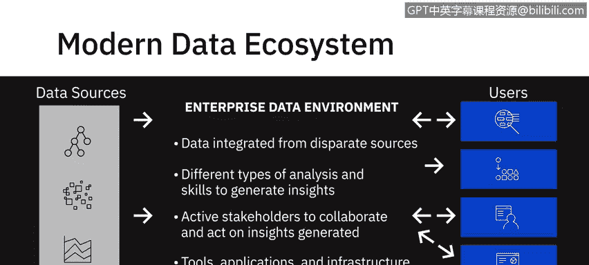

它包括了需要从不同来源整合的数据、用于生成洞察的不同类型的分析与技能、积极协作并根据生成的洞察采取行动的利益相关者，以及用于按需存储、处理和传播数据的工具、应用程序和基础设施。

---

上一节我们介绍了现代数据生态系统的整体概念，本节中我们来看看它的核心组成部分。

首先是数据源。数据以各种结构化和非结构化数据集的形式存在，来源包括：
*   文本、图像、视频
*   点击流、用户对话
*   社交媒体平台
*   物联网设备
*   实时数据流事件
*   遗留数据库
*   专业数据提供商和机构提供的数据

数据源的多样性和动态性前所未有。

当处理如此多不同的数据源时，第一步是将数据从原始源复制到数据存储库中。在此阶段，您主要关注获取所需数据，处理数据格式、来源以及可以拉取数据的接口。确保所获取数据的**可靠性、安全性和完整性**是此阶段需要应对的挑战之一。

---

一旦原始数据进入一个公共存储空间，就需要对其进行组织、清理和优化，以便最终用户访问。数据还需要符合组织内执行的合规性和标准。

例如，遵守管理个人数据（如健康、生物识别或物联网设备中的家庭数据）存储和使用的指导方针。

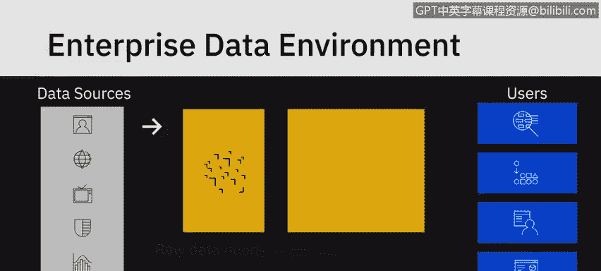

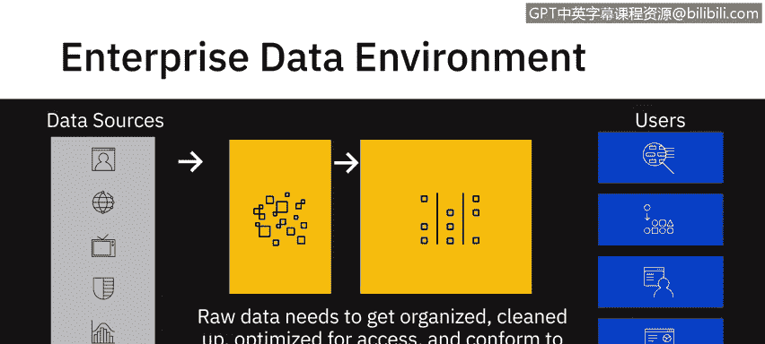

另一个例子是遵循组织内的主数据表，以确保主数据在组织所有应用和系统中的标准化。

此阶段的关键挑战可能涉及**数据管理**，以及使用能提供**高可用性、灵活性、可访问性和安全性**的数据存储库。

---

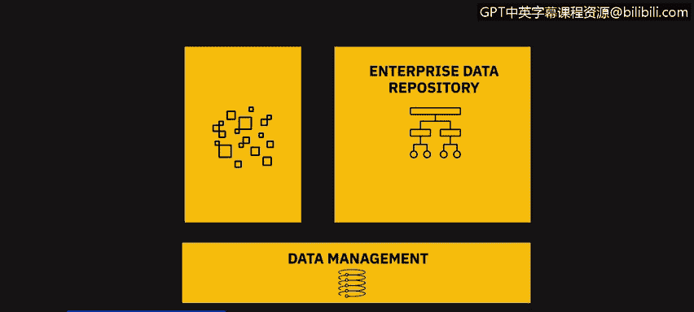

在数据被妥善组织和管理之后，最终环节是数据的消费与应用。

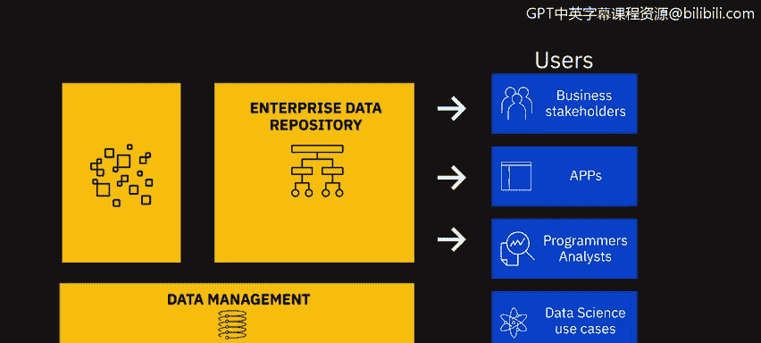

最终，我们的业务利益相关者、应用程序、程序员、分析师和数据科学用例都会从企业数据存储库中提取这些数据。

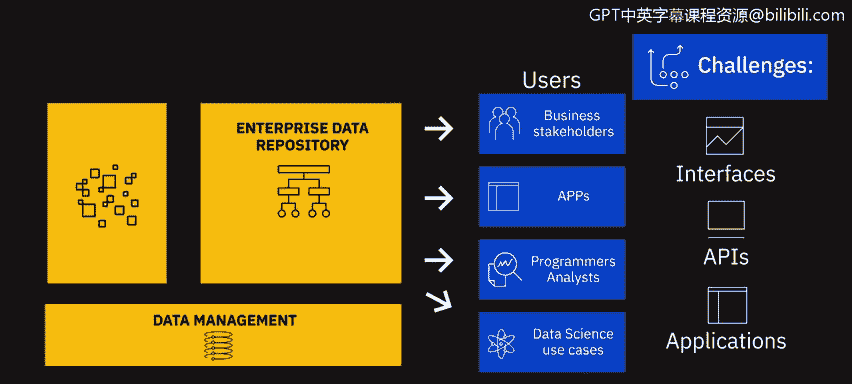

此阶段的关键挑战可能包括**接口、API和应用程序**，它们需要能够根据最终用户的特定需求将数据送达。

以下是不同用户对数据的不同需求示例：
*   **数据分析师**可能需要原始数据进行处理。
*   **业务利益相关者**可能需要报告和仪表板。
*   **应用程序**可能需要自定义API来拉取这些数据。

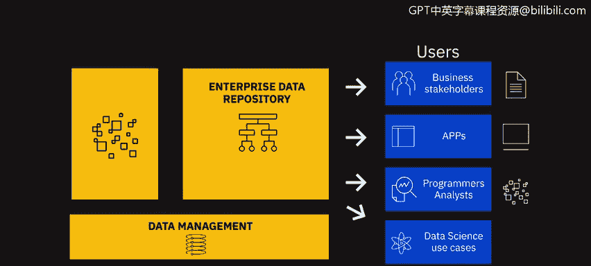

---

值得注意的是，一些新兴技术正在塑造当今的数据生态系统及其可能性，例如**云计算、机器学习和大数据**。

得益于**云计算技术**，如今每家企业都能获得近乎无限的存储、高性能计算、开源技术、机器学习技术以及最新的工具和库。数据科学家通过在历史数据上训练机器学习算法来创建预测模型。

此外是**大数据**。今天我们处理的数据集如此庞大和多样，以至于传统工具和分析方法已不再适用，这为新工具、新技术以及新知识和洞察铺平了道路。

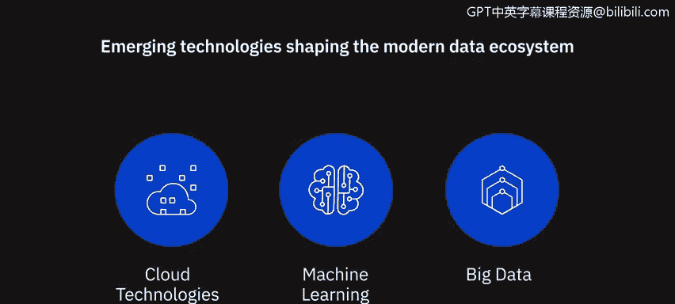

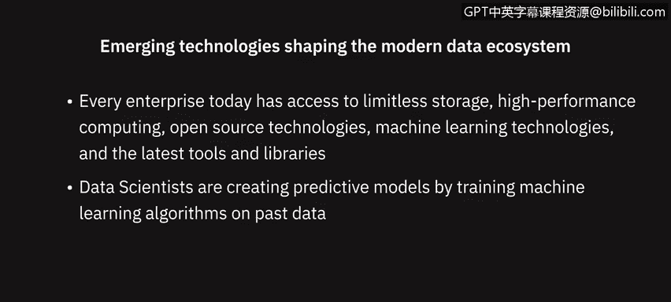

我们将在本课程后续部分进一步学习大数据及其对商业决策的影响。

---

本节课中，我们一起学习了现代数据生态系统的完整流程：从多样化的数据源开始，经过**数据采集**（关注可靠性、安全性、完整性）、**数据组织与管理**（关注合规性、标准化、高可用性），到最终的**数据消费与应用**（通过接口、API、报告等形式满足不同用户需求）。同时，我们也认识到**云计算、机器学习和大数据**等关键技术正在不断扩展数据生态系统的边界与能力。理解这个生态系统是成为一名数据分析师的重要基础。