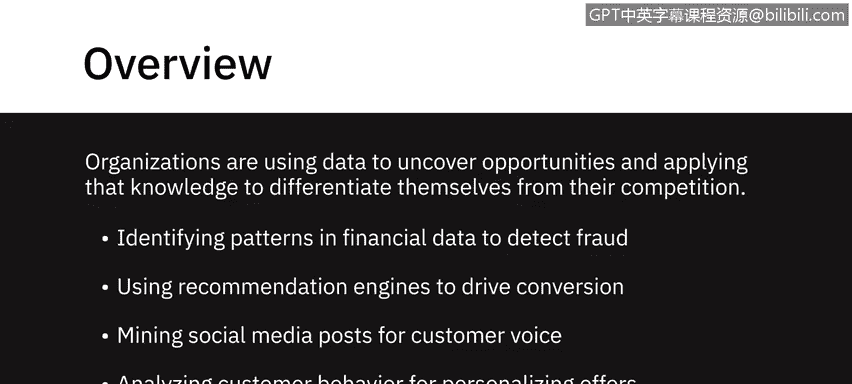
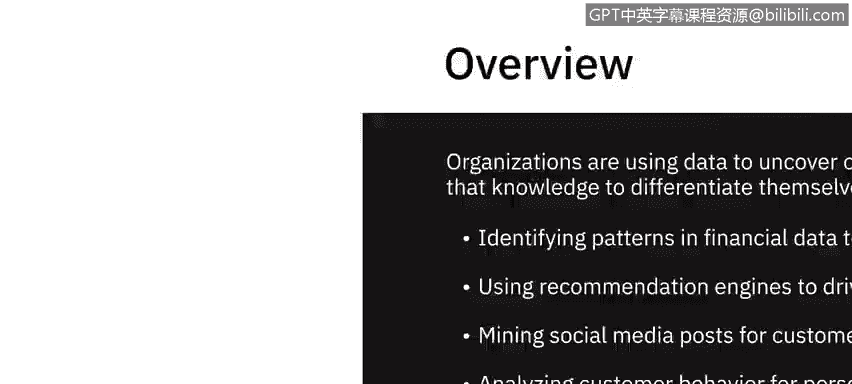
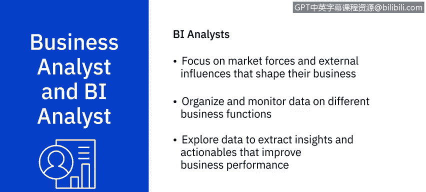
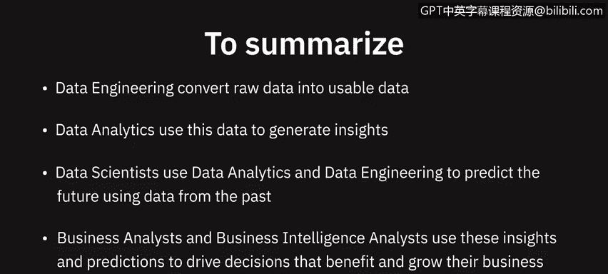

# 045：数据生态系统中的关键角色 🧩

在本节课中，我们将学习数据生态系统中的几个核心角色。理解这些角色如何协作，对于从数据中获取价值至关重要。

如今，那些利用数据发现机遇并应用这些知识来形成自身差异化的组织，正引领着未来。无论是通过分析金融交易模式来检测欺诈，使用推荐引擎来提升转化率，挖掘社交媒体帖子以了解客户心声，还是品牌根据客户行为分析来个性化其产品推荐，商业领袖们都认识到，数据是获得竞争优势的关键。

要从数据中获取价值，需要大量不同的技能组合和扮演不同角色的人员。在本视频中，我们将探讨数据工程师、数据分析师、数据科学家、业务分析师和商业智能分析师在帮助组织利用海量数据并将其转化为可操作的见解方面所扮演的角色。

## 数据工程师：数据的架构师 🏗️

一切始于数据工程师。数据工程师是开发和维护数据架构，并使数据可用于业务运营和分析的人员。

数据工程师在数据生态系统内工作，负责从不同来源提取、整合和组织数据，清洗、转换和准备数据，并在数据仓库中设计、存储和管理数据。他们使数据能够以各种业务应用以及数据分析师和数据科学家等利益相关者可以利用的格式和系统进行访问。

一名数据工程师必须具备良好的编程知识、扎实的系统和技术架构知识，以及对关系型数据库和非关系型数据存储的深入理解。

## 数据分析师：数据的翻译官 📊

上一节我们介绍了数据的构建者，本节中我们来看看数据的解读者。简而言之，数据分析师将数据和数字翻译成通俗易懂的语言，以便组织能够做出决策。

数据分析师检查和清理数据以获取洞察，识别相关性，寻找模式，应用统计方法分析和挖掘数据，并通过可视化来解读和呈现数据分析的结果。

以下是数据分析师通常回答的问题类型：
*   我们网站上的搜索功能，用户的搜索体验总体上是好是坏？
*   公众对我们品牌重塑举措的普遍看法是什么？
*   一种产品的销售与另一种产品的销售之间是否存在相关性？

数据分析师需要熟练掌握电子表格、编写查询语句，以及使用统计工具创建图表和仪表板。现代数据分析师还需要具备一定的编程技能。他们同样需要强大的分析和叙事能力。

## 数据科学家：未来的预测者 🔮

现在，让我们看看数据科学家在这个生态系统中扮演的角色。数据科学家分析数据以获得可操作的见解，并构建机器学习或深度学习模型，这些模型基于历史数据进行训练，以创建预测模型。

以下是数据科学家通常回答的问题类型：
*   下个月我可能会获得多少新的社交媒体关注者？
*   下一个季度，我可能有多少比例的客户会流失到竞争对手那里？
*   这笔金融交易对该客户来说是否异常？

数据科学家需要具备数学、统计学知识，并对编程语言、数据库和构建数据模型有相当的理解。他们还需要具备领域知识。

## 业务分析师与商业智能分析师：决策的推动者 🎯

然后，我们还有业务分析师和商业智能分析师。业务分析师利用数据分析师和数据科学家的工作成果，审视对其业务的可能影响以及他们需要采取或建议的行动。商业智能分析师做类似的工作，但他们的侧重点在于塑造其业务的市场力量和外部影响。

他们通过组织和监控不同业务职能的数据，并探索这些数据以提取能改善业务绩效的见解和可执行方案，来提供商业智能解决方案。

## 总结与职业路径 🌟

本节课中我们一起学习了数据生态系统中的关键角色。简单总结一下：
*   **数据工程**将原始数据转换为可用数据。
*   **数据分析**利用这些数据生成洞察。
*   **数据科学**使用数据分析和数据工程，基于过去的数据预测未来。
*   **业务分析师**和**商业智能分析师**则利用这些洞察和预测来推动有利于业务增长和发展的决策。

有趣的是，数据专业人士从其中一个数据角色开始职业生涯，然后通过补充技能过渡到数据生态系统内的另一个角色，这种情况并不少见。