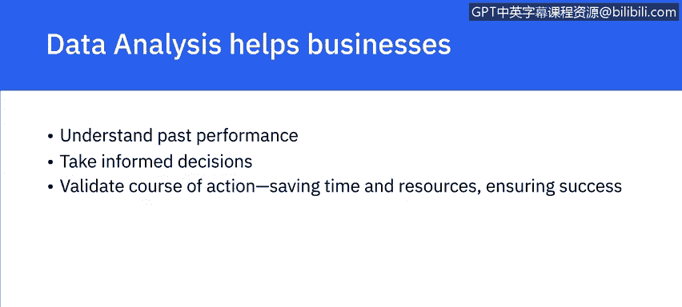
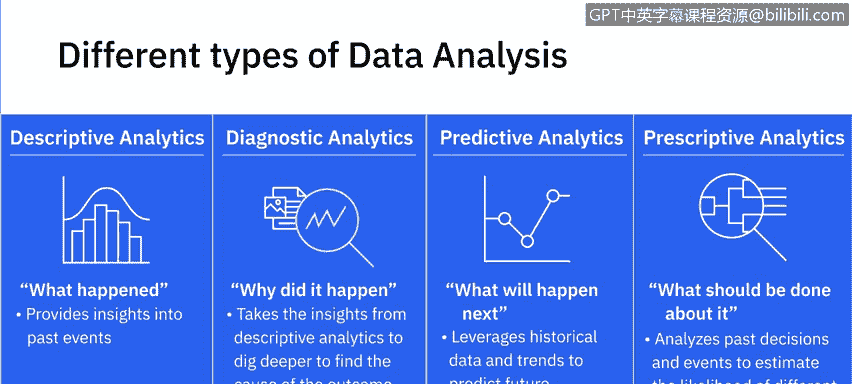
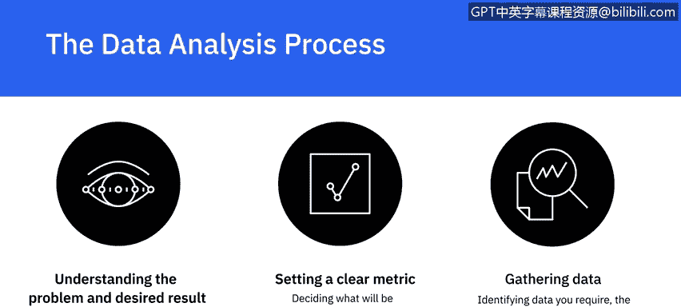
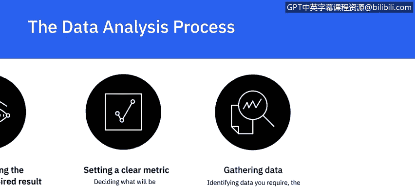
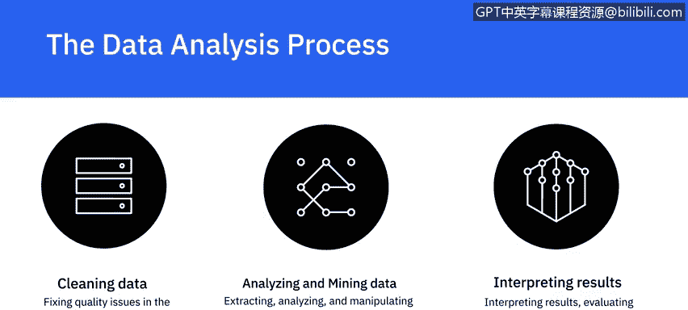
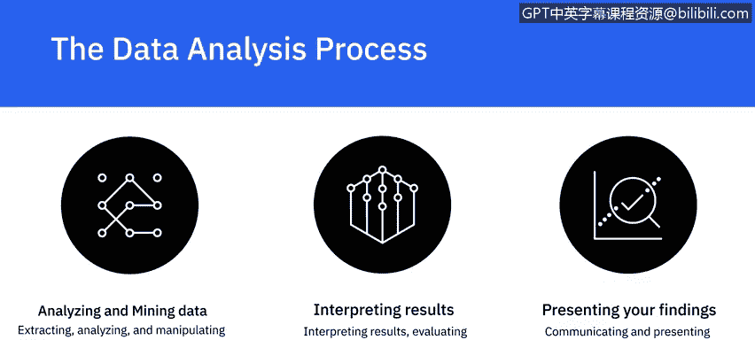

# 046：定义数据分析

在本节课中，我们将学习数据分析的核心概念、主要类型以及其标准流程。数据分析是当今商业决策中不可或缺的一环，理解其基本框架是成为一名数据分析师的第一步。

---

## 什么是数据分析？

数据分析是一个系统性的过程，它包含**收集、清理、分析和挖掘数据**，随后**解读结果**，并最终**报告研究发现**。通过数据分析，我们能够在数据中发现**模式**，并识别不同数据点之间的**关联**。正是通过这些模式和关联，我们得以生成洞察并得出结论。

数据分析帮助企业理解其过往表现，并为未来的行动决策提供信息支持。通过数据分析，企业可以在投入资源前验证行动方案的可行性，从而节省宝贵的时间和资源，并确保更高的成功率。

---

## 数据分析的四种主要类型

接下来，我们将探讨数据分析的四种主要类型。每种类型在数据分析过程中都有不同的目标和定位。

以下是四种主要的数据分析类型：

1.  **描述性分析**
    *   **目标**：回答“**发生了什么**”的问题。
    *   **方法**：通过汇总过去的数据并向利益相关者展示结果，来总结特定时间段内的情况。
    *   **作用**：提供对过去事件的基本洞察。
    *   **示例**：基于组织的关键绩效指标追踪过往表现，或进行现金流分析。

2.  **诊断性分析**
    *   **目标**：回答“**为什么会发生**”的问题。
    *   **方法**：利用描述性分析得出的洞察，深入挖掘以找出结果的根本原因。
    *   **示例**：网站流量在无明显原因的情况下突然变化，或某个区域在营销策略未变的情况下销售额增加。

3.  **预测性分析**
    *   **目标**：回答“**接下来可能会发生什么**”的问题。
    *   **方法**：利用历史数据和趋势来预测未来结果。
    *   **作用**：企业应用预测性分析的领域包括风险评估和销售预测。
    *   **核心概念**：预测性分析的目的**不是**断言未来一定会发生什么，而是**预测未来可能发生的情况**。所有预测本质上都是**概率性**的。

4.  **规范性分析**
    *   **目标**：回答“**应该对此采取什么行动**”的问题。
    *   **方法**：通过分析过去的决策和事件，估计不同结果的可能性，并在此基础上决定行动方案。
    *   **示例**：自动驾驶汽车分析环境以做出关于速度、变道、路线选择等决策；航空公司根据客户需求、油价、天气或联程路线的交通状况自动调整机票价格。

---

## 数据分析的关键步骤

上一节我们介绍了数据分析的类型，本节中我们来看看一个典型的数据分析过程包含哪些关键步骤。遵循一个结构化的流程对于确保分析的有效性和可靠性至关重要。

以下是数据分析过程中的关键步骤：

1.  **理解问题与期望结果**
    *   数据分析始于理解需要解决的问题和需要达成的期望结果。在分析过程开始之前，必须明确定义“现状”和“目标”。

2.  **设定清晰的衡量指标**
    *   此阶段包括决定**测量什么**（例如，某地区产品X的销量）以及**如何测量**（例如，在一个季度内或在某个节日季期间）。

3.  **收集数据**
    *   一旦明确了测量内容和方式，就需要确定所需的数据、需要从中提取数据的数据源，以及完成此任务的最佳工具。

4.  **清理数据**
    *   收集数据后，下一步是修复数据中可能影响分析准确性的质量问题。这是一个关键步骤，因为只有数据干净，才能确保分析的准确性。
    *   清理工作包括处理**缺失值**、**不完整值**和**异常值**。例如，客户人口统计数据中年龄字段值为150就是一个异常值。
    *   还需要对来自多个来源的数据进行**标准化**处理。

5.  **分析与挖掘数据**
    *   数据清理完毕后，将从不同角度提取和分析数据。可能需要以多种不同方式操作数据，以理解趋势、识别关联、发现模式和变化。

6.  **解读结果**
    *   在分析数据并可能进行进一步研究（这可能是一个迭代循环）之后，就到了解读结果的时候。在解读时，需要评估你的分析是否足以应对质疑，以及是否存在任何局限性或特定情况会使你的分析不成立。

7.  **呈现你的发现**
    *   最终，任何分析的目标都是影响决策。以清晰且有影响力的方式沟通和呈现你的发现，是数据分析过程中与分析本身同等重要的一部分。报告、仪表板、图表、图形、地图和案例研究等都是呈现数据的有效方式。

---

## 总结

本节课中，我们一起学习了数据分析的基础知识。我们首先定义了数据分析是一个包含收集、清理、分析、解读和报告的系统过程。接着，我们探讨了描述性、诊断性、预测性和规范性这四种主要的数据分析类型及其目标。最后，我们详细介绍了数据分析流程中的七个关键步骤，从理解问题开始，到最终呈现发现结束。掌握这些核心概念和流程，是开启数据分析之旅的重要基石。