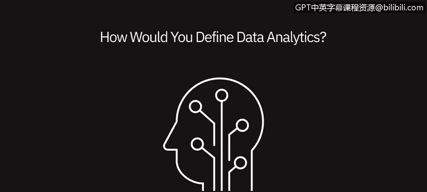
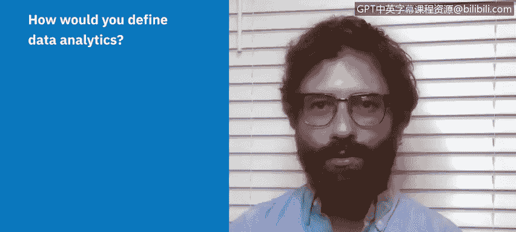
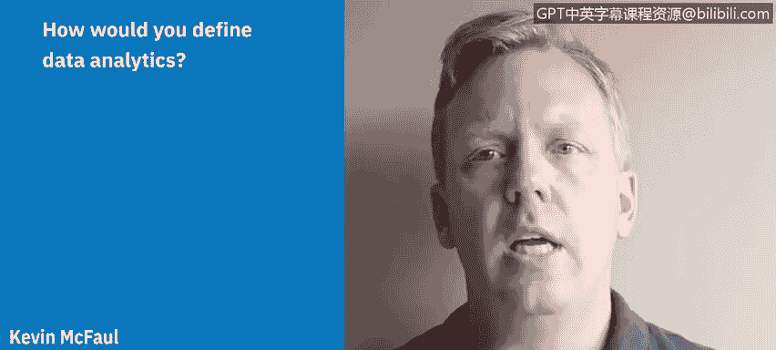

# 047：视角——什么是数据分析？🔍

在本节课中，我们将聆听几位数据专业人士的分享，了解他们如何定义数据分析，以及这个术语对他们意味着什么。通过他们的视角，我们可以更全面地理解数据分析的本质和应用。

---

上一节我们介绍了本视频的主题。本节中，我们来看看第一位专业人士的观点。

我将数据分析定义为**收集信息并分析这些信息以验证各种假设的过程**。对我而言，数据分析也意味着**用数据讲故事**，即使用数据清晰、简洁地向周围的人传达世界的状态。

---

理解了数据分析作为“验证假设”和“数据叙事”的概念后，我们接下来听听另一位专家如何将其与日常生活联系起来。

数据分析是利用你周围的信息来做决策。就像你每天早上起床，会看新闻，天气预报会告诉你当天的温度和是否会下雨，这可能会决定你穿什么或能进行什么活动。所以数据分析不是一个抽象的概念，它是我们自然而然在做的事情，只是它有一个技术名称。现在人们被雇佣来在更大规模或更宏大的场景中做这件事，但它真的没那么复杂。

---

既然数据分析与日常决策息息相关，那么它在解决专业问题时的具体流程是怎样的呢？让我们继续聆听。

我的理解是，你遇到了一个问题，你需要用事实来检验一个假设。这就是数据分析发挥作用的地方。这个过程从**定义问题**开始，然后你需要**建立自己的假设**。为了检验它，你需要**收集数据、清理数据、分析数据**，然后**将其呈现给关键的利益相关者**。数据分析本质上就是你可以用来审查信息的任何数据集。

---

在商业环境中，数据分析如何帮助洞察现状和预测未来呢？以下是来自一位注册会计师的见解。

任何能帮助你理解正在发生什么事情的数据集。以我作为一名注册会计师为例，我总是在查看财务报表，总是在分析数据，以预测某人过去的情况、现在的状况以及未来的走向。因此，数据帮助我看得更远，几乎可以预测我正在合作的任何公司的未来。所以，数据分析是**整理、清洗、分析、呈现**，并最终分享你的数据和分析结果，以帮助准确传达你的业务或数据中正在发生的事情，从而帮助做出更好的决策。

---

最后，让我们从数字营销和内容策略的角度，看看数据分析如何指导产品与服务决策。

我会将数据分析定义为一个过程，或者更确切地说，是一种现象：**从相关群体（可能是你的客户或社交受众）那里收集信息，将这些信息分解成子集，并利用这些数据来制定关于你想要提供的产品或服务的决策**，或者在我们所处的数字环境中，**决定你想要发布的某些内容，以吸引你的目标受众**。

---

本节课中，我们一起学习了多位数据专业人士对数据分析的定义。他们从假设验证、数据叙事、日常决策、问题解决流程、商业洞察与预测，以及产品与内容策略等多个视角，阐述了数据分析的核心在于**利用数据来理解现状、检验想法并支持更好的决策**。无论背景如何，数据分析都围绕着**处理信息以获取有价值的见解**这一共同目标。