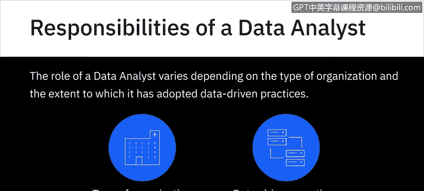
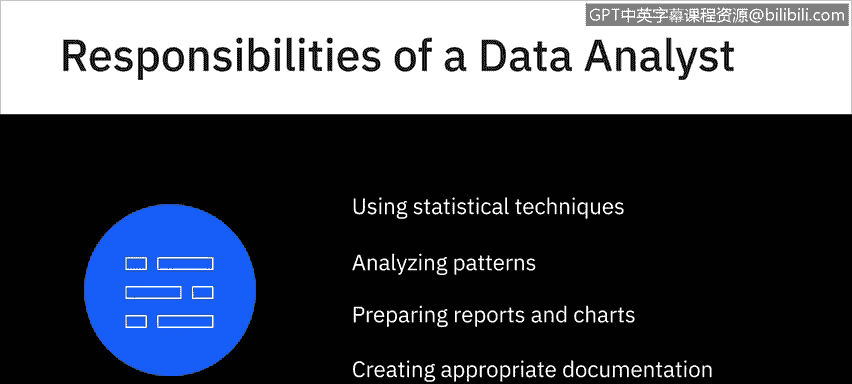
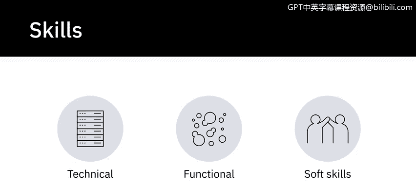
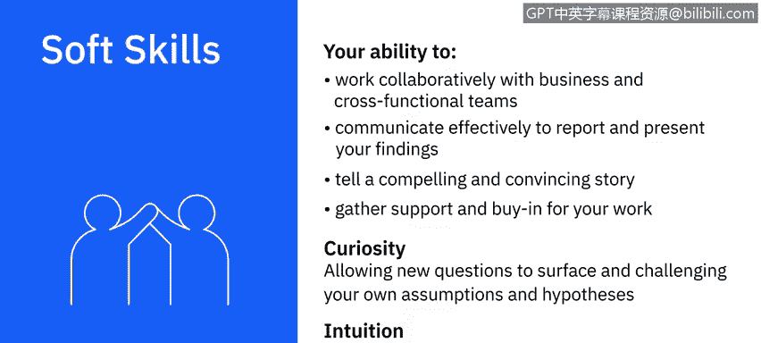

# 048：数据分析师的职责与技能 📊

在本节课中，我们将学习数据分析师的核心职责以及成功胜任此角色所需的关键技能。我们将从典型的工作内容入手，然后深入探讨支撑这些工作的技术、职能和软技能。

## 数据分析师的典型职责

虽然数据分析师的角色因组织类型及其数据实践采用程度而异，但在当今的组织中，仍有一些职责是数据分析师角色的典型组成部分。

以下是数据分析师的主要职责列表：

*   **数据获取**：从主要和次要数据源获取数据。
*   **数据查询**：创建查询以从数据库和其他数据收集系统中提取所需数据。
*   **数据准备**：对数据进行过滤、清洗、标准化和重组，为数据分析做准备。
*   **数据解读**：使用统计工具解读数据集。
*   **模式识别**：使用统计技术识别数据中的模式和相关性。
*   **趋势分析**：分析复杂数据集中的模式并解读趋势。
*   **报告与可视化**：准备有效传达趋势和模式的报告与图表。
*   **过程文档**：创建适当的文档来定义和演示数据分析过程的步骤。

## 数据分析师的核心技能

上一节我们介绍了数据分析师的主要职责，本节中我们来看看支撑这些职责所需的技能。数据分析过程需要技术、职能和软技能的结合。

### 技术技能

首先，让我们看看作为数据分析师角色所需的一些技术技能。这些技能是处理数据和工具的基础。

以下是关键的技术技能列表：

*   **电子表格**：精通使用电子表格，如 Microsoft Excel 或 Google Sheets。
*   **分析与可视化工具**：熟练使用统计分析和可视化工具及软件，如 IBM Cognos、IBM SPSS、Oracle Visual Analyzer、Microsoft Power BI 和 Tableau。
*   **编程语言**：至少精通一种编程语言，如 R 或 Python；在某些情况下，可能还需要 C++、Java 和 MATLAB。
*   **SQL 与数据库**：具备良好的 SQL 知识，能够处理关系型和非 SQL 数据库中的数据。
*   **数据仓库访问**：能够从数据仓库、数据湖和数据管道等数据存储库访问和提取数据。
*   **大数据工具**：熟悉 Hadoop、Hive 和 Spark 等大数据处理工具。

我们将在课程后续部分进一步了解这些编程语言、数据库、数据存储库和大数据处理工具的特性和用例。

### 职能技能

现在，让我们看看数据分析师角色所需的一些职能技能。这些技能帮助你理解问题、分析数据并得出有意义的结论。

以下是关键的职能技能列表：

*   **统计学**：精通统计学，以帮助你分析数据、验证分析结果并识别谬误和逻辑错误。
*   **分析能力**：帮助你研究和解释数据、建立理论并进行预测的分析能力。
*   **解决问题能力**：因为所有数据分析的最终目标都是解决问题。
*   **探究能力**：对于发现过程至关重要，即从不同利益相关者和用户的角度理解问题，因为数据分析过程真正始于对问题陈述和期望结果的清晰阐述。
*   **数据可视化技能**：帮助你根据受众、数据类型、背景和分析的最终目标，决定有效呈现研究结果的技术和工具。
*   **项目管理技能**：用于管理项目流程、依赖关系和时间线。

### 软技能

谈完技术性和职能性技能，接下来我们看看数据分析师的软技能。数据分析既是一门科学，也是一门艺术。你可以精通技术和职能专长，但成功的关键区别因素之一将是软技能。

以下是关键的软技能列表：

*   **协作能力**：与业务和跨职能团队协作的能力。
*   **有效沟通**：有效沟通以报告和呈现你的发现。
*   **讲故事能力**：讲述引人入胜且令人信服的故事，并为你的工作争取支持和认可。
*   **好奇心**：最重要的是，好奇心是数据分析的核心。在你的工作过程中，你会遇到可能指引你走向不同路径的模式、现象和异常。允许新问题浮现并挑战你的假设和假设的能力，造就了出色的分析。
*   **直觉**：你还会听到数据分析从业者将直觉视为必备品质。必须注意的是，这里的直觉是指基于模式识别和过去经验对未来有所感知的能力。

## 总结

本节课中，我们一起学习了数据分析师的核心职责，包括从数据获取、清洗到分析、可视化和文档化的全过程。同时，我们深入探讨了支撑这些工作的三大类技能：处理数据和工具的技术技能、理解问题和进行分析的职能技能，以及协作沟通和保持好奇心的软技能。掌握这些职责和技能是成为一名成功数据分析师的基础。