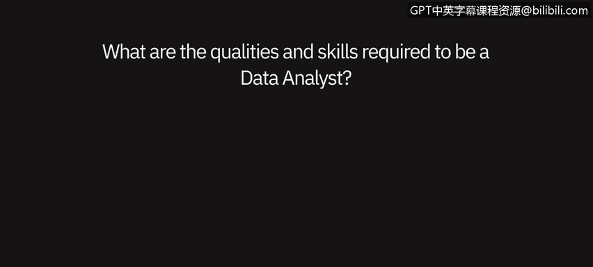
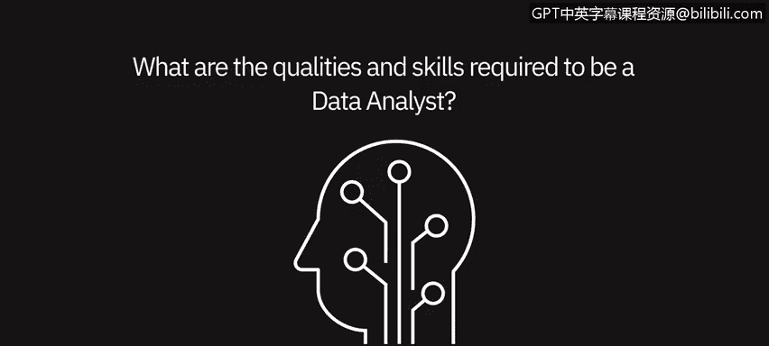

# 049：数据分析师的视角、特质与技能 🎯

在本节课中，我们将聆听来自数据领域专业人士的分享，了解成为一名数据分析师所需具备的特质与技能。

---

## 数据分析师的特质与技能

数据分析师的特质包括：天生充满好奇心、注重细节、并且乐于与计算机打交道。

一个充满好奇心的人，即使在没有明确问题的情况下，也会主动寻找答案。他们不介意深入研究，探索那些可能之前未被考虑过的领域。

注重细节意味着善于寻找规律。例如，你是否会自然地走进一个房间，就开始数人数，或者观察房间的布局？关注这些细微之处至关重要。同时，乐于使用计算机也很重要，因为技术发展日新月异。你今天学习的某项技能，可能在两三年后就不再适用。因此，你需要能够根据市场或行业的变化，不断学习新技能和新软件。

---

## 硬技能与软技能

毫无疑问，成为一名数据分析师需要同时具备技术技能（硬技能）和软技能。

技术技能包括：
*   **Python**
*   **SQL**
*   **R**
*   **Tableau**
*   **Power BI**

软技能或人际交往能力，意味着你需要知道：
*   应该使用哪些正确的数据。
*   应该使用哪些正确的工具。
*   如何向相关利益方展示数据。

这些技能要求你具备商业头脑和出色的演示能力。你必须非常注重细节，热爱数字和信息，并且愿意深入挖掘信息，而不是停留在表面。

例如，在我的工作中，我不能只看银行对账单的表面价值。我必须仔细检查并对比，比如印章看起来是否正确。尤其是在当今世界，存在大量欺诈和错误信息，有人试图窃取你的信息进行欺诈使用。一名优秀的数据分析师应该能够将去年的信息与今年的信息进行比较，以判断其是否合理。你必须具备这种洞察力和思维方式，而不是只看表面。

---

## 软技能与硬技能详解

成为一名数据分析师需要许多特质和技能，我通常将它们分为两大类：软技能和硬技能。

我认为，对于数据分析师来说，最重要的软技能是：
*   **保持真正的好奇心**，提出大量好问题。
*   **深思熟虑**，并仔细倾听。
*   **理解用户和同事的视角**，了解他们最需要从数据中获得什么。
*   **始终保持学习意愿**，因为分析领域发展迅速，你必须不断学习和阅读以保持领先。

成为一名数据分析师也需要许多技术技能。

对于任何新的数据分析师来说，最重要的一项技术技能是学习 **SQL**。这是迄今为止使用最广泛的技能。任何时候你需要从数据库中提取数据，都需要了解 SQL。一个拥有出色 SQL 技能的数据分析师是无与伦比的。

我认为，有时人们会好高骛远，在掌握 SQL 基础之前就尝试一堆非常复杂的技术，这是一个很大的错误。了解 **Python** 和 **R** 这两种用于数据分析的主要编程语言总是好的。作为一名新的数据分析师，你不需要精通两者，甚至不需要精通其中任何一个，但开始熟练掌握其中一种将对你的职业生涯非常有用。

数据分析师的另一项重要技术技能是，**至少精通一种数据可视化工具**，并理解数据可视化的通用原则。

---

## 现代数据分析师的端到端技能

如今，数据分析师的端到端技能组合比过去更加动态。

数据分析师需要知道他们试图用数据解决什么问题。他们需要使用 **SQL** 从数据湖中提取所需的数据，并以所需的结构进行组织。这通常涉及许多不同的数据表，他们需要弄清楚如何连接这些表，然后提取数据。

接下来，他们需要清理、整理、操作和挖掘这些数据，以便能够从中提炼出见解。最后，他们需要使用良好的可视化和仪表板，简洁清晰地呈现这些见解。换句话说，**能够用数据讲述一个精彩的故事**。

---

## 课程总结

在本节课中，我们一起学习了成为一名成功的数据分析师所需的核心特质与技能组合。我们了解到，这不仅是关于掌握 **SQL**、**Python** 等技术工具，更重要的是培养好奇心、注重细节和持续学习等软技能。现代数据分析师的角色是动态的，涵盖了从理解业务问题、提取和处理数据，到最终通过可视化清晰传达数据故事的完整流程。