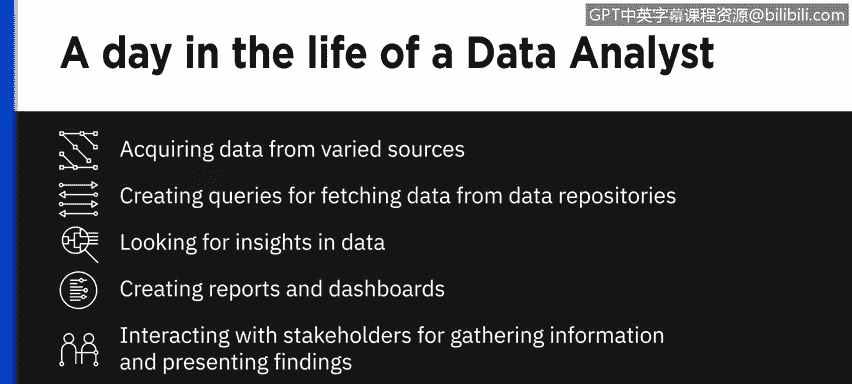
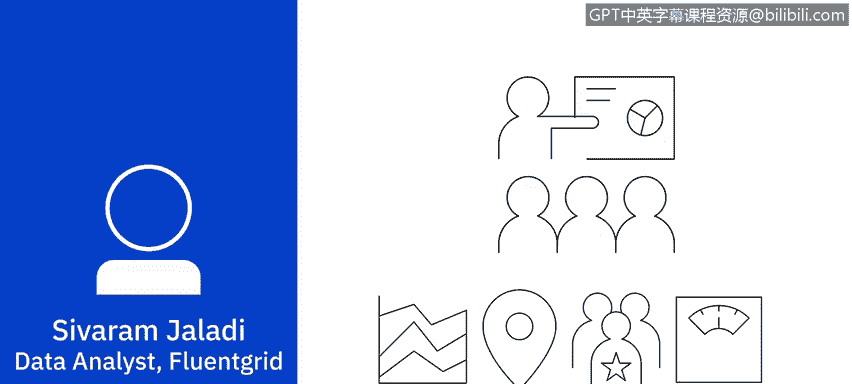

# 050：数据分析师的一天

在本节课中，我们将通过一个真实案例，了解数据分析师日常工作的核心流程。我们将跟随一位数据分析师，探索她如何从业务问题出发，通过数据寻找洞察，并最终向利益相关者汇报发现。

数据分析师的一天可能包含多种任务。从获取多样化的数据源，到编写查询从数据仓库中提取数据；从逐行筛查数据以寻找洞察，到创建报告和仪表板；再到与利益相关者沟通以收集信息和呈现发现，这是一个完整的工作光谱。当然，还有一项重要任务：**清洗和准备数据**，以确保分析结果具有可信的基础。这通常是数据分析师工作中很大的一部分。

如果必须选择一种典型的工作日来描述，我会选择专注于**从数据中挖掘洞察**的那一天。这是我工作中最令我着迷的部分。

大家好，我是 Sieveramjaladi。我在 Fluent Grid 公司担任数据分析师。这是一家位于印度维沙卡帕特南的智能电网技术解决方案公司。Fluent Grid 是 IBM 的合作伙伴，并因其在智能能源和智慧城市领域的解决方案而获得 IBM Beacon 奖项。我们利用名为 **`Fluent Grid Act Diligence`** 的可操作智能平台，为电力公司和智慧城市提供集成的运营中心解决方案。

我们的客户是印度南部的一家电力公司。他们注意到关于账单过高的投诉激增，投诉频率表明这可能不是随机事件。因此，我被要求查看投诉数据和账单数据，看看是否能发现一些规律。

## 🎯 第一步：明确问题与假设

在深入数据细节之前，我首先明确手头有什么。我知道需要查看的几个明显数据源是：投诉数据、用户信息数据和账单数据。这将是我的起点。

接着，我会列出初始问题和假设。以下是我开始时提出的假设：

1.  **用户使用模式**：报告此问题的用户的使用模式是怎样的？是否存在某个特定的用电量范围，过高账单的发生率更高？
2.  **投诉的区域集中度**：投诉是否集中在城市的特定区域？
3.  **投诉的频率与重复性**：是否相同的用户在重复报告过高账单？如果是，重复发生的频率如何？如果用户被多收费一次，是从第一次发生起每月都出现，还是重复发生是零星的，或者根本不重复？

## 🔍 第二步：数据提取与分析

明确了初始假设和问题后，我确定了需要隔离和分析以验证或反驳这些假设的数据集。

首先，我提取了投诉者的年平均、季度平均和月平均账单金额，寻找投诉更集中的金额范围。

接着，我调取了投诉者的位置数据，以查看过高账单是否与邮政编码有关联。在这里，我发现投诉似乎集中在某些区域。这看起来可能是一个线索。

因此，我没有立即转向第三个假设，而是决定更深入地挖掘这部分数据。

然后，我提取了用户的**入网日期数据**。结果显示，超过95%的投诉者成为我们的用户已超过七年。当然，并非所有超过七年的用户都面临此投诉。

至此，我们看到了一些区域性的集中，以及基于入网日期的显著投诉集中现象。

最后，我提取了电表的**制造商和序列号**数据。关键发现出现了：这些序列号属于同一供应商提供的同一批电表。这些电表的集中安装区域，也正是投诉集中的区域。

## 📈 第三步：呈现发现与总结

在这个阶段，我有信心将这些发现呈现给利益相关者。我也会分享数据来源和分析过程，这总是能极大地增加发现结果的可信度。

这个项目可能就此结束，或者很可能会有后续。也许是带有不同共性的相同投诉，也可能是我们需要寻找答案的全新投诉集。

在本节课中，我们一起学习了数据分析师处理一个具体问题的完整流程：从理解业务背景、提出假设、提取和分析相关数据，到最终发现关键洞察（同一批次的电表是问题根源）并准备汇报。这个过程体现了数据分析如何将原始数据转化为有价值的业务决策依据。