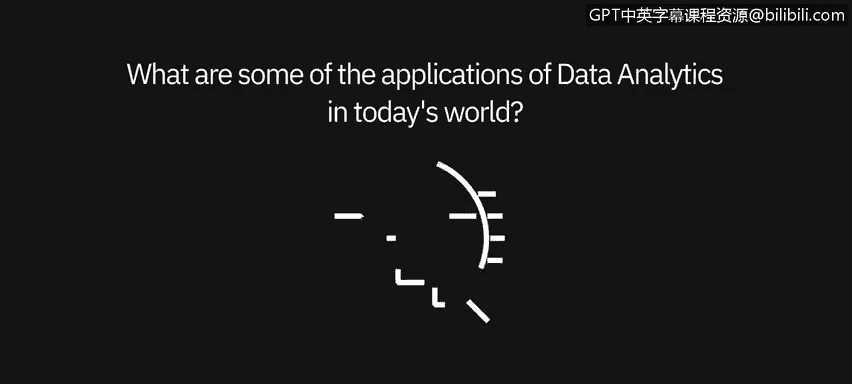
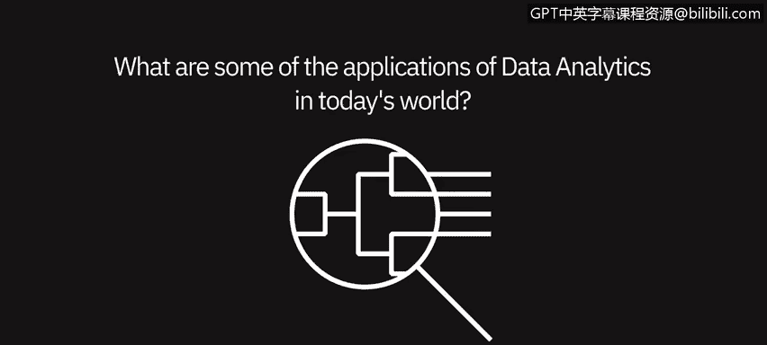

# 051：数据分析的视角与应用 🌐

在本节课中，我们将通过从业者的视角，了解数据分析在当今世界中的广泛应用。我们将看到数据分析如何渗透到各个行业和日常生活，并探讨其在特定领域（如金融）中的创新应用。

---

上一节我们探讨了数据分析的基本概念，本节中我们来看看数据分析在现实世界中的具体应用场景。

数据分析在当今世界的应用无处不在。你看到的每一个商业广告，都有人从消费者或公司的角度进行分析，以确定他们想要分享的信息。无论是“十分之四的牙医推荐”，还是与卡路里含量或对某些事物的反应相关的信息，所有这些都需要分析。数据分析不应被视为独立于生活之外的事物，它就是我们日常生活中的一部分。即使是糖尿病患者监测血糖水平，也始终伴随着分析。因此，数据分析的应用是普遍存在的。

当今时代，数据分析的一大优势在于其广泛适用性。

每个行业、每个垂直领域、每个组织内的职能部门都能从数据和分析中受益。

以下是数据分析的一些典型应用场景：

*   **销售渠道分析**：评估销售流程和预测业绩。
*   **月度财务分析**：在月末进行财务数据汇总与审查。
*   **标准化报告生成**：创建预定义和标准格式的报告。
*   **人力规划与审查**：进行人员编制规划和评估。

正如之前所说，这些应用遍及所有垂直领域，无论是航空、制药还是银行业，其内部的各个职能部门都能从分析中获益。

在我们当前所处的疫情环境下，数据分析显得尤为重要。许多公司正在密切关注客户的购买习惯，这些习惯可能与公司的预期有所不同。因此，数据分析变得更加关键，公司需要确保能够灵活调整策略，跟上需求变化，真正满足客户和顾客的需求。

接下来，让我们聚焦一个具体领域，看看数据分析的深入应用。

我们可以谈谈数据分析在金融领域的应用。近年来，我们在金融界看到了越来越多另类数据分析的应用。

以下是几个具体的例子：

*   **情感分析**：我们可以利用对推文和新闻报道的情感分析，来补充传统的金融分析，从而做出更明智的投资决策。其核心是分析文本数据中的情绪倾向，公式可简化为：`投资信号 = 传统财务指标 + 市场情绪指数`。
*   **卫星图像数据**：卫星图像数据可用于追踪工业活动的发展情况。
*   **地理位置数据**：地理位置数据可用于追踪门店客流量，并预测销售额。

---

本节课中我们一起学习了数据分析的广泛应用。我们看到，数据分析已融入商业和日常生活的方方面面，从广告营销到健康管理，从传统行业报告到金融领域的创新实践（如情感分析和卫星数据应用）。特别是在快速变化的环境中，数据分析能帮助组织保持敏捷，满足客户需求。理解这些应用场景，有助于我们认识到数据分析的价值和普遍性。