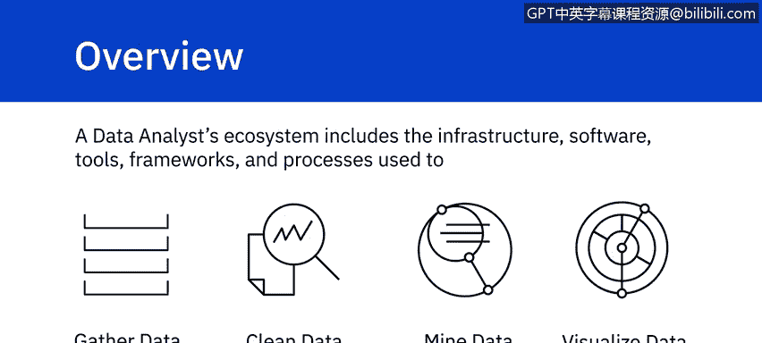
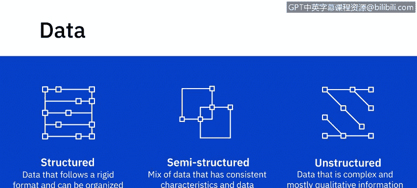
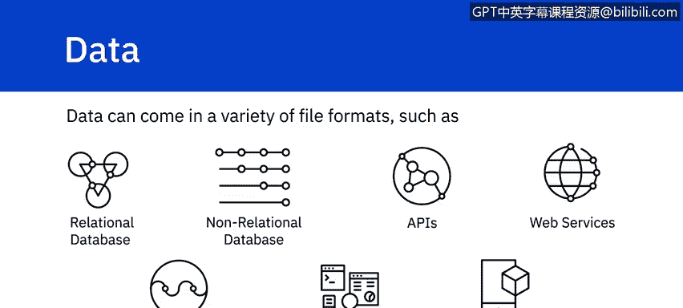
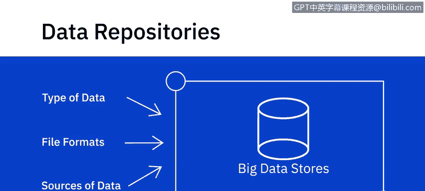
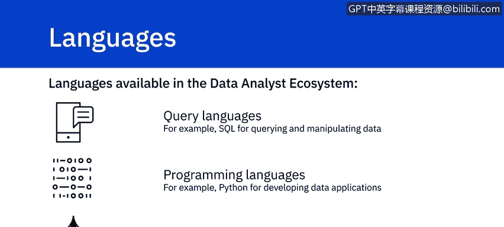
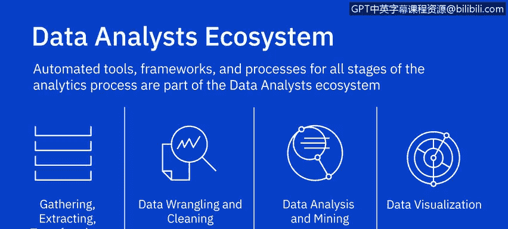

# 052：数据分析师生态系统概览 🧩

在本节课中，我们将学习数据分析师生态系统的基本构成。这个生态系统包含了用于收集、清洗、分析、挖掘和可视化数据的基础设施、软件、工具、框架和流程。我们将首先对生态系统进行一个快速概览，后续视频会深入探讨每个主题的细节。

## 数据分类 📊

首先，我们来谈谈数据。根据数据结构的明确程度，数据可以分为结构化、半结构化和非结构化数据。

以下是不同类型数据的定义和示例：

*   **结构化数据**：遵循严格格式，可以整齐地组织成行和列的数据。这是你在数据库和电子表格中通常看到的数据。
*   **半结构化数据**：混合了具有一致特征的数据和不符合严格结构的数据。例如，电子邮件包含发件人和收件人姓名等结构化数据，但也包含邮件正文这类非结构化数据。
*   **非结构化数据**：结构复杂且主要为定性信息，无法简化为行和列。例如，照片、视频、文本文件、PDF 和社交媒体内容。

数据的类型决定了可以收集和存储数据的种类，也决定了可用于查询或处理数据的工具。

## 数据来源与格式 🌐

数据以多种多样的文件格式存在，并从各种数据源收集而来。这些数据源的范围很广，包括：

*   关系型和非关系型数据库
*   API 和网络服务
*   数据流
*   社交平台
*   传感器设备

## 数据存储库 🗄️

上一节我们介绍了数据的来源，本节中我们来看看数据的存储。数据存储库是一个统称，包括数据库、数据仓库、数据集市、数据湖和大数据存储。

数据的类型、格式和来源会影响你可以使用哪种数据存储库来收集、存储、清洗、分析和挖掘数据。例如，如果你处理的是大数据，你将需要能够存储和处理海量、高速数据的大数据仓库，以及允许你对大数据进行实时复杂分析的框架。

## 编程与查询语言 💻

生态系统还包括各种语言，可分为查询语言、编程语言以及 Shell 和脚本语言。

以下是数据分析师工作台中重要的语言组件：

*   使用 **SQL** 查询和操作数据
*   使用 **Python** 开发数据应用程序
*   编写 **Shell 脚本** 来自动化重复性操作任务

## 工具与框架 🛠️

自动化工具、框架和流程贯穿数据分析过程的各个阶段，是数据分析师生态系统的一部分。

从用于收集、提取、转换数据并将其加载到数据存储库的工具，到用于数据整理、数据清洗、分析、数据挖掘和数据可视化的工具，这是一个非常多样且丰富的生态系统。电子表格、Jupyter Notebooks 和 IBM Cognos 只是其中的几个例子。我们将在课程后续章节更详细地介绍一些数据分析工具。

## 总结 📝

本节课中，我们一起学习了数据分析师生态系统的基本组成部分。我们了解了数据的三种主要类型（结构化、半结构化和非结构化），认识了数据的多种来源和存储库，并简要介绍了数据分析中常用的编程语言、查询语言以及各类自动化工具和框架。这个生态系统为数据分析师提供了从数据获取到最终洞察呈现所需的全套支持。