# 054：理解不同的文件格式 📁

在本节课中，我们将学习数据分析工作中常见的几种数据文件类型和格式。理解这些格式的底层结构、优点和局限性，将帮助你根据数据和性能需求做出正确的选择。

我们将要介绍的标准文件格式包括：分隔文本文件、Microsoft Excel Open XML 电子表格（XLSX）、可扩展标记语言（XML）、便携式文档格式（PDF）以及 JavaScript 对象表示法（JSON）。

---

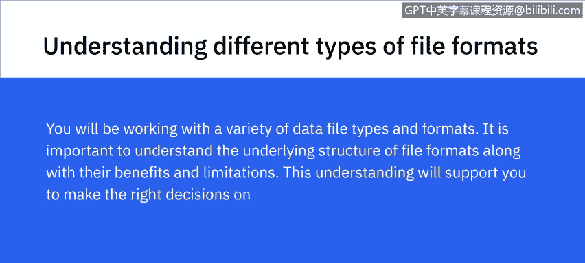

## 分隔文本文件 📄

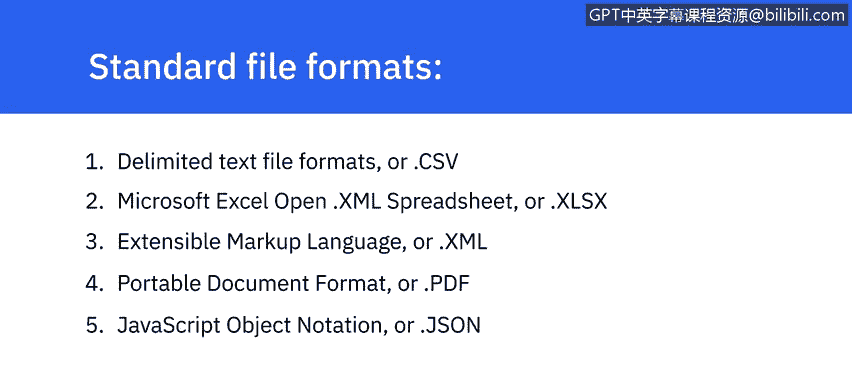

上一节我们概述了课程内容，本节中我们首先来看看**分隔文本文件**。这是一种以文本形式存储数据的文件，其中每一行（或每一行记录）的值都由一个特定的**分隔符**隔开。

分隔符是一个或多个字符的序列，用于指定独立实体或值之间的边界。任何字符都可以用作分隔符，但最常见的包括：**逗号**、**制表符**、**冒号**、**竖线**和**空格**。

以下是两种最常用的分隔文本文件类型：
*   **逗号分隔值（CSV）**：使用逗号 `,` 作为分隔符。
*   **制表符分隔值（TSV）**：使用制表符 `\t` 作为分隔符。当文本数据本身包含逗号时，TSV 可以作为 CSV 格式的替代方案。

在文本文件中，每一行代表一条记录，包含一组由分隔符分隔的值。第一行通常作为列标题，每一列可以包含不同类型的数据，例如日期、字符串或整数。

分隔文件允许字段值为任意长度，被视为提供直接信息模式的标准格式，并且几乎可以被所有现有应用程序处理。

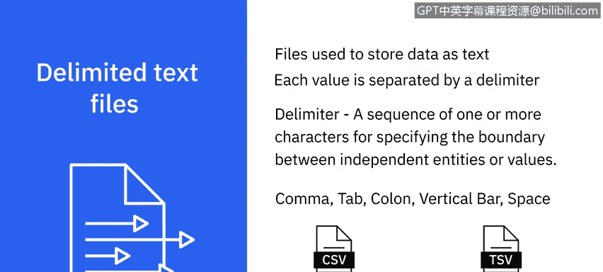

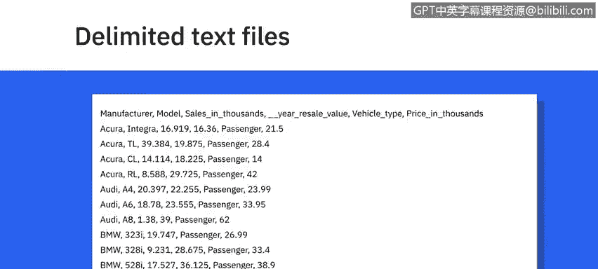

---

## Microsoft Excel Open XML 电子表格（XLSX）📊

了解了基础的文本格式后，我们来看看更结构化的电子表格格式。**Microsoft Excel Open XML 电子表格（XLSX）** 是一种基于 XML 的电子表格文件格式，由 Microsoft 创建。

一个 XLSX 文件也称为一个**工作簿**，其中可以包含多个**工作表**。每个工作表由行和列组织，行列交叉处称为**单元格**，每个单元格包含数据。

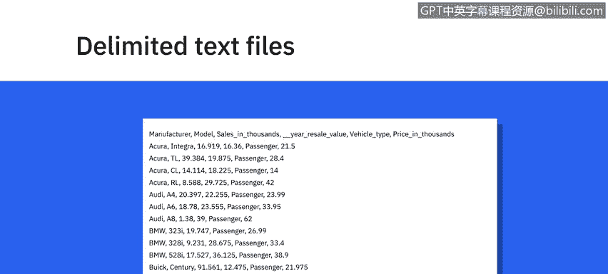

XLSX 采用开放文件格式，这意味着大多数其他应用程序通常都可以访问它。它可以使用和保存 Excel 中的所有功能，并且被认为是一种更安全的文件格式，因为它无法保存恶意代码。

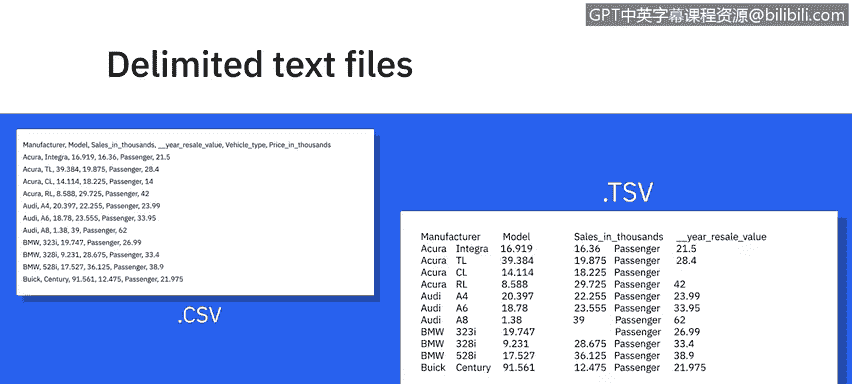

---

## 可扩展标记语言（XML）🏷️

接下来，我们探讨一种用于编码数据的标记语言。**可扩展标记语言（XML）** 是一种具有编码数据规则的标记语言。

XML 文件格式对人类和机器都可读。它是一种自描述语言，专为在互联网上传输信息而设计。

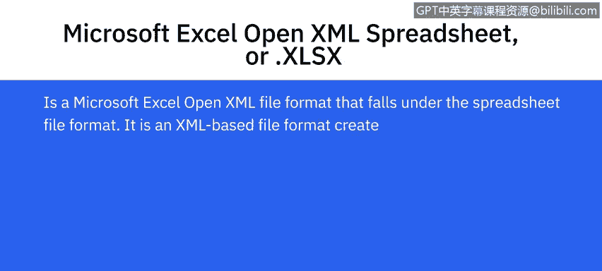

XML 在某些方面与 HTML 相似，但也有区别。例如，XML 不像 HTML 那样使用预定义的标签。XML 独立于平台和编程语言，因此简化了不同系统之间的数据共享。

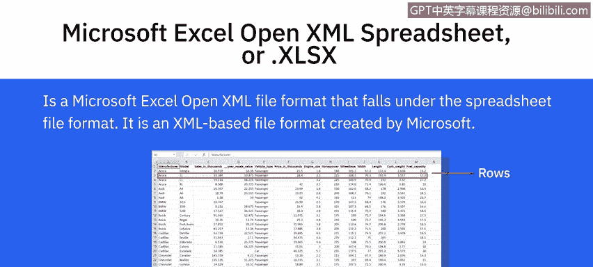

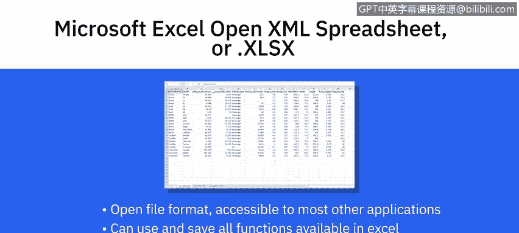

---

## 便携式文档格式（PDF）📑

除了用于数据交换的格式，我们还需要了解一种广泛用于文档分发的格式。**便携式文档格式（PDF）** 由 Adobe 开发，用于呈现独立于应用软件、硬件和操作系统的文档。

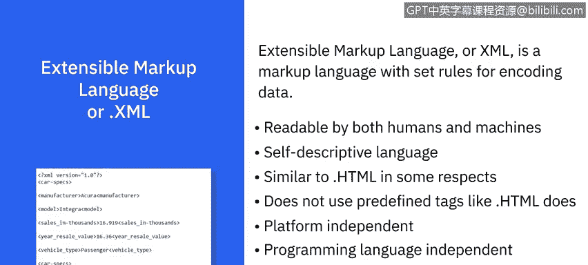

这意味着 PDF 文件在任何设备上查看的效果都相同。这种格式常用于法律和财务文件，也可用于填写表格等数据。

---

## JavaScript 对象表示法（JSON）🔤

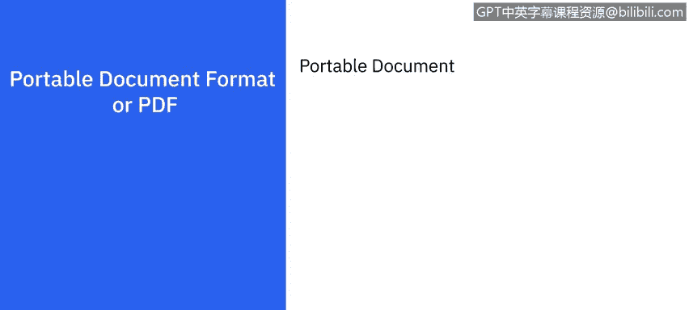

最后，我们学习一种在现代网络开发中至关重要的数据交换格式。**JavaScript 对象表示法（JSON）** 是一种基于文本的开放标准，专为在网络上传输结构化数据而设计。

JSON 是一种独立于语言的数据格式，可以用任何编程语言读取。它易于使用，与广泛的浏览器兼容，并被认为是共享任何大小和类型数据（甚至包括音频和视频）的最佳工具之一。这也是许多 API 和 Web 服务器以 JSON 格式返回数据的原因之一。

---

本节课中，我们一起学习了数据分析中五种常见的文件格式：**分隔文本文件（CSV/TSV）**、**Microsoft Excel Open XML 电子表格（XLSX）**、**可扩展标记语言（XML）**、**便携式文档格式（PDF）** 以及 **JavaScript 对象表示法（JSON）**。理解它们各自的特点和适用场景，是高效处理和分析数据的重要基础。