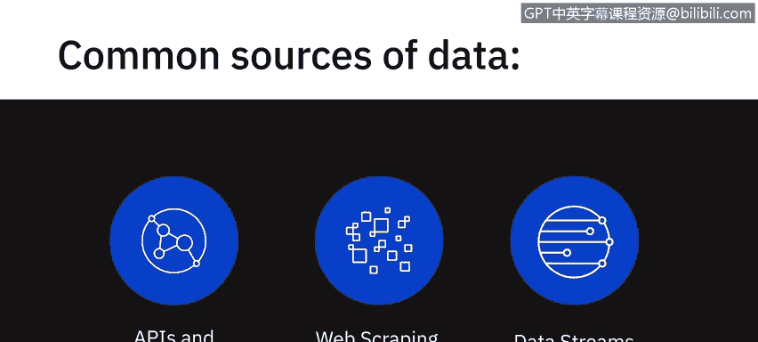
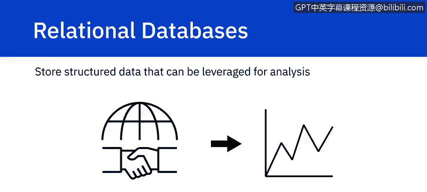
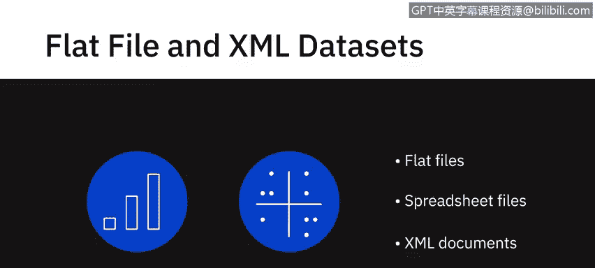
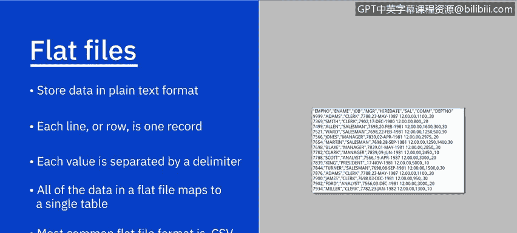
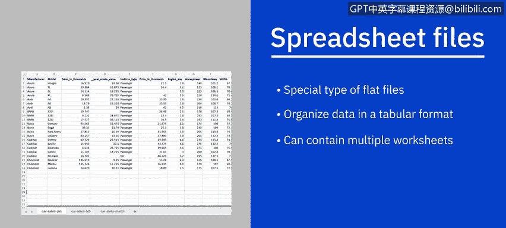
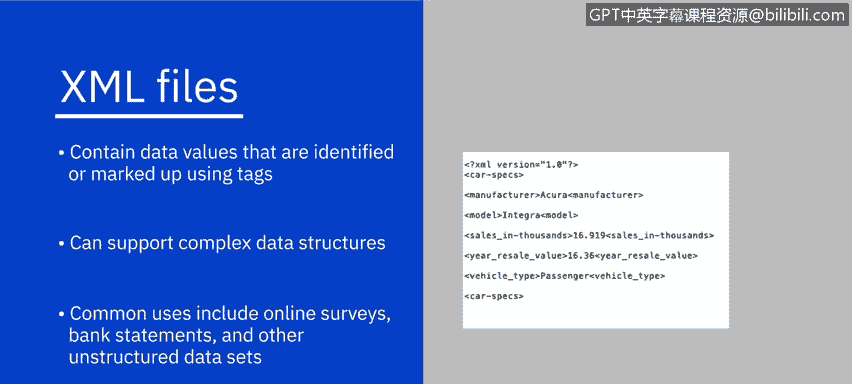
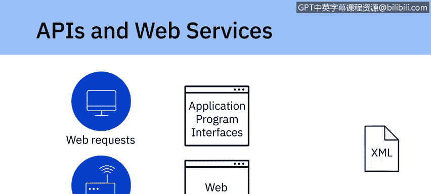
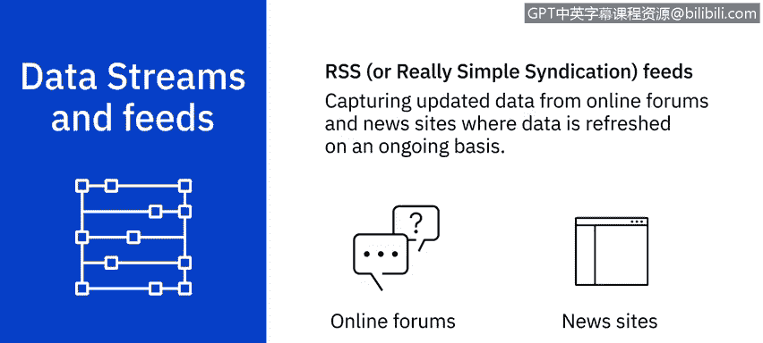

# 055：数据来源 📊

## 概述
在本节课中，我们将学习数据分析中常见的几种数据来源。正如我们在之前的视频中提到的，当今的数据来源比以往任何时候都更加动态和多样。我们将逐一探讨关系型数据库、平面文件、XML数据、API与网络服务、网络爬虫以及数据流与订阅源。

---

## 内部数据源：关系型数据库

上一节我们提到了数据来源的多样性，本节中我们首先来看看组织内部最常见的数据源。

通常，组织会使用内部应用程序来支持其日常业务活动、客户交易、人力资源活动和工作流程的管理。这些系统使用如 **SQL Server**、**Oracle**、**MySQL** 和 **IBM DB2** 等关系型数据库，以结构化的方式存储数据。

存储在数据库和数据仓库中的数据可以作为分析的数据源。例如，来自零售交易系统的数据可用于分析不同地区的销售情况，而来自客户关系管理系统的数据则可用于进行销售预测。

---

## 外部数据源：平面文件与XML

除了内部数据，组织外部也存在大量公开或私有的数据集可供使用。

例如，政府机构会持续发布人口统计和经济数据集。此外，还有一些公司专门销售特定数据，如销售点数据、金融数据或天气数据。企业可以利用这些数据来制定战略、预测需求，并做出与分销或营销促销等相关的决策。

这类数据集通常以平面文件、电子表格文件或XML文档的形式提供。

以下是几种常见的外部数据文件格式：

*   **平面文件**：以纯文本格式存储数据，每行一条记录，每个值由逗号、分号或制表符等分隔符分隔。平面文件中的数据映射到单个表，这与包含多个表的关系型数据库不同。最常见的平面文件格式是**CSV**，其值由逗号分隔。
    *   **示例代码/公式**：`id,name,age\n1,Alice,30\n2,Bob,25`
*   **电子表格文件**：这是一种特殊的平面文件，同样以表格格式（行和列）识别数据。但电子表格可以包含多个工作表，每个工作表可以映射到不同的表。虽然电子表格中的数据是纯文本，但文件可以以自定义格式存储，并包含格式、公式等附加信息。**Microsoft Excel**（存储为XLS或XLSX格式）可能是最常用的电子表格，其他还包括Google Sheets、Apple Numbers和LibroOffice。
*   **XML文件**：包含使用标签标识或标记的数据值。与映射到单个表的平面文件不同，XML文件可以支持更复杂的数据结构，例如层次结构。XML的一些常见用途包括来自在线调查、银行对账单和其他非结构化数据集的数据。

---

## 动态数据获取：API、网络服务与网络爬虫

在了解了静态文件格式后，我们来看看如何动态地获取数据。

许多数据提供商和网站提供**API**或应用程序编程接口以及**网络服务**，多个用户或应用程序可以与之交互，以获取数据进行处理或分析。API和网络服务通常监听传入的请求（这些请求可以来自用户的网络请求或应用程序的网络请求），并以纯文本、XML、HTML、JSON或媒体文件的形式返回数据。

让我们看一些将API用作数据分析数据源的流行例子：

*   使用Twitter和Facebook API从推文和帖子中获取数据，用于执行意见挖掘或情感分析等任务。
*   使用股市API提取股价和商品价格、每股收益和历史价格等数据，用于交易和分析。
*   使用数据查找和验证API，这对于数据分析师清理和准备数据以及核对数据非常有用。

**网络爬虫**用于从非结构化来源中提取相关数据，也称为屏幕抓取、网络采集和网络数据提取。它使得根据定义的参数从网页下载特定数据成为可能。网络爬虫可以从网站中提取文本、联系信息、图像、视频、产品项目等。

一些流行的网络爬虫用途包括：
*   从零售商、制造商和电子商务网站收集产品详情以提供价格比较。
*   通过公共数据源生成销售线索。
*   从各种论坛和社区提取帖子和作者数据。
*   为机器学习模型收集训练和测试数据集。

一些流行的网络爬虫工具包括 **Beautiful Soup**、**Scrapy**、**Pandas** 和 **Selenium**。

---

## 实时数据：数据流与订阅源

最后，我们来探讨持续更新的实时数据来源。

**数据流**是另一种广泛使用的数据源，用于聚合来自仪器、物联网设备、应用程序、汽车GPS数据、计算机程序、网站和社交媒体帖子等来源的持续数据流。这些数据通常带有时间戳，也可能带有地理标签以进行地理标识。

一些数据流及其利用方式包括：
*   用于金融交易的股票和市场行情。
*   用于预测需求和供应链管理的零售交易流。
*   用于威胁检测的监控和视频源。
*   用于情感分析的社交媒体源。
*   用于监控工业或农业机械的传感器数据源。
*   用于监控网络性能和改进设计的网络点击流。
*   用于重新预订和重新安排航班的实时航班事件。

一些用于处理数据流的流行应用程序包括 **Apache Kafka**、**Apache Spark Streaming** 和 **Apache Storm**。

**RSS** 是另一种流行的数据源，通常用于从在线论坛和新闻网站捕获持续更新的数据。使用订阅阅读器（一种将RSS文本文件转换为更新数据流的接口），更新内容会流向用户设备。

---

## 总结
本节课中，我们一起学习了数据分析中多种重要的数据来源。我们从组织内部的关系型数据库开始，扩展到外部的平面文件和XML数据。接着，我们探讨了通过API、网络服务和网络爬虫动态获取数据的方法。最后，我们了解了用于处理实时信息的数据流和订阅源。理解这些数据来源是进行有效数据分析的第一步。