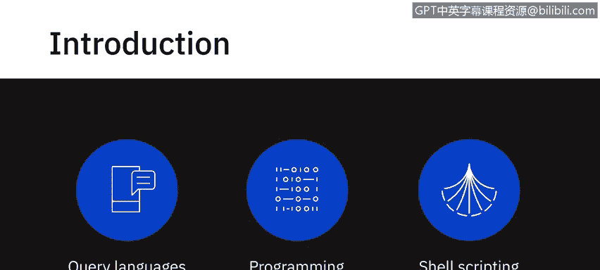
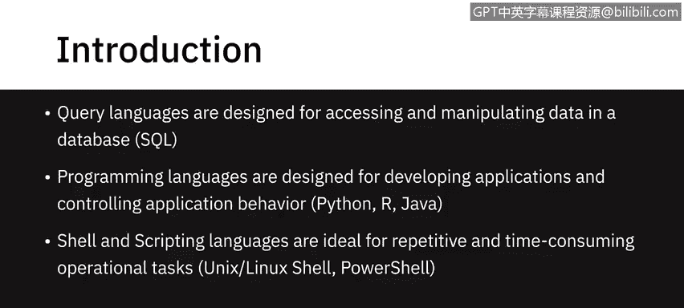
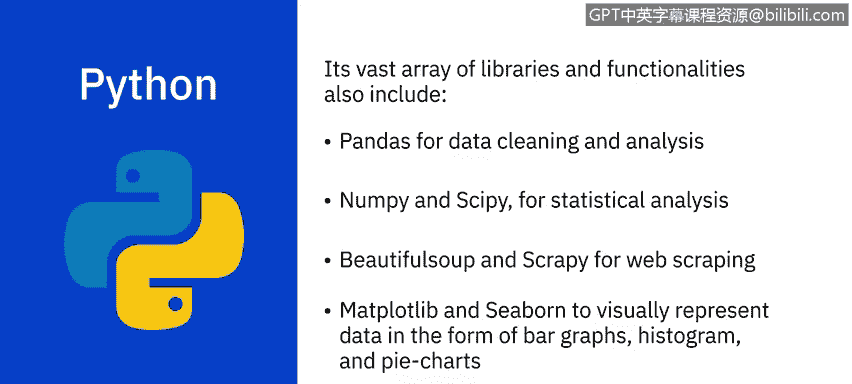
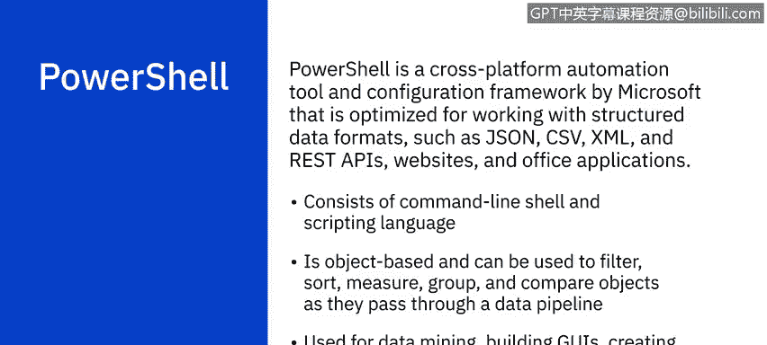

# 056：数据专业人员相关语言 🖥️

在本节课中，我们将学习数据专业人员工作中相关的一些语言。这些语言可以分为查询语言、编程语言和Shell脚本语言。对于任何数据专业人员而言，熟练掌握每个类别中的至少一种语言都至关重要。

接下来，我们将更深入地探讨这些语言。

## 查询语言：SQL

上一节我们介绍了语言的基本分类，本节中我们首先来看看查询语言。简单来说，查询语言是为访问和操作数据库中的数据而设计的。

例如，**SQL**（结构化查询语言）就是一种为访问和操作信息（主要但不限于关系型数据库）而设计的查询语言。使用SQL，我们可以编写一组指令来执行以下操作：
*   在数据库中插入、更新和删除记录。
*   创建新的数据库、表和视图。
*   编写存储过程，这意味着你可以编写一组指令并稍后调用它们。

以下是使用SQL的一些优势：
*   **可移植性**：SQL可跨平台使用。
*   **广泛适用**：可用于查询多种数据库和数据存储库中的数据，尽管不同供应商可能有各自的变体和特殊扩展。
*   **语法简单**：语法类似于英语，允许开发者用比其他一些编程语言更少的代码行来编写程序，使用如 `SELECT`、`INSERT INTO`、`UPDATE` 等基本关键字。
*   **高效检索**：能够快速高效地检索大量数据。
*   **解释型系统**：代码编写后可立即执行，使得原型设计快速简便。
*   **社区与生态**：拥有庞大的用户社区和多年积累的大量文档，是全球用户统一的平台。

## 编程语言：Python

了解了用于数据操作的SQL后，我们转向功能更广泛的编程语言。**Python** 是一种广泛使用的开源、通用、高级编程语言。与其他一些较老的语言相比，其语法允许程序员用更少的代码行表达概念。

Python因其注重简洁性、可读性以及较低的学习曲线，被视为最容易学习的语言之一，并拥有庞大的开发者社区。它是初学者的理想工具。

以下是Python的一些关键特点：
*   **高性能计算**：擅长处理海量数据的高计算任务，否则会非常耗时和繁琐。它提供如 `NumPy` 和 `Pandas` 这样的库，通过使用并行处理来简化任务。
*   **内置功能丰富**：为几乎所有常用概念提供了内置函数。
*   **多范式支持**：支持面向对象、命令式、函数式和过程式等多种编程范式，适用于广泛的用例。

现在，让我们看看使Python成为当今世界增长最快的编程语言之一的一些原因：
*   **易于学习**：与其他语言相比，可以用更少的代码行完成任务。
*   **开源免费**：Python是免费的，并采用社区驱动的开发模式。
*   **跨平台**：可在Windows和Linux环境中运行，并可移植到多个平台。
*   **强大的社区与库支持**：拥有广泛的社区支持，提供了大量有用的分析库。其庞大的库和功能包括：
    *   `Pandas`：用于数据清洗和分析。
    *   `NumPy` 和 `SciPy`：用于统计分析。
    *   `Beautiful Soup` 和 `Scrapy`：用于网络爬虫。
    *   `Matplotlib` 和 `Seaborn`：用于以条形图、直方图和饼图等形式可视化呈现数据。
    *   `OpenCV`：用于图像处理。

## 编程语言：R

除了Python，**R** 是另一个在数据分析领域举足轻重的语言。R是一种用于数据分析、数据可视化、机器学习和统计的开源编程语言和环境。它广泛用于开发统计软件和执行数据分析，尤其以其创建引人注目的可视化效果的能力而闻名，这使其在该领域比其他一些语言更具优势。

R的一些主要优点包括：
*   **开源与跨平台**：是一个开源、独立于平台的编程语言。
*   **可与其他语言集成**：可以与包括Python在内的许多编程语言配对使用。
*   **高度可扩展**：开发者可以通过定义新函数来持续添加功能。
*   **处理多种数据类型**：便于处理结构化和非结构化数据，意味着具有更全面的数据处理能力。
*   **强大的图形库**：拥有如 `ggplot2` 和 `plotly` 这样的库，为用户提供美观的图形绘图。
*   **报告与交互应用**：可以制作嵌入数据和脚本的报告，以及允许用户与结果和数据交互的交互式Web应用程序。
*   **统计工具开发**：在开发统计工具方面比其他编程语言更具优势。

## 编程语言：Java

我们已探讨了Python和R，现在来看看另一种强大的通用语言。**Java** 是一种面向对象、基于类且独立于平台的编程语言，最初由Sun Microsystems开发。它是当今使用最广泛的顶级编程语言之一。

Java在数据分析的多个过程中都有应用，包括数据清洗、数据导入导出、统计分析和数据可视化。事实上，大多数用于大数据的流行框架和工具通常都是用Java编写的，例如 `Hadoop`、`Hive` 和 `Spark`。它非常适合对速度要求苛刻的项目。

## Shell脚本语言

最后，我们来了解用于自动化任务的Shell脚本语言。**Unix/Linux Shell** 是为Unix Shell编写的计算机程序。它是写入纯文本文件中的一系列Unix命令，用于完成特定任务。

编写Shell脚本快速且简单。它对于重复性任务最为有用，这些任务如果一次键入一行命令来执行可能会非常耗时。Shell脚本执行的典型操作包括：
*   文件操作。
*   程序执行。
*   系统管理任务，如磁盘备份和评估系统日志。
*   复杂程序的安装脚本。
*   执行例行备份。
*   运行批处理作业。

**PowerShell** 是微软推出的跨平台自动化工具和配置框架，针对处理结构化数据格式（如JSON、CSV、XML）以及REST API、网站和Office应用程序进行了优化。它由命令行Shell和脚本语言组成。

PowerShell基于对象，这使得在对象通过数据管道时，可以对它们进行过滤、排序、测量、分组、比较等多种操作。它也是数据挖掘、构建GUI、创建图表、仪表板和交互式报告的良好工具。

---

本节课中我们一起学习了数据专业人员常用的几类语言：用于数据查询的SQL，用于通用编程和数据分析的Python、R和Java，以及用于自动化任务的Unix/Linux Shell和PowerShell脚本。掌握这些工具将为你未来的数据分析工作奠定坚实的基础。