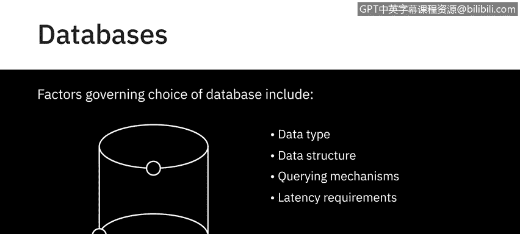
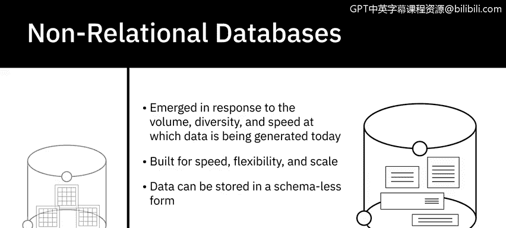
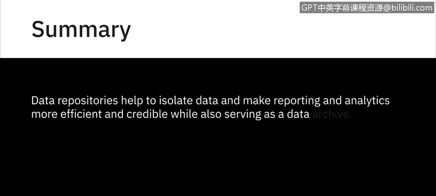

# 057：数据存储库概述 🗃️

在本节课中，我们将学习数据存储库的基本概念，并了解几种主要的数据存储类型，包括数据库、数据仓库和大数据存储。理解这些存储库的差异和用途，是进行有效数据分析的基础。

---

## 什么是数据存储库？

数据存储库是一个通用术语，指代那些被收集、组织和隔离起来，以便用于业务运营或用于报告和数据分析的数据。它可以是一个小型或大型的数据库基础设施，包含一个或多个用于收集、管理和存储数据的数据库。

在接下来的内容中，我们将概述您的数据可能驻留的不同类型的存储库，例如数据库、数据仓库和大数据存储，并在后续视频中更详细地研究它们。

---

## 数据库

让我们从数据库开始。数据库是为数据的输入、存储、搜索、检索和修改而设计的数据或信息集合。

数据库管理系统（DBMS）是一组用于创建和维护数据库的程序。它允许您使用名为“查询”的功能来存储、修改和从数据库中提取信息。

例如，如果您想查找已闲置六个月或更长时间的客户，使用查询功能，数据库管理系统将从数据库中检索所有已闲置六个月或更长时间的客户数据。

尽管数据库和DBMS含义不同，但这两个术语经常互换使用。

### 数据库的类型

有多种类型的数据库。选择数据库时需要考虑几个因素，例如数据类型和结构、查询机制、延迟要求、事务速度以及数据的预期用途。

以下是两种主要的数据库类型：

*   **关系型数据库**：也称为RDBMS，它建立在平面文件的组织原则之上，数据被组织成具有行和列的表格格式，遵循定义良好的结构和模式。然而，与平面文件不同，RDBMS针对涉及多个表和更大数据量的数据操作和查询进行了优化。结构化查询语言（SQL）是关系型数据库的标准查询语言。
*   **非关系型数据库**：也称为NoSQL或Not Only SQL。非关系型数据库的出现是为了应对当今数据生成的速度、多样性和体量，主要受到云计算、物联网和社交媒体普及的推动。非关系型数据库为速度、灵活性和规模而构建，使得以无模式或自由形式的方式存储数据成为可能。NoSQL被广泛用于处理大数据。

---

## 数据仓库

上一节我们介绍了数据库，本节中我们来看看数据仓库。数据仓库作为一个中央存储库，合并来自不同来源的信息，并通过提取、转换和加载过程（也称为ETL过程）将其整合到一个用于分析和商业智能的综合性数据库中。

在较高层次上，ETL过程帮助您从不同的数据源提取数据，将数据转换为干净可用的状态，并将数据加载到企业的数据存储库中。

与数据仓库相关的概念还有数据集市和数据湖，我们将在后面介绍。数据集市和数据仓库在历史上一直是关系型的，因为许多传统的企业数据都驻留在RDBMS中。然而，随着NoSQL技术和新数据源的出现，非关系型数据存储库现在也被用于数据仓库。

---

## 大数据存储

另一类数据存储库是大数据存储，它包括分布式计算和存储基础设施，用于存储、扩展和处理非常大的数据集。

---

## 总结

本节课中我们一起学习了数据存储库的核心概念。总体而言，数据存储库有助于隔离数据，使报告和分析更高效、更可靠，同时也充当数据档案。

数据存储库主要分为数据库、数据仓库和大数据存储等类型。数据库是基础，分为关系型（使用SQL）和非关系型（NoSQL）。数据仓库通过ETL过程整合多源数据用于分析。大数据存储则专门处理海量、高速、多样的数据集。理解这些是选择合适工具进行数据分析的关键一步。