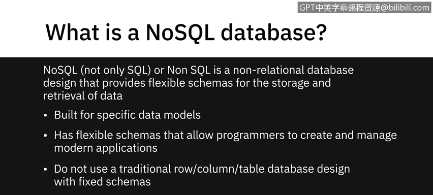
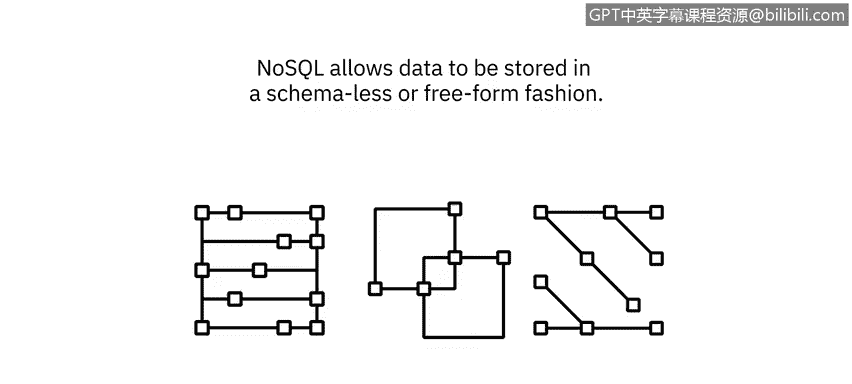
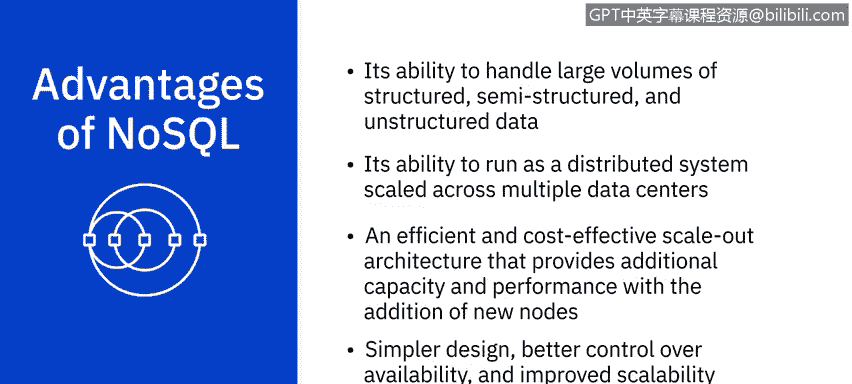
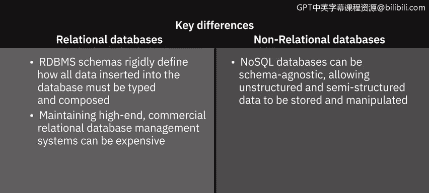

# 059：NoSQL 数据库简介 🗄️

在本节课中，我们将要学习 NoSQL 数据库。我们将了解 NoSQL 的含义、它与传统数据库的区别、主要的四种类型及其适用场景，并总结其核心优势。

---

NoSQL，全称是“Not Only SQL”（不仅仅是 SQL），有时也指“Non SQL”（非 SQL）。它是一种非关系型数据库设计，为数据的存储和检索提供了灵活的架构。

NoSQL 数据库已存在多年，但直到云计算、大数据以及高流量网络和移动应用时代才变得更为流行。如今，人们选择它们是因为其在扩展性、性能和易用性方面的特性。需要强调的是，“No” 在 NoSQL 中是 “Not Only” 的缩写，而不是“不”的意思。

NoSQL 数据库为特定的数据模型构建，并拥有灵活的架构，允许程序员创建和管理现代应用程序。它们不使用具有固定架构的传统行列式表格数据库设计，并且通常不使用结构化查询语言（SQL）来查询数据，尽管有些可能支持 SQL 或类 SQL 接口。

NoSQL 允许数据以无模式或自由格式的方式存储。任何数据，无论是结构化的、半结构化的还是非结构化的，都可以存储在任何记录中。

根据用于存储数据的模型，NoSQL 数据库主要有四种常见类型。

以下是四种主要的 NoSQL 数据库类型：

*   **键值存储**：在键值数据库中，数据以键值对的集合形式存储。键代表数据的属性，并且是唯一标识符。键和值都可以是任何内容，从简单的整数或字符串到复杂的 JSON 文档。键值存储非常适合存储用户会话数据和用户偏好、进行实时推荐和定向广告以及内存数据缓存。然而，如果您需要根据特定的数据值进行查询、需要数据值之间的关系或需要多个唯一键，键值存储可能不是最佳选择。Redis、Memcached 和 DynamoDB 是此类别中一些知名的例子。
*   **文档型数据库**：文档数据库将每条记录及其关联数据存储在单个文档中。它们支持对文档集合进行灵活的索引、强大的即席查询和分析。文档数据库更适用于电子商务平台、医疗记录存储、CRM 平台和分析平台。但是，如果您需要运行复杂的搜索查询和多个操作的事务，文档型数据库可能不是您的最佳选择。MongoDB、DocumentDB、CouchDB 和 Cloudant 是一些流行的文档型数据库。
*   **列式数据库**：列式模型将数据存储在按数据列（而非行）分组的单元格中。通常一起访问的列的逻辑分组称为列族。例如，客户的姓名和个人资料信息很可能被一起访问，但他们的购买历史则不会，因此客户姓名和个人资料信息数据可以分组到一个列族中。由于列数据库将对应于某一列的所有单元格作为连续的磁盘条目存储，因此访问和搜索数据变得非常快。列数据库非常适合需要大量写入请求的系统、存储时间序列数据、天气数据和物联网数据。但是，如果您需要使用复杂查询或频繁更改查询模式，这可能不是最佳选择。最流行的列数据库是 Cassandra 和 HBase。
*   **图数据库**：图数据库使用图模型来表示和存储数据。它们对于可视化、分析和查找不同数据片段之间的连接特别有用。圆圈是节点，它们包含数据。箭头代表关系。图数据库是处理连接数据（即包含大量互连关系的数据）的绝佳选择。图数据库非常适合社交网络、实时产品推荐、网络图、欺诈检测和访问管理。但是，如果您想要处理大量事务，它可能不是最佳选择，因为图数据库并未针对大容量分析查询进行优化。Neo4j 和 Cosmos DB 是一些更流行的图数据库。

NoSQL 的创建是为了应对传统关系数据库技术的局限性。NoSQL 的主要优势在于其处理大量结构化、半结构化和非结构化数据的能力。它的其他一些优点包括：能够作为分布式系统在多个数据中心扩展，这使得它们能够利用云计算基础设施；高效且经济高效的横向扩展架构，通过添加新节点提供额外的容量和性能；以及更简单的设计、更好的可用性控制和改进的可扩展性，使您能够更加敏捷、灵活并更快地进行迭代。

上一节我们介绍了 NoSQL 的优势，本节我们来总结一下关系型数据库与非关系型数据库之间的关键区别。

以下是关系型数据库与非关系型数据库的关键区别：

*   **架构**：RDBMS 的架构严格定义了插入数据库的所有数据的类型和组成方式，而 NoSQL 数据库可以是模式无关的，允许存储和操作非结构化和半结构化数据。
*   **成本**：维护高端的商业关系数据库管理系统成本高昂，而 NoSQL 数据库专门为低成本商用硬件设计。
*   **事务与可靠性**：与大多数 NoSQL 不同，关系数据库支持 ACID 合规性，这确保了事务的可靠性和故障恢复能力。
*   **技术成熟度**：RDBMS 是一项成熟且有良好文档记录的技术，这意味着其风险或多或少是可预见的，而 NoSQL 是一项相对较新的技术。

尽管如此，NoSQL 数据库已经站稳脚跟，并且越来越多地用于关键任务应用程序。

---

本节课中，我们一起学习了 NoSQL 数据库。我们明确了 NoSQL 代表“不仅仅是 SQL”，了解了其灵活的、非关系型的设计特点。我们详细探讨了四种主要的 NoSQL 数据库类型：键值存储、文档型、列式和图数据库，并分析了它们各自的适用场景。最后，我们总结了 NoSQL 在处理海量多样化数据、扩展性和敏捷性方面的核心优势，以及它与传统关系型数据库在架构、成本、事务和成熟度方面的关键区别。