# 061：大数据基础 🚀

在本节课中，我们将要学习大数据的基本概念。我们将了解什么是大数据，以及描述其核心特征的“5V”模型。通过理解这些概念，你将能够认识到大数据在现代世界中的普遍性和重要性。

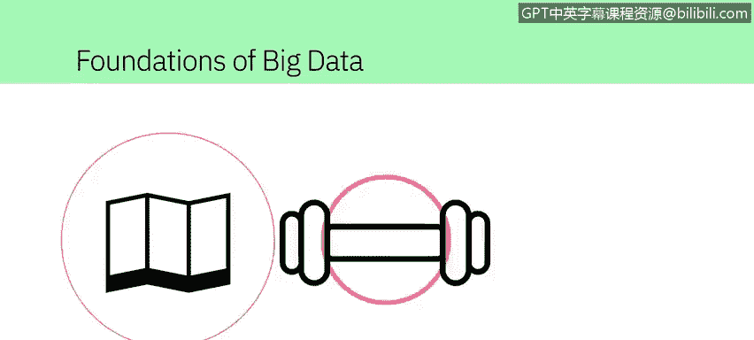

---

在这个数字化的世界里，每个人都留下了痕迹，从我们的出行习惯到锻炼和娱乐活动。

我们日常交互的、数量日益增长的联网设备，记录了大量关于我们的数据。

甚至有一个专门的术语来描述它：**大数据**。安永（Ernst & Young）提供了以下定义。

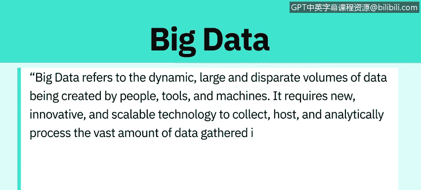

大数据指的是由人、工具和机器产生的动态、海量且多样化的数据集合。

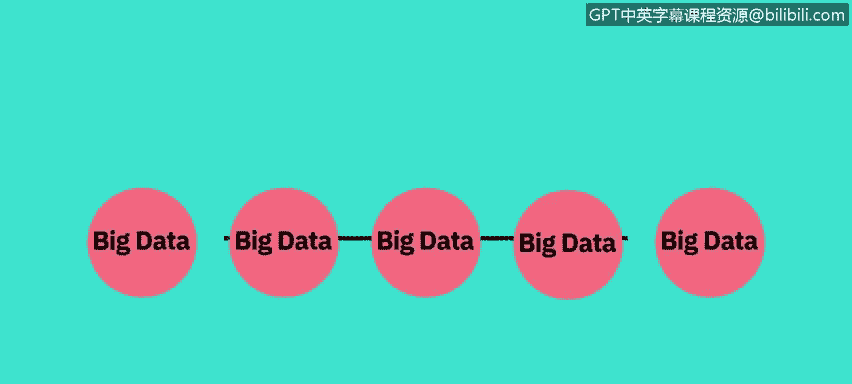

它需要新颖、创新且可扩展的技术来收集、存储和分析所获取的海量数据，以驱动与消费者、风险、利润、绩效、生产力管理和提升股东价值相关的实时商业洞察。

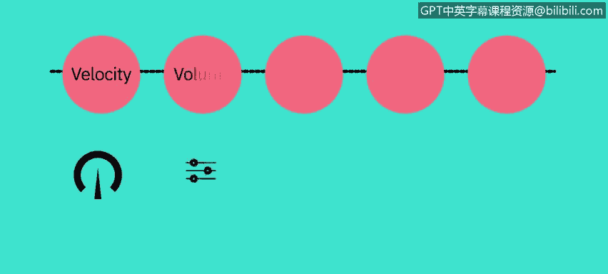

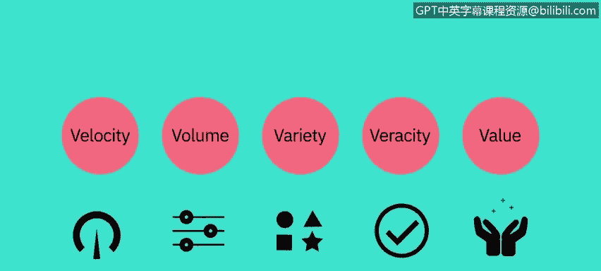

对于大数据并没有一个统一的定义，但在不同的定义中存在一些共同的要素。

例如：**速度（Velocity）、体量（Volume）、多样性（Variety）、真实性（Veracity）和价值（Value）**。

这些就是大数据的 **“5V”** 特征。

---

上一节我们介绍了大数据的“5V”模型，本节中我们来详细看看每一个“V”的具体含义。

**速度（Velocity）** 指的是数据积累的速度；数据正以极快的速度生成，这个过程永不停止。

近实时或实时的流处理、本地和基于云的技术可以非常快速地处理信息。

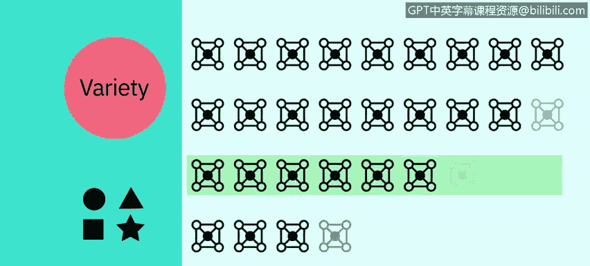

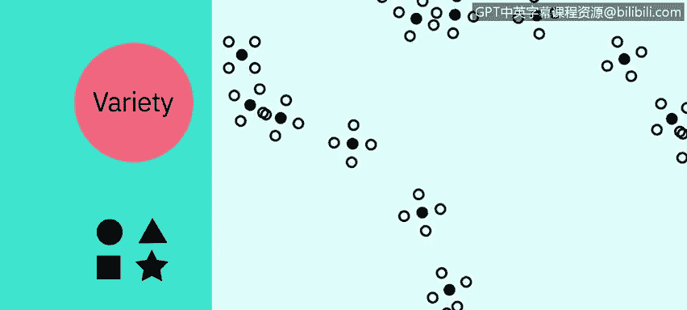

**体量（Volume）** 指的是数据的规模或存储数据量的增长。

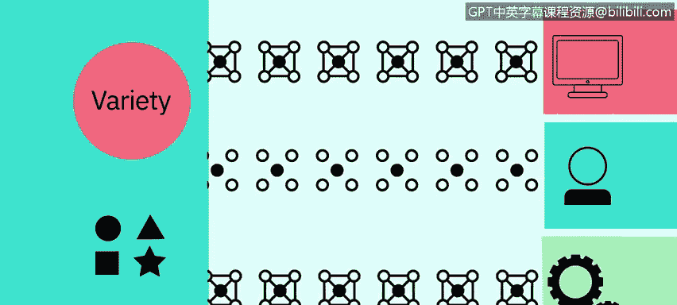

驱动数据体量增长的因素包括数据源的增加、更高分辨率的传感器以及可扩展的基础设施。

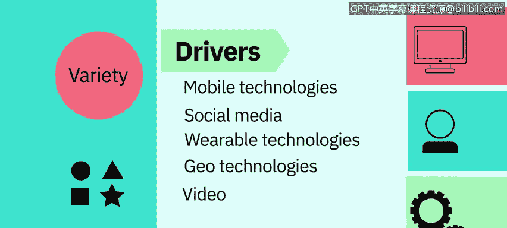

**多样性（Variety）** 指的是数据的多样性。

**结构化数据** 能整齐地放入行、列和关系型数据库中，而**非结构化数据** 则没有预定义的组织方式，例如推文、博客文章、图片、数字和视频。

多样性也反映了数据来自不同的来源：机器、人员和流程，既有组织内部的，也有外部的。

驱动数据多样性的因素包括移动技术、社交媒体、可穿戴技术、地理技术、视频等等。

**真实性（Veracity）** 指的是数据的质量和来源，以及其与事实和准确性的符合程度。

属性包括一致性、完整性、完整性和明确性。

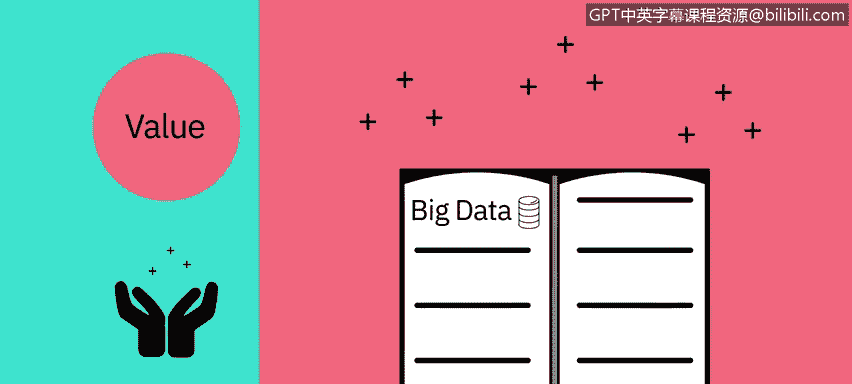

驱动因素包括成本和对海量数据可追溯性的需求。关于数字时代数据准确性的争论非常激烈：信息是真实的还是虚假的？

**价值（Value）** 指的是我们将数据转化为价值的能力和需求。价值不仅仅是利润。

它可能具有医疗或社会效益，以及客户、员工或个人满意度。

人们投入时间去理解大数据的主要原因就是为了从中**提取价值**。

---

理解了每个“V”的定义后，让我们通过一些实例来看看它们在实际中是如何体现的。

以下是“5V”特征的一些具体例子：

*   **速度**：每分钟，都有数小时的视频被上传到YouTube，这就在不断生成数据。试想一下，数据在几小时、几天和几年内积累的速度有多快。
*   **体量**：世界人口约为70亿，其中绝大多数人现在都在使用数字设备，如手机、台式机和笔记本电脑、可穿戴设备等。这些设备每天生成、捕获和存储大约**2.5万亿亿字节**的数据，这相当于1000万张蓝光DVD的容量。
*   **多样性**：让我们想想不同类型的数据：文本、图片、电影、声音、来自可穿戴设备的健康数据，以及来自物联网设备的各种不同类型的数据。
*   **真实性**：80%的数据被认为是非结构化的，我们必须设计方法来产生可靠和准确的洞察；数据必须被分类、分析和可视化。
*   **价值**：数据科学家从大数据中提取洞察，并应对这些海量数据集带来的挑战。最终目标是将原始数据转化为对个人、企业或社会有意义的**价值**。

---

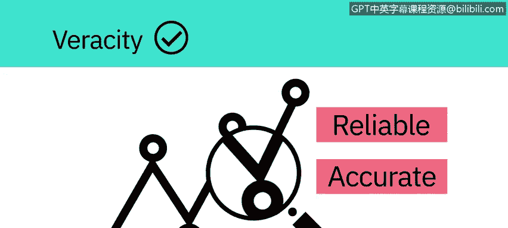

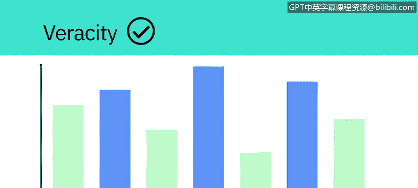

面对如此庞大和复杂的数据，传统的分析工具往往力不从心。接下来，我们看看数据科学家是如何应对这些挑战的。

如今，数据科学家从大数据中提取洞察，并应对这些海量数据集带来的挑战。

所收集数据的规模意味着使用传统的数据分析工具是不可行的。

然而，利用分布式计算能力的替代工具可以克服这个问题。

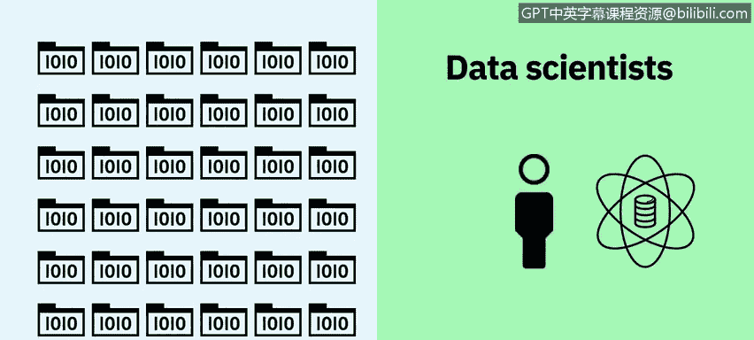

像 **Apache Spark**、**Hadoop** 及其生态系统这样的工具，提供了跨分布式计算资源提取、加载、分析和处理数据的方法，从而提供新的洞察和知识。

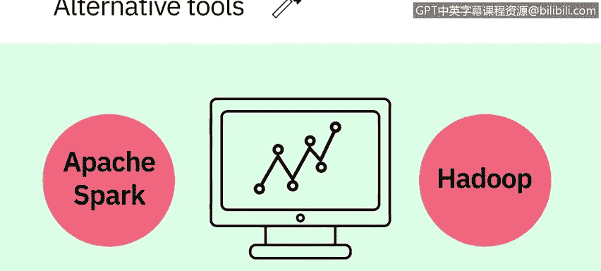

这为组织提供了更多与其客户连接的方式，并丰富了他们提供的服务。

所以，下次当你戴上智能手表、解锁智能手机或追踪你的锻炼时，请记住：你的数据正在开始一段旅程，它可能通过大数据分析环游世界，然后再回到你身边。

---

本节课中我们一起学习了大数据的基础知识。我们探讨了安永对大数据的定义，并深入理解了描述其核心特征的“5V”模型：**速度、体量、多样性、真实性和价值**。我们还通过实例看到了这些特征在现实世界中的体现，并了解了数据科学家如何使用如 Apache Spark 和 Hadoop 等工具来处理海量数据并从中提取价值。理解这些基础概念是迈入数据分析世界的重要一步。