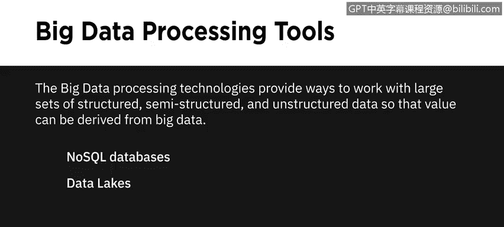
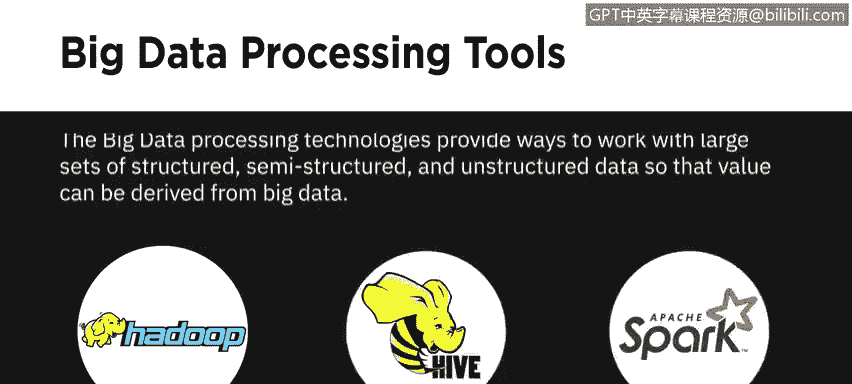
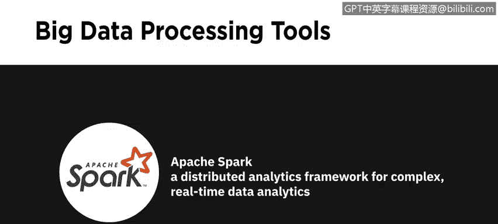
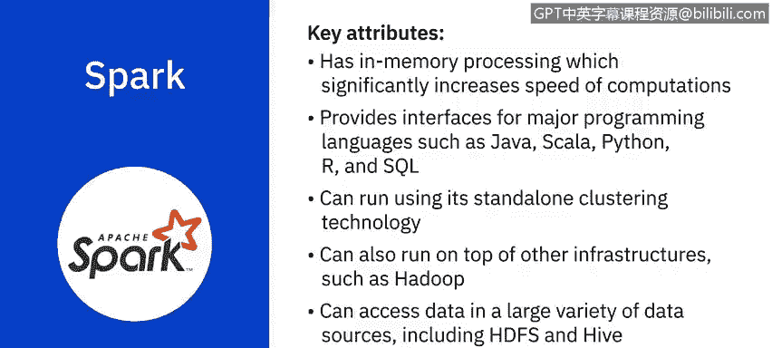

# 062：大数据处理工具 🛠️

在本节课中，我们将学习三种开源大数据处理技术：Apache Hadoop、Apache Hive 和 Apache Spark。我们将了解它们各自的功能、特点以及在大数据分析中扮演的角色。

---

## 大数据处理技术概述

大数据处理技术提供了处理大规模结构化、半结构化和非结构化数据集的方法，以便从大数据中提取价值。

在之前的视频中，我们讨论过 NoSQL 数据库和数据湖等技术。本节中，我们将重点介绍三种开源技术及其在大数据分析中的作用。

以下是三种核心工具：
*   **Apache Hadoop**：一个工具集合，提供大数据的分布式存储和处理。
*   **Apache Hive**：构建在 Hadoop 之上的数据仓库，用于数据查询和分析。
*   **Apache Spark**：一个分布式数据分析框架，旨在实时执行复杂的数据分析。

---

## Apache Hadoop：分布式存储与处理的基石

上一节我们概述了三种工具，本节中我们来看看 Apache Hadoop 的具体架构和优势。

Hadoop 是一个基于 Java 的开源框架，允许在计算机集群组成的分布式系统中，对大型数据集进行分布式存储和处理。在 Hadoop 分布式系统中，一台单独的计算机称为一个**节点**，而节点的集合则构成一个**集群**。

Hadoop 可以从单个节点扩展到任意数量的节点，每个节点都提供本地存储和计算能力。它为存储数据提供了一个可靠、可扩展且经济高效的解决方案，并且对数据格式没有要求。

使用 Hadoop，你可以整合新兴的数据格式（如流媒体音频、视频、社交媒体情绪和点击流数据），以及传统数据仓库中不常使用的结构化、半结构化和非结构化数据。

Hadoop 的主要优势包括：
*   **为所有利益相关者提供近乎实时的服务访问**。
*   **优化和简化企业数据仓库成本**：通过整合整个组织的数据，并将“冷数据”（不频繁使用的数据）迁移到基于 Hadoop 的系统。

### Hadoop 分布式文件系统

Hadoop 的四个主要组件之一是 **Hadoop 分布式文件系统**。这是一个为大数据设计的存储系统，运行在通过网络连接的多台商用硬件上。

HDFS 通过将文件分区存储到多个节点上，提供了可扩展且可靠的大数据存储。它将大文件分割并存储在多台计算机上，允许并行访问。因此，计算可以在存储数据的每个节点上并行运行。它还会在不同的节点上复制文件块以防止数据丢失，使其具备**容错性**。

让我们通过一个例子来理解。假设有一个包含全美国电话号码的文件。姓氏以 A 开头的人的电话号码可能存储在服务器 1 上，以 B 开头的存储在服务器 2 上，依此类推。在 Hadoop 中，这个电话簿的各个部分会分布存储在集群中。要重建整个电话簿，你的程序需要从集群中的每台服务器获取数据块。

默认情况下，HDFS 还会将这些较小的数据块复制到另外两台服务器上，确保当一台服务器故障时数据仍然可用。

除了更高的可用性，HDFS 还带来以下好处：
*   **更好的可扩展性**：允许 Hadoop 集群将工作分解成更小的块，并在集群中的所有服务器上运行这些任务。
*   **数据本地性**：将计算过程移动到数据所在的节点附近。这在处理大型数据集时至关重要，因为它能最大限度地减少网络拥塞并提高吞吐量。

使用 HDFS 的其他好处还包括：
*   **强大的硬件故障恢复能力**：HDFS 专为检测故障和自动恢复而构建。
*   **支持流数据访问**：HDFS 支持高数据吞吐率。
*   **容纳大型数据集**：HDFS 可以扩展到单个集群中的数百个节点或计算机。
*   **可移植性**：HDFS 可在多个硬件平台上移植，并与各种底层操作系统兼容。

---

## Apache Hive：基于 Hadoop 的数据仓库

了解了 Hadoop 的存储基础后，我们来看看构建在其之上的数据查询工具 Apache Hive。

Hive 是一个开源数据仓库软件，用于读取、写入和管理直接存储在 HDFS 或其他数据存储系统（如 Apache HBase）中的大型数据集文件。

由于 Hadoop 是为长时间顺序扫描设计的，而 Hive 基于 Hadoop，因此其查询具有**很高的延迟**。这意味着 Hive 不太适合需要极快响应时间的应用程序。

Hive 也不适合通常涉及大量写操作的事务处理。它更适用于数据仓库任务，如 **ETL**、报告和数据分析，并且包含支持通过 **SQL** 轻松访问数据的工具。

---

## Apache Spark：实时处理与复杂分析引擎

上一节我们介绍了适用于批处理查询的 Hive，本节中我们来看看专为速度和实时处理设计的 Apache Spark。

Spark 是一个通用的数据处理引擎，旨在为广泛的应用程序提取和处理海量数据，包括交互式分析、流处理、机器学习、数据集成和 ETL。

它利用**内存处理**来显著提高计算速度，只有在内存受限时才将数据溢出到磁盘。

Spark 支持多种主流编程语言接口，如 Java、Scala、Python、R 和 SQL。它可以使用其独立的集群技术运行，也可以在其他基础设施（如 Hadoop）之上运行。它能够访问多种数据源（包括 HDFS 和 Hive）中的数据，使其具有高度的通用性。

**快速处理流数据并实时执行复杂分析是 Apache Spark 的关键用例。**

---

## 课程总结

在本节课中，我们一起学习了三种核心的大数据处理开源工具：
1.  **Apache Hadoop**：提供了分布式存储和处理的底层框架，核心是容错的 HDFS。
2.  **Apache Hive**：构建在 Hadoop 之上的数据仓库，允许使用 SQL 进行查询，适用于高延迟的批处理任务。
3.  **Apache Spark**：一个利用内存计算的数据处理引擎，专为低延迟、实时处理和复杂分析而设计，能处理流数据和批量数据。

理解这些工具的特性和适用场景，是构建有效大数据分析解决方案的基础。