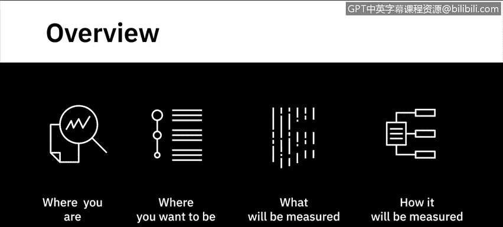
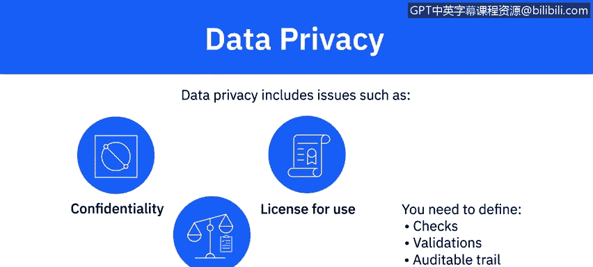

# 063：识别用于分析的数据 📊

在本节课中，我们将学习数据分析流程中的一个关键步骤：如何识别和确定分析所需的数据。我们将了解从明确信息需求、制定收集计划到选择收集方法的完整过程，并探讨数据质量、治理与隐私等重要考量因素。

---

## 理解问题与目标

上一节我们讨论了如何定义问题和期望的成果。现在，你已经清楚现状与目标，并拥有定义明确的衡量指标。你知道要测量什么以及如何测量。

接下来的步骤是为你的具体用例识别所需的数据。

## 确定所需信息

识别数据的过程始于确定你想要收集的信息。在此步骤中，你需要决定所需的具体信息以及这些数据的可能来源。你的目标决定了这些问题的答案。

我们以一个产品公司为例，该公司希望根据最喜爱其产品的年龄段来创建有针对性的营销活动。他们的目标是设计最能吸引该细分群体的推广方式，并鼓励他们进一步影响其朋友和同龄人购买这些产品。

基于这个用例，你将识别出的一些明显信息包括：
*   客户档案
*   购买历史
*   地理位置
*   年龄
*   教育程度
*   职业
*   收入
*   婚姻状况

为了确保你对该细分群体有更深入的了解，你可能还会决定收集该群体的客户投诉数据，以了解他们遇到的问题类型。因为这可能会阻碍他们推荐你的产品。

为了了解他们对问题解决的满意度，你可以收集他们客户服务调查的评分。

更进一步，你可能希望了解这些客户在社交媒体上如何谈论你的产品，以及有多少他们的联系人在这些讨论中与他们互动。例如，他们的帖子获得的点赞、分享和评论数量。

## 制定数据收集计划

识别信息后，下一步是制定数据收集计划。你需要为已识别的数据建立一个收集时间框架。你需要的某些数据可能需要持续收集，而另一些则需要在特定时间段内收集。

例如，收集网站访问者数据可能需要实时更新数字。但如果你正在跟踪特定事件的数据，则收集数据有明确的开始和结束日期。

在此步骤中，你还可以定义需要多少数据才能进行可信的分析。数据量是由细分群体定义的吗？例如，是 21 至 30 岁年龄段的所有客户，还是该年龄段内 10 万名客户的数据集。

你还可以利用此步骤来定义依赖关系、风险、缓解计划以及与你的项目相关的其他几个因素。该计划的目的是为执行建立所需的清晰度。

## 确定数据收集方法

制定计划后，流程的第三步是确定你的数据收集方法。在此步骤中，你将确定收集所需数据的方法。

你将定义如何从已识别的数据源（如内部系统、社交媒体网站或第三方数据提供商）收集数据。你的方法将取决于数据类型、你需要数据的时间框架以及数据量。

一旦你的计划和数据收集方法最终确定，你就可以实施数据收集策略并开始收集数据。在实施过程中，你需要根据实际情况不断更新你的计划，因为条件会随着计划的落地而演变。

## 数据质量、治理与隐私考量

你识别的数据、数据来源以及你用于收集数据的实践，都会对质量、安全性和隐私产生影响。这些都不是一次性的考虑因素，而是在数据分析流程的整个生命周期中都相关。

以下是需要考虑的关键方面：

**数据质量**
在不考虑数据如何衡量质量指标的情况下，使用来自不同来源的数据可能导致失败。为了可靠，数据需要**无错误、准确、完整、相关且可访问**。你需要定义质量特征、指标和检查点，以确保你的分析将基于高质量的数据。

**数据治理**
你还需要注意与数据治理相关的问题，例如安全、法规和合规性。数据治理政策和程序涉及数据的可用性、完整性和可用性。不合规的处罚可能高达数百万美元，不仅会损害你研究结果的可信度，还会损害你组织的信誉。

**数据隐私**
你收集的数据需要满足**保密性、使用许可和遵守强制性法规**的要求。需要计划好检查、验证和可审计的追踪记录。对用于分析的数据失去信任可能会损害流程，导致可疑的研究结果并招致处罚。

---

## 总结

在本节课中，我们一起学习了识别分析数据的关键步骤。我们了解到，这个过程始于根据业务目标确定所需信息，接着需要制定详细的收集计划和时间框架，然后选择合适的数据收集方法。最后，我们强调了在整个过程中持续关注**数据质量**、遵守**数据治理**政策以及保护**数据隐私**的极端重要性。正确执行这一步骤，将确保你能够从多个角度审视问题，并使你的研究发现可信且可靠。