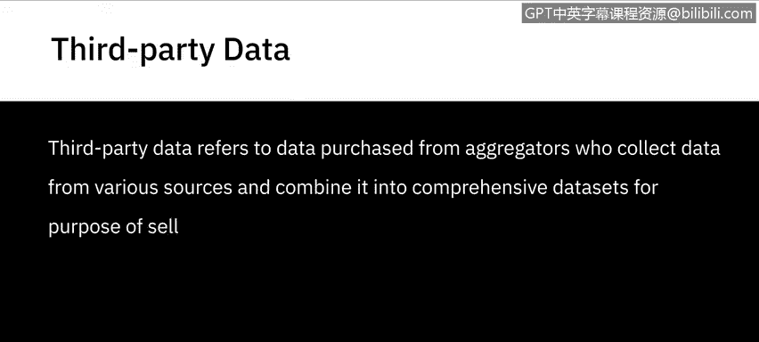
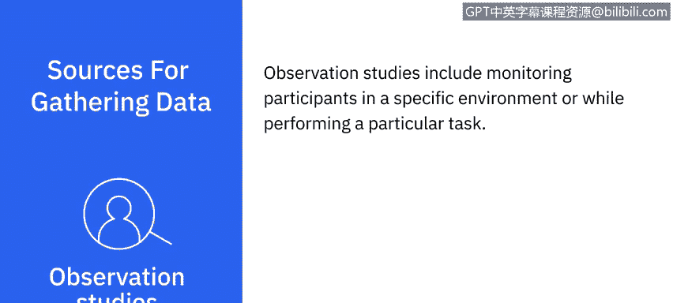
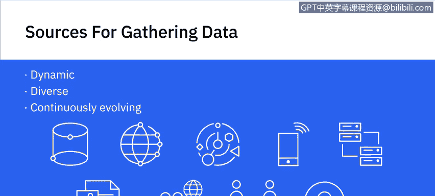

# 064：数据来源 📊

在本节课中，我们将要学习数据分析中一个基础但至关重要的概念：**数据来源**。理解数据从何而来，以及如何区分不同类型的数据，是进行有效分析的第一步。

数据来源可以是组织内部的，也可以是外部的。同时，根据获取方式，数据可以分为**一手数据**、**二手数据**和**第三方数据**。接下来，我们通过几个例子来具体理解这些概念。

---

## 一手数据、二手数据与第三方数据

**一手数据**指的是你直接从源头获取的信息。
这可以来自内部来源，例如组织的客户关系管理（CRM）系统、人力资源（HR）系统或工作流应用程序中的数据。
它也包括你通过**调查、访谈、讨论、观察和焦点小组**直接收集的数据。

**二手数据**指的是从现有来源检索到的信息，例如外部数据库、研究文章、出版物、培训材料、互联网搜索或作为公开数据提供的财务记录。
这也包括通过外部机构进行的调查、访谈、讨论、观察和焦点小组所收集的数据。

**第三方数据**是你从数据聚合商处购买的数据。这些聚合商从各种来源收集数据，并将其整合成综合数据集，其目的纯粹是为了销售数据。

---

## 主要的数据来源类型

上一节我们介绍了数据的分类，本节中我们来看看数据具体可以从哪些渠道获取。以下是常见的数据来源：

**数据库**
数据库可以是一手、二手和第三方数据的来源。
大多数组织都有用于管理其流程、工作流和客户的内部应用程序。
外部数据库通常需要订阅或购买才能使用。

**云端**
大量企业已经或正在将业务迁移到云端。
云端正日益成为获取实时信息和按需洞察的数据来源。

**互联网**
互联网是公开可用数据的来源，可供公司和个人免费或商业使用。
互联网是公共领域中丰富的数据来源，包括教科书、政府记录、可供公众消费的文章等。

**社交媒体**
诸如 Facebook、Twitter、Google、YouTube 和 Instagram 等社交媒体网站和互动平台，正越来越多地被用于获取用户数据和观点。
企业利用这些数据源来获取关于现有和潜在客户的定量和定性洞察。

**物联网与传感器**
由可穿戴设备、智能建筑、智慧城市、智能手机、医疗设备甚至家用电器产生的传感器数据，是一个被广泛使用的数据来源。

**数据交换**
数据交换是第三方数据的一个来源，涉及数据提供者和数据消费者之间自愿共享数据。
个人、组织和政府都可以同时是数据提供者和数据消费者。
交换的数据可能来自商业应用程序、传感器设备、社交媒体活动、位置数据或消费者行为数据。

**调查**
调查通过向特定人群分发问卷来收集信息。
例如，衡量现有客户对产品升级版的兴趣和消费意愿。
调查可以是基于网络的，也可以是纸质的。
人口普查数据也是收集家庭数据（如财富和收入）或人口数据的常用来源。

**访谈**
访谈是收集定性数据的来源，例如参与者的意见和经验。
例如，为理解客服专员日常面临的挑战而进行的访谈。
访谈可以通过电话、网络或面对面进行。

**观察研究**
观察研究包括在特定环境中或执行特定任务时监测参与者。
例如，观察用户浏览电子商务网站，以评估他们查找产品和完成购买的难易程度。

来自调查、访谈和观察研究的数据，都可能作为一手、二手或第三方数据存在。

---

## 总结与展望

本节课中，我们一起学习了数据的不同来源及其分类。数据来源从未像今天这样动态和多样，并且还在持续演变。

将你的一手数据与二手及第三方数据源相结合，可以帮助你以新的、有意义的方式探索问题和解决方案。理解这些来源是构建可靠数据分析的基石。