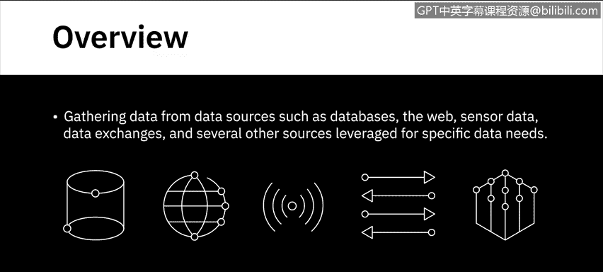
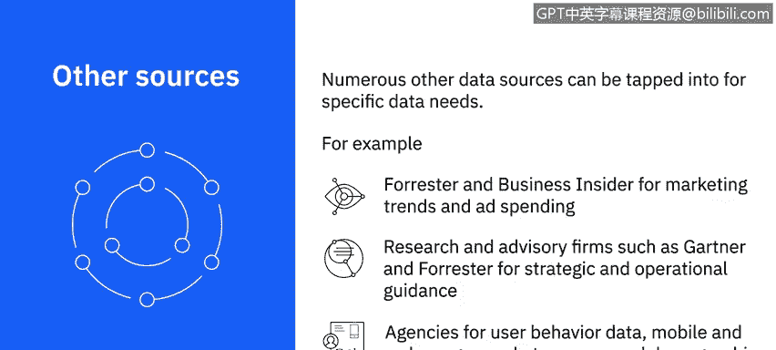
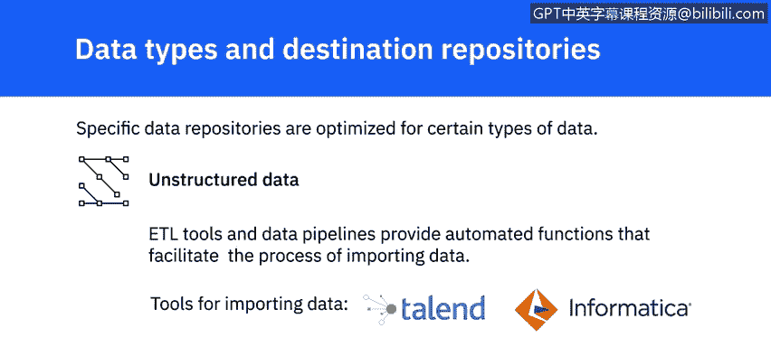

# 065：如何收集与导入数据



在本节课中，我们将学习从不同数据源收集数据的方法与工具，以及如何将数据导入到各类数据仓库中。课程涵盖的数据源包括数据库、网络、传感器数据、数据交换平台等。

---

## 🔍 数据收集方法与工具

上一节我们探讨了各种数据源，本节中我们来看看从这些数据源收集数据的具体方法与工具。

以下是几种主要的数据收集方法：

*   **SQL（结构化查询语言）**：这是一种用于从关系型数据库中提取信息的查询语言。SQL 提供简单的命令来指定需要从数据库的哪个表中提取什么数据，例如对匹配值进行分组、规定查询结果的显示顺序以及限制返回结果的数量等。其核心命令格式可概括为：
    ```sql
    SELECT [列名] FROM [表名] WHERE [条件];
    ```
*   **非关系型数据库查询工具**：非关系型数据库可以使用 SQL 或类 SQL 工具进行查询。一些数据库也拥有自己的专用查询工具，例如 Cassandra 的 CQL 和 Neo4j 的 GraphQL。
*   **应用程序编程接口（API）**：API 被广泛用于从各种数据源提取数据。需要数据的应用程序调用 API 来访问包含数据的端点，这些端点可以是数据库、网络服务或数据市场。API 也常用于数据验证，例如验证邮政编码。
*   **网络爬取**：网络爬取（或称屏幕抓取、网络采集）用于根据定义的参数从网页下载特定数据。它可以提取文本、联系信息、图像、视频、播客和产品条目等数据。
*   **RSS 订阅**：RSS 订阅通常用于从在线论坛和新闻网站等数据持续更新的来源捕获最新数据。
*   **数据流**：数据流是聚合来自仪器、物联网设备、应用程序以及汽车 GPS 等来源的持续数据流的常用方式。数据流和订阅也用于从社交媒体网站和互动平台提取数据。
*   **数据交换平台**：数据交换平台允许数据提供者和消费者之间交换数据。这些平台有定义良好的交换标准、协议和格式，不仅促进数据交换，还确保安全性和治理，提供数据许可工作流、个人信息的去标识化与保护、法律框架和隔离的分析环境。流行的平台包括 AWS Data Exchange、Crunchbase、Loomy 和 Snowflake。
*   **其他专业数据源**：针对特定数据需求，如营销趋势和广告支出，可以借助其他数据源。例如，Forrester 和 Business Insider 等研究公司提供可靠数据；Gartner 和 Forrester 等研究和咨询公司是战略与运营指导的广泛信任来源。同样，在用户行为数据、移动和网络使用情况、市场调查和人口统计研究领域也有许多值得信赖的机构。

---

## 📥 数据导入与存储

在从各种数据源识别和收集数据之后，需要将其加载或导入到数据仓库中，才能进行后续的整理、挖掘和分析。导入过程涉及合并不同来源的数据，以提供统一的视图和单一接口，便于查询和操作数据。根据数据类型、数据量和目标仓库的类型，可能需要不同的工具和方法。



以下是针对不同数据类型的存储方案：

*   **关系型数据库**：用于存储具有明确定义模式的结构化数据。如果使用关系型数据库作为目标系统，则只能存储结构化数据，例如来自 OLTP 系统、电子表格、在线表单、传感器、网络和 Web 日志的数据。结构化数据也可以存储在 NoSQL 数据库中。
*   **半结构化数据**：指具有一定组织属性但没有严格模式的数据，例如来自电子邮件、XML、ZIP 文件、二进制可执行文件以及 TCP/IP 协议的数据。半结构化数据可以存储在 NoSQL 集群中。XML 和 JSON 常用于存储和交换半结构化数据，JSON 也是 Web 服务的首选数据类型。
*   **非结构化数据**：指没有固定结构、无法组织成模式的数据，例如来自网页、社交媒体订阅、图像、视频、文档、媒体日志和调查的数据。NoSQL 数据库和数据湖为存储和处理大量非结构化数据提供了良好选择。数据湖可以容纳所有数据类型和模式。

ETL 工具和数据管道提供了自动化功能，以促进数据导入过程。诸如 Talend 和 Informatica 等工具，以及 Python 和 R 等编程语言及其相关库，都被广泛用于导入数据。

---

## ✅ 课程总结



本节课中，我们一起学习了从数据库、网络、API、数据流等多种来源收集数据的关键方法与工具，并了解了如何根据数据的结构化程度（结构化、半结构化、非结构化），将其导入到关系型数据库、NoSQL 数据库或数据湖等合适的数据仓库中，为后续的数据分析工作做好准备。