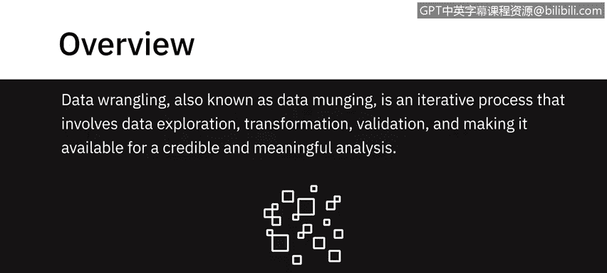
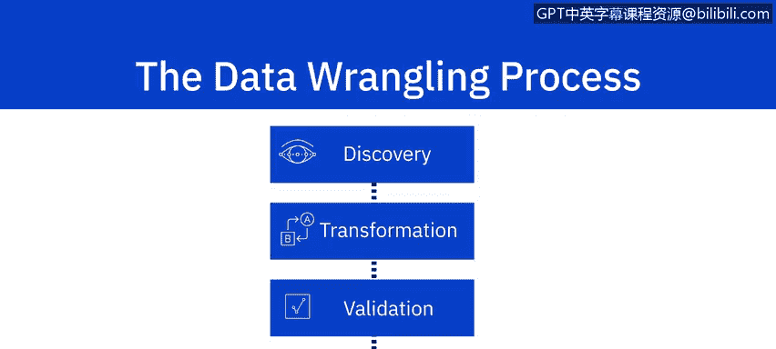
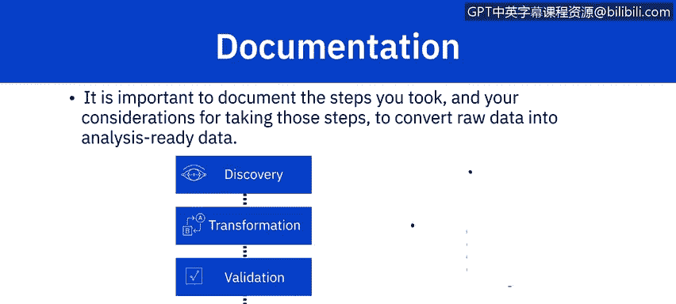

# 066：什么是数据整理？🧹

在本节课中，我们将要学习数据整理的核心概念、流程及其重要性。数据整理是数据分析中至关重要的一步，它确保原始数据被转化为可信、可用的形式，为后续的深入分析奠定基础。

---

数据整理，也称为数据清洗，是一个迭代过程，它包含数据探索、转换、验证，并使其可用于可信且有意义的分析。

它涵盖了一系列任务，旨在为明确定义的目的准备原始数据。此阶段的原始数据是指通过数据存储库中的各种数据源收集而来的数据。

数据整理涵盖了为分析准备数据所涉及的一系列任务。通常，它是一个包含四个步骤的过程：**发现**、**转换**、**验证**和**发布**。

## 发现阶段 🔍

发现阶段，也称为探索阶段，旨在结合你的具体用例来更好地理解数据。其目标是明确如何最好地为你手头的数据进行清理、结构化、组织和映射，以满足分析需求。

## 转换阶段 🔄

转换阶段构成了数据整理过程的主体，它涉及你为转换数据而执行的任务，例如数据的**结构化**、**规范化**、**反规范化**、**清理**和**丰富**。

以下是转换阶段的主要任务类型：

**1. 结构化**
此任务包括改变数据形式和模式的操作。输入的数据可能格式各异。例如，你可能有一些来自关系数据库的数据和一些来自 Web API 的数据。为了合并它们，你需要改变数据的形式或模式。这种改变可能简单到改变记录中字段的顺序，也可能复杂到将字段组合成复杂的结构。

`JOIN`（连接）和 `UNION`（联合）是用于合并一个或多个表数据的最常见的结构化转换。它们合并数据的方式不同：
*   **JOIN 合并列**：当两个表连接时，第一个源表的列与第二个源表的列在同一行中组合。因此，结果表中的每一行都包含来自两个表的列。
*   **UNION 合并行**：第一个源表的数据行与第二个源表的数据行合并到一个表中。结果表中的每一行都来自某一个源表。

**2. 规范化与反规范化**
转换也可以包括数据的规范化和反规范化。
*   **规范化**侧重于清理数据库中未使用的数据，并减少冗余和不一致性。例如，来自事务系统的数据，由于持续进行大量的插入、更新和删除操作，通常是高度规范化的。
*   **反规范化**用于将来自多个表的数据合并到一个表中，以便更快地进行查询。例如，来自事务系统的规范化数据通常在运行报告和分析查询之前进行反规范化。

**3. 清理**
清理任务是修复数据中的不规则之处，以产生可信且准确的分析。不准确、缺失或不完整的数据可能会扭曲你的分析结果，因此需要加以考虑。数据也可能存在偏差、相关字段有空值或存在异常值。

例如，你可能想了解某款产品销售的客户人口统计信息，但你收到的数据没有记录性别字段。这时，你既需要寻找这个数据点并将其与现有数据集合并，也可能需要删除或不考虑缺少此字段的记录。我们将在本课程后续部分探讨更多数据清理的例子。

**4. 丰富数据**
丰富数据是第四种转换类型。当你审视现有数据，并考虑可以添加哪些额外的数据点以使你的分析更有意义时，你就是在考虑丰富数据。

例如，在一个信息分散在多个系统的大型组织中，你可能需要用其他系统甚至公共数据集中的信息来丰富某个系统提供的数据集。

考虑这样一个场景：你向企业销售 IT 外设，并想分析过去五年客户的购买模式。你拥有记录了客户信息和购买历史的客户主表和交易表。如果用一个可能作为公共数据集的企业绩效数据来补充你的数据集，对于理解影响其购买决策的因素将非常有价值。

插入元数据也能丰富数据。例如，从客户反馈日志中计算情感得分、从度假村位置收集基于地理位置的天气数据以分析入住趋势，或者为博客文章捕获发布时间和标签。

## 验证阶段 ✅

在转换之后，数据整理的下一个阶段是验证。在此阶段，你需要检查经过结构化、规范化、清理和丰富后的数据质量。

验证规则指的是用于验证数据一致性、质量和安全性的重复性编程步骤。

## 发布阶段 📤

这引出了数据整理过程的第四阶段——发布。发布涉及为下游项目需求交付整理后的数据输出。

发布的内容是输入数据集的转换和验证版本，以及关于数据的元数据。

## 文档记录的重要性 📝

最后，必须注意记录你将原始数据转换为可用于分析的数据所采取的步骤和考虑因素的重要性。数据整理的所有阶段本质上都是迭代的。为了能够复现这些步骤并重新审视执行这些步骤时的考量，记录所有的考虑和行动至关重要。

---

本节课中，我们一起学习了数据整理的完整流程。我们了解到，数据整理是一个包含**发现**、**转换**、**验证**和**发布**四个阶段的迭代过程，其核心目标是将原始数据转化为高质量、可用于分析的数据集。记住，**详尽的文档记录**是确保过程可复现、结果可信的关键。掌握这些基础知识，将为后续的数据分析工作打下坚实的基础。