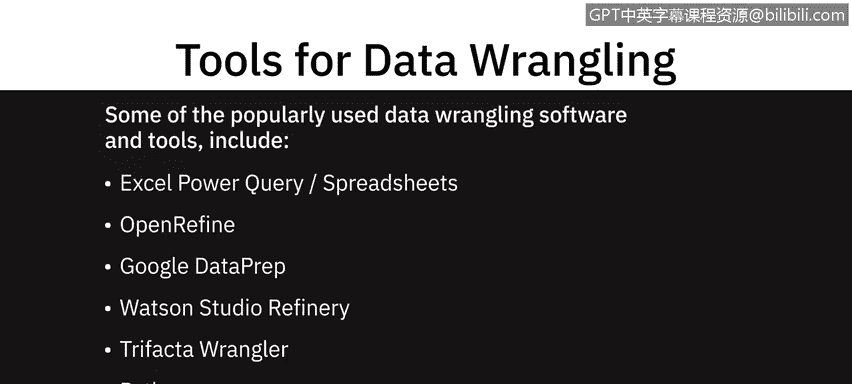
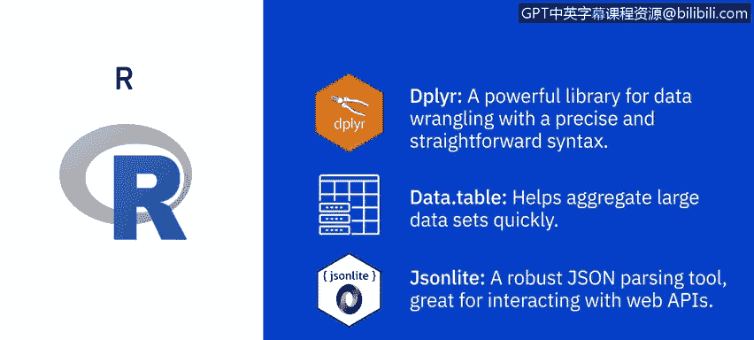
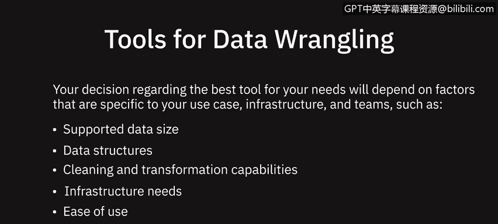

# 067：数据整理工具 🛠️

在本节课中，我们将学习数据整理过程中常用的一些软件和工具。数据整理是数据分析的关键步骤，旨在将原始、杂乱的数据转换为干净、可用的格式。我们将逐一介绍这些工具的特点和适用场景。

上一节我们介绍了数据整理的基本概念，本节中我们来看看具体有哪些工具可以帮助我们完成这项工作。

## 电子表格软件 📊

最基础的数据整理工具是电子表格软件，例如 Microsoft Excel 和 Google Sheets。

这类软件内置了丰富的功能和公式，可以帮助你识别数据问题、清理和转换数据。此外，它们还提供插件或功能，允许你从多种不同类型的源导入数据，并根据需要进行清理和转换。

以下是两个典型的增强功能：
*   **Microsoft Power Query**：用于 Excel，提供强大的数据获取和转换功能。
*   **Google Sheets 查询函数**：用于 Google Sheets，支持类似 SQL 的查询操作。

## 开源工具：OpenRefine 🔓

OpenRefine 是一个开源工具，允许你以多种格式（如 TSV、CSV、XLS、XML、JSON）导入和导出数据。

使用 OpenRefine，你可以清理数据、将其从一种格式转换为另一种格式，并通过 Web 服务和外部数据扩展数据集。OpenRefine 易于学习和使用，它提供基于菜单的操作，这意味着你无需记忆命令或语法。

## 智能云服务：Google Data Prep ☁️

Google Data Prep 是一种智能云数据服务，允许你以可视化方式探索、清理和准备结构化和非结构化数据以进行分析。

它是一个完全托管的服务，这意味着你无需安装或管理软件或基础设施。Data Prep 极其易用，你的每一个编辑操作都会获得关于理想下一步的建议。Data Prep 可以自动检测数据模式、数据类型和异常。

## IBM 平台工具：Watson Studio Refinery 🤖

通过 IBM Watson Studio 提供的 Watson Studio Refinery，允许你使用内置操作来发现、清理和转换数据。

它将大量原始数据转换为可供分析使用的优质信息。Data Refinery 提供了将数据导出到一系列数据源的灵活性。它能自动检测数据类型和分类，并自动执行适用的数据治理策略。

## 协作型云服务：Trifacta Wrangler 👥

Trifacta Wrangler 是一种基于云的交互式服务，用于清理和转换数据。它能处理混乱的真实世界数据，并将其清理和重新排列成数据表，然后可以导出到 Excel、Tableau 和 R 等工具。

该工具以其协作功能而闻名，允许多个团队成员同时工作。

## 编程语言：Python 🐍

Python 拥有庞大的库和包集合，提供了强大的数据操作能力。让我们看看其中几个重要的库。

以下是几个核心的数据处理库：
*   **Jupyter Notebook**：一个开源的 Web 应用程序，广泛用于数据清理和转换、统计建模以及数据可视化。
*   **NumPy**：是 Python 提供的最基础的包（`import numpy as np`）。它快速、灵活、可互操作且易于使用。它为大型多维数组和矩阵提供支持，并提供高级数学函数来操作这些数组。
*   **Pandas**：专为快速简便的数据分析操作而设计（`import pandas as pd`）。它允许通过简单的一行命令执行复杂操作，例如合并、连接和转换大量数据。使用 Pandas，可以防止因来自不同源的数据未对齐而导致的常见错误。

## 编程语言：R 📈

R 也提供了一系列专门为整理混乱数据而创建的库和包，例如 Dplyr、Data Table 和 Jsonlite。

使用这些库，你可以调查、操作和分析数据。

以下是几个核心的 R 包：
*   **Dplyr**：一个用于数据整理的强大库（`library(dplyr)`）。它具有精确而直接的语法。
*   **Data Table**：帮助你快速聚合大型数据集（`library(data.table)`）。
*   **Jsonlite**：一个强大的 JSON 解析工具，非常适合与 Web API 交互（`library(jsonlite)`）。

## 如何选择工具？ 🤔

数据整理工具具有不同的能力和维度。你选择最适合需求的工具将取决于特定于你的用例、基础设施和团队的因素。

以下是需要考虑的关键因素：
*   **支持的数据大小**
*   **支持的数据结构**
*   **清理和转换能力**
*   **基础设施需求**
*   **易用性和学习成本**

---

本节课中我们一起学习了多种数据整理工具，从简单的电子表格到强大的编程语言库。每种工具都有其优势和适用场景，理解它们的特点将帮助你在实际工作中根据数据规模、团队技能和项目需求做出合适的选择。掌握这些工具是成为一名高效数据分析师的重要基础。