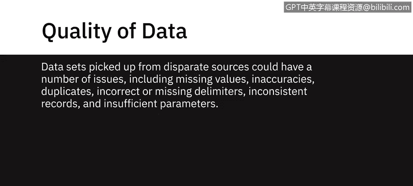
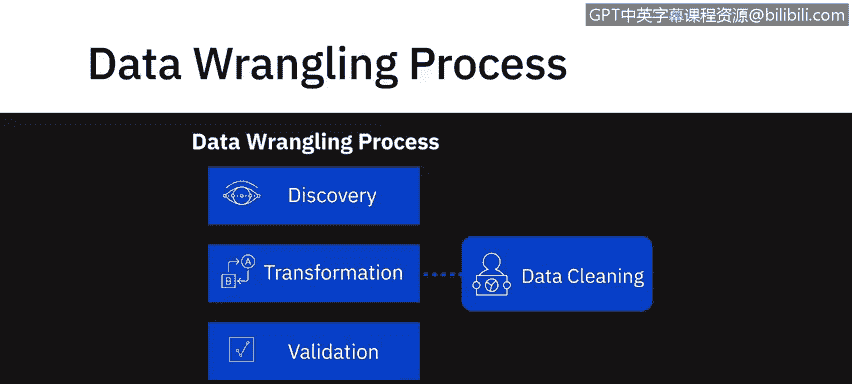
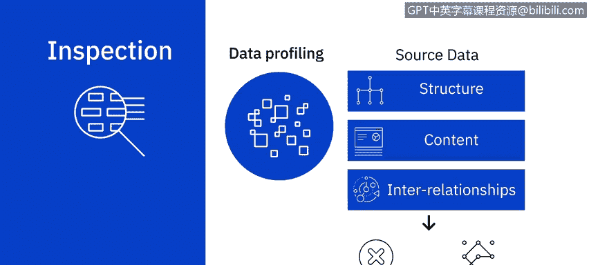
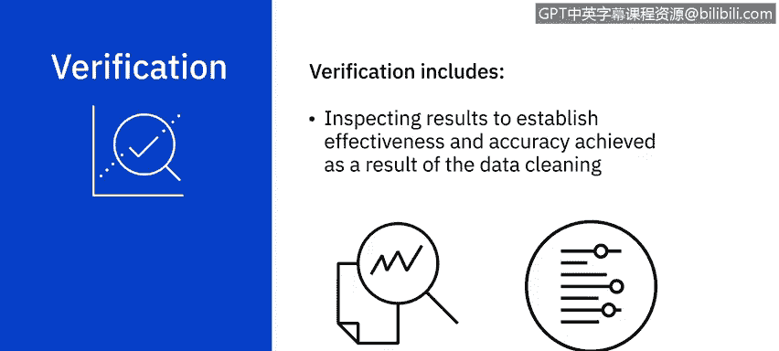
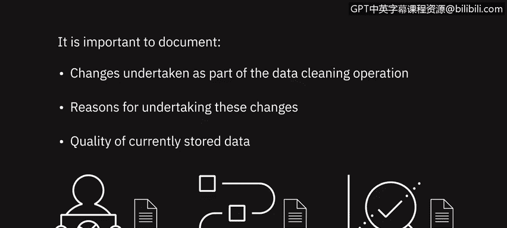

# 068：数据清洗 📊

在本节课中，我们将要学习数据清洗的核心概念、重要性以及标准工作流程。数据清洗是确保数据质量、获得可靠分析结果的关键步骤。

---

根据高德纳（Gartner）关于数据质量的报告，低质量的数据会削弱组织的竞争力，并破坏关键业务目标。

缺失、不一致或不正确的数据可能导致错误的结论，进而引发无效的决策。在商业世界中，这可能代价高昂。

从不同来源获取的数据集可能存在多种问题，包括：**缺失值**、**不准确的数据**、**重复项**、**错误或缺失的分隔符**、**不一致的记录**以及**参数不足**。

在某些情况下，可以借助数据整理工具和脚本手动或自动纠正数据。但如果数据无法修复，则必须将其从数据集中移除。

尽管“数据清洗”和“数据整理”这两个术语有时可以互换使用，但必须记住，数据清洗只是整个数据整理过程的一个子集。

数据清洗在数据整理工作流的转换阶段构成了非常重要且不可或缺的一部分。

---

## 典型的数据清洗工作流程

一个典型的数据清洗工作流程包括：**检查**、**清洗**和**验证**。

### 检查

数据清洗工作流程的第一步是检测数据集中可能存在的不同类型的问题和错误。

您可以使用脚本和工具来定义特定的规则和约束，并根据这些规则和约束来验证您的数据。

您也可以使用数据剖析和数据可视化工具进行检查。

数据剖析帮助您检查源数据，以理解数据的结构、内容和相互关系。它能揭示异常和数据质量问题。

例如，空白或空值、重复数据，或者某个字段的值是否落在预期范围内。

使用统计方法可视化数据可以帮助您发现异常值。例如，绘制人口统计数据集中平均收入的图表可以帮助您发现异常值。

---

### 清洗

上一节我们介绍了如何检查数据，本节中我们来看看如何进行实际的数据清洗。您应用于清洗数据集的技术将取决于具体用例和遇到的问题类型。

以下是几种更常见的数据问题及其处理方法：

*   **缺失值**：处理缺失值非常重要，因为它们可能导致意外或有偏差的结果。您可以选择过滤掉具有缺失值的记录，或者，如果该信息对您的用例至关重要，则设法寻找来源补充该信息。第三种方法是**插补**，即基于统计值计算缺失值。您选择的行动方案需要以最适合您的用例为基础。
    *   **公式示例**：`均值插补`：用该字段所有非缺失值的平均值填充缺失值。
*   **重复数据**：数据集中重复的数据点需要被移除。
*   **无关数据**：不符合您用例上下文的数据可被视为无关数据。例如，如果您正在分析某个人群分段的总体健康状况，他们的联系电话可能对您不相关。
*   **数据类型转换**：清洗可能涉及数据类型转换。这是为了确保字段中的值以该字段的数据类型存储。例如，数字存储为数值数据类型，日期存储为日期数据类型。
    *   **代码示例**（Python pandas）：`df[‘column_name’] = pd.to_numeric(df[‘column_name’])`
*   **标准化**：您可能还需要清洗数据以使其标准化。例如，对于字符串，您可能希望所有值都是小写。同样，日期格式和度量单位也需要标准化。
    *   **代码示例**（Python）：`df[‘column_name’] = df[‘column_name’].str.lower()`
*   **语法错误**：例如，字符串开头或结尾的空格或多余空格是需要纠正的语法错误。这也包括修复拼写错误或格式。例如，在某些记录中，州名以全称（如 New York）输入，而在另一些记录中以缩写（如 NY）输入。
*   **异常值**：数据中也可能存在异常值，即与数据集中其他观测值差异极大的值。异常值可能正确也可能不正确。例如，当选民数据库中的年龄字段值为 5 时，您知道这是不正确的数据，需要纠正。现在，考虑一组年收入在 10 万到 20 万美元之间的人，除了那个年收入 100 万美元的人。虽然这个数据点并非不正确，但它是一个异常值，需要审视。根据您的用例，您可能需要决定包含此数据是否会以不利于您用例的方式扭曲结果。

---

### 验证

这使我们进入数据清洗工作流程的下一步：**验证**。

在此步骤中，您检查结果，以确定数据清洗操作所实现的有效性和准确性。

您需要重新检查数据，以确保在您进行更正后，适用于数据的规则和约束仍然成立。

---

## 文档记录

最后，重要的是要注意，作为数据清洗操作一部分进行的所有更改都需要被记录在案。

不仅要记录更改，还要记录进行这些更改的原因以及当前存储数据的质量。报告数据的“健康”程度是一个非常关键的步骤。

---

## 总结

本节课中我们一起学习了数据清洗的完整流程。我们了解到，数据清洗是数据整理的关键环节，旨在解决数据集中存在的缺失值、重复项、不一致、异常值等问题。标准工作流程包括**检查**、**清洗**和**验证**三个阶段，并且所有操作都必须有完善的**文档记录**。高质量的数据清洗是获得准确、可靠数据分析结果的基石。