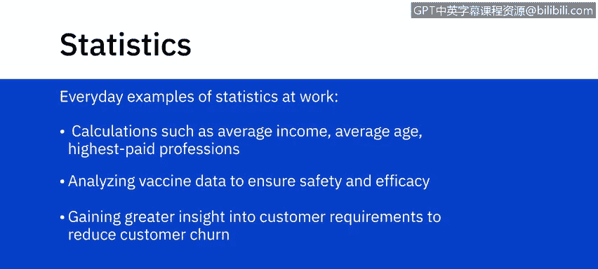
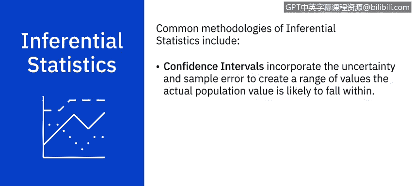
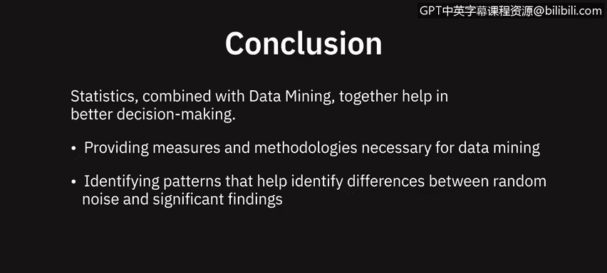

# 070：统计分析概述 📊

在本节课中，我们将要学习统计分析的基础知识，了解它与数据分析，特别是数据挖掘的关系。我们将从统计学的基本定义开始，逐步深入到描述性统计和推断性统计的核心概念。

---

在理解统计分析、它与数据分析以及数据挖掘的关系之前，我们首先需要审视什么是统计学。

统计学是数学的一个分支，处理数值或定量数据的收集、分析、解释和呈现。它无处不在，无论是谈论平均收入、平均年龄还是最高薪职业，这些都涉及统计学。

如今，统计学正被应用于各行各业，以基于数据做出决策。例如，研究人员使用统计学分析疫苗生产数据以确保安全性和有效性；公司使用统计学来深入了解客户需求，从而减少客户流失。

---

上一节我们介绍了统计学的定义和应用，本节中我们来看看什么是统计分析。

统计分析是将统计方法应用于数据样本，以发展对该数据所代表内容的理解。它包括收集和审查一组项目中的每个数据样本，这些样本可以从总体中抽取。

在统计学中，**样本**是从总体中抽取的代表性选择。而**总体**是指一个离散的人群或事物集合，它们至少有一个共同特征，以便进行数据收集和分析。

例如，在某个用例中，总体可能是某个州所有拥有驾驶执照的人，而从这个总体中抽取的样本（即总体的一个子集）可能是年龄超过 50 岁的男性驾驶员。

统计方法主要用于确保数据被正确解释，并且明显的关系是有意义的，而不仅仅是偶然发生的。

---

当我们从样本中收集数据时，可以运行两种不同类型的统计：**描述性统计**用于总结样本信息，**推断性统计**用于对更广泛的总体进行推断或概括。

描述性统计使您能够以有意义的方式呈现数据，从而简化数据的解释。数据使用汇总图表、表格和图形进行描述，而不试图从抽取样本的总体中得出结论。其目标是使原始数据更容易理解和可视化，而不对任何已做出的假设下结论。

例如，我们想要描述一个特定班级 25 名学生的英语考试成绩。我们记录所有学生的考试成绩，计算汇总统计数据，并生成图表。

以下是描述性统计分析的一些常见度量指标：

*   **集中趋势**：定位数据样本的中心。常见的度量指标包括**均值**、**中位数**和**众数**。这些指标告诉您数据集中大多数值落在哪里。
    *   **均值**：数学平均值。在上述例子中，25 名学生的平均分是所有 25 名学生分数的总和除以 25（学生人数）。公式：`均值 = 总和 / 数量`。
    *   **中位数**：将数据集从小到大排序后，位于中间位置的值。对于 25 个值，中位数是第 13 个值（左右各有 12 个值）。中位数不受异常值影响。
    *   **众数**：数据集中出现频率最高的值。例如，如果这 25 名学生中最常见的分数是 72%，那么这就是该数据集的众数。

*   **离散程度**：衡量数据集的变异性。常见的统计离散度量指标是**方差**、**标准差**和**极差**。
    *   **方差**：衡量数据点偏离中心（即均值）的程度，反映了值的分布情况。变异性越低，数据集中的值越一致；变异性越高，数据点差异越大，极端值出现的可能性越高。
    *   **标准差**：告诉你数据围绕均值聚集的紧密程度。公式：`标准差 = 方差的平方根`。
    *   **极差**：数据集中最大值与最小值之间的距离。

*   **偏度**：衡量数值分布是围绕中心值对称还是向左或向右偏斜。偏斜的数据会影响哪些类型的分析是有效的。

这些是一些基本且最常用的描述性统计工具，但还有其他工具，例如使用**相关性和散点图**来评估配对数据的关系。

---

上一节我们探讨了如何描述数据，本节中我们转向推断性统计，看看如何从样本推断总体。

推断性统计从样本中获取数据，对抽取样本的更大总体进行推断。使用推断性统计的方法，你可以得出将样本结果应用于整个总体的概括性结论。

以下是推断性统计的一些常见方法：

*   **假设检验**：例如，可以通过比较对照组的结果来研究疫苗的有效性。假设检验可以告诉你，在对照组中观察到的疫苗有效性是否也可能存在于总体中。
*   **置信区间**：结合不确定性和抽样误差，创建一个实际总体值可能落入的数值范围。
*   **回归分析**：包含假设检验，有助于确定在样本数据中观察到的关系是否真实存在于总体中，而不仅仅是在样本中。

---

有多种软件包可用于执行统计数据分析，例如 **SAS**、**SPSS** 和 **Stata**。

统计学通过提供数据挖掘所需的度量和方法论，并帮助识别随机噪声与重要发现之间的差异，构成了数据挖掘的核心。

数据挖掘（我们将在本课程中了解更多）和统计学作为数据分析技术，都有助于做出更好的决策。

---

本节课中我们一起学习了统计分析的基础。我们首先定义了统计学及其应用，然后区分了描述性统计（用于总结和呈现数据）和推断性统计（用于从样本推断总体）。我们探讨了集中趋势、离散程度和偏度等关键描述性度量，以及假设检验、置信区间和回归分析等推断性方法。最后，我们了解到统计学是数据挖掘的核心，两者共同支持基于数据的决策。