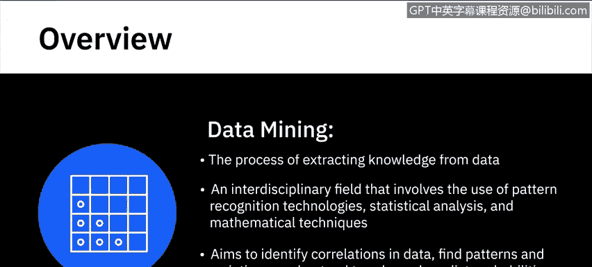
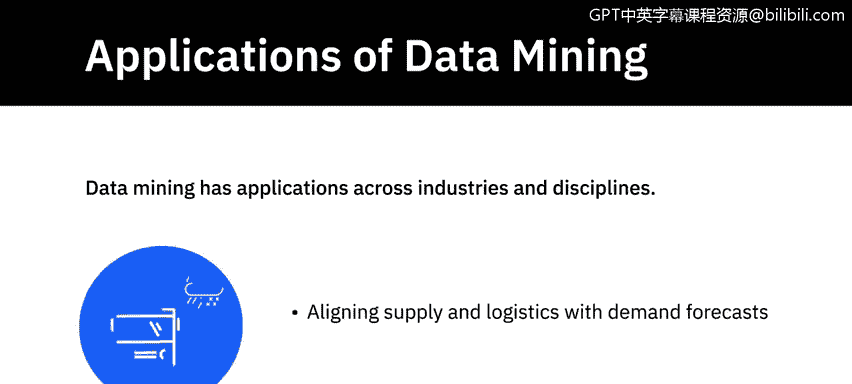
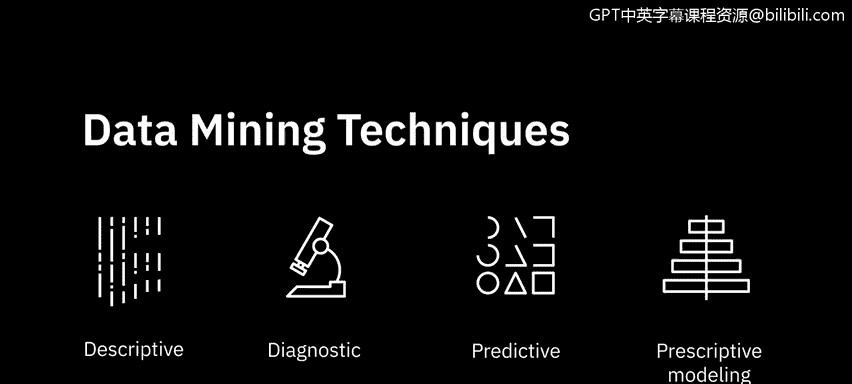
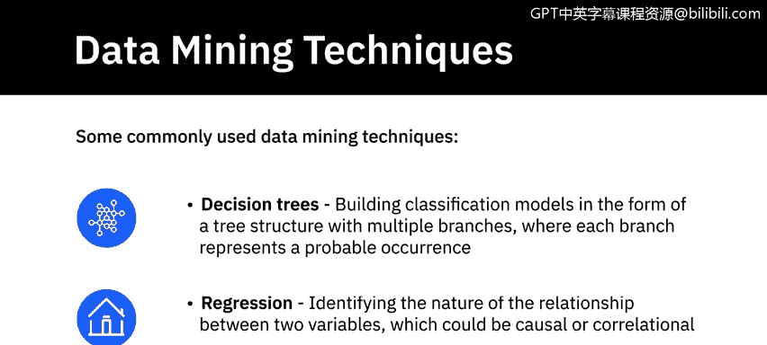
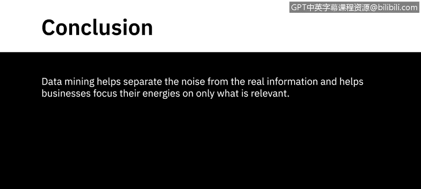

# 071：什么是数据挖掘？🔍

在本节课中，我们将要学习数据挖掘的核心概念、应用场景以及常用的技术方法。数据挖掘是从数据中提取知识的关键过程，它结合了多种技术来发现数据中的模式、趋势和关联。

---

## 什么是数据挖掘？💎

数据挖掘是从数据中提取知识的过程，它是数据分析过程的核心。数据挖掘是一个跨学科领域，涉及模式识别技术、统计分析和数学方法的应用。其目标是识别数据中的相关性、发现模式和变化、理解趋势并预测概率。

在数据分析的语境中，你会经常听到“模式”和“趋势”，因此我们首先需要理解这些概念。

---

## 模式与趋势 📈

**模式识别**是指在数据中发现规律性或共性的过程。例如，考虑一个组织内应用程序的登录日志数据，它包含用户名、登录时间戳、每次登录会话的持续时间以及执行的活动等信息。当我们分析这些数据以深入了解用户的习惯或行为时，例如一天中最多用户倾向于登录的时间、通常在应用程序中登录时间最长的用户角色，或者工作流应用程序中正在使用的模块，我们就是在通过手动或工具检查数据，以揭示隐藏在数据中的模式。

**趋势**则是一组数据随时间变化的一般倾向。例如，全球变暖。在短期内，比如逐年来看，温度可能保持不变或上下波动几度，但全球总体温度随着时间的推移持续上升，这使得全球变暖成为一种趋势。

---

## 数据挖掘的应用领域 🌐

数据挖掘在各行各业和学科中都有应用，以下是几个例子：

*   **客户分析**：分析客户行为、需求和可支配收入，以提供有针对性的营销活动。
*   **金融风控**：金融机构跟踪客户交易以发现异常行为，并使用数据挖掘模型标记欺诈交易。
*   **医疗健康**：使用统计模型预测患者患特定健康状况的可能性，并优先安排治疗。
*   **教育评估**：评估学生的表现数据以预测其成就水平，并集中精力在需要的地方提供支持。
*   **公共安全与物流**：帮助调查机构在犯罪可能性较高的地区部署警力，并根据需求预测调整供应和物流。

---

## 主要的数据挖掘技术 🛠️

有多种技术可用于检测模式并为发现构建准确的模型，无论是描述性、诊断性、预测性还是规范性建模。以下是几种最常用的技术：

*   **分类**：一种将属性分类到目标类别的技术。例如，根据客户的收入水平将其分为低、中、高消费群体。
    *   **公式/代码示例**：`if (income > 100000) category = "高消费"; else if (income > 50000) category = "中消费"; else category = "低消费";`
*   **聚类**：与分类类似，但涉及将数据分组到簇中，以便将其视为群体进行处理。例如，根据地理区域对客户进行聚类。
*   **异常值检测**：一种帮助发现数据中不正常或意外模式的技术。例如，信用卡使用量的突然激增可能标志着潜在的滥用。
*   **关联规则挖掘**：一种帮助建立两个数据事件之间关系的技术。例如，购买笔记本电脑经常伴随着购买散热垫。
*   **序列模式**：追踪按顺序发生的一系列事件的技术。例如，追踪客户从登录在线商店到退出的整个购物路径。
*   **亲和性分组**：一种用于发现关系中同时发生情况的技术。该技术广泛应用于在线商店，通过根据购买同一商品的其他人的购买历史向人们推荐产品，来进行交叉销售和向上销售。
*   **决策树**：帮助以树形结构构建分类模型，每个分支代表一个可能的发生情况。该技术有助于清晰理解输入和输出之间的关系。
*   **回归**：一种帮助识别两个变量之间关系性质的技术，这种关系可能是因果关系或相关关系。例如，基于位置和覆盖面积等因素，回归模型可用于预测房屋的价值。
    *   **公式示例**：`房价 = β₀ + β₁ * 面积 + β₂ * 地段评分 + ...`

---

## 总结 📝

本节课中，我们一起学习了数据挖掘的基础知识。我们了解到，数据挖掘本质上帮助我们从噪声中分离出真实信息，使企业能够将精力集中在相关的事务上。它通过一系列技术，如分类、聚类、回归等，从数据中提取有价值的模式和见解，为决策提供支持。掌握这些概念是成为一名数据分析师的重要一步。