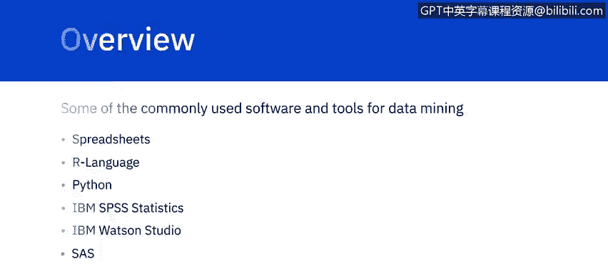
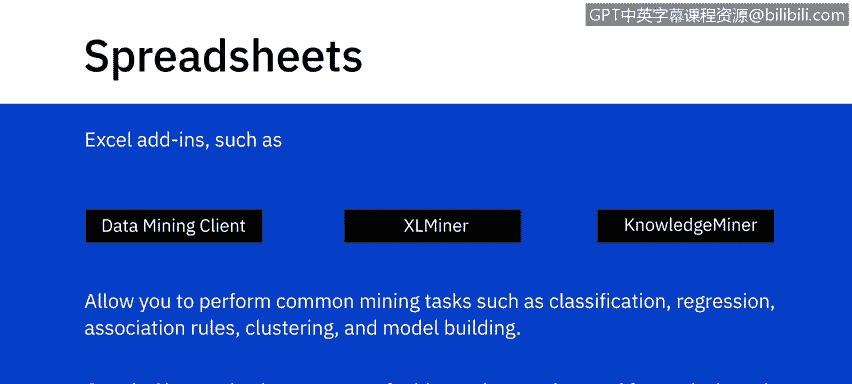
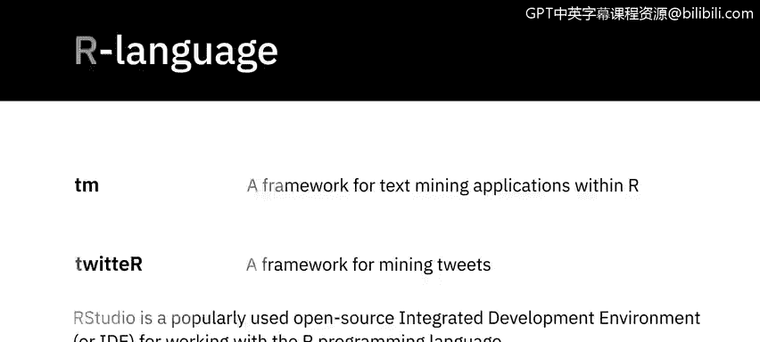
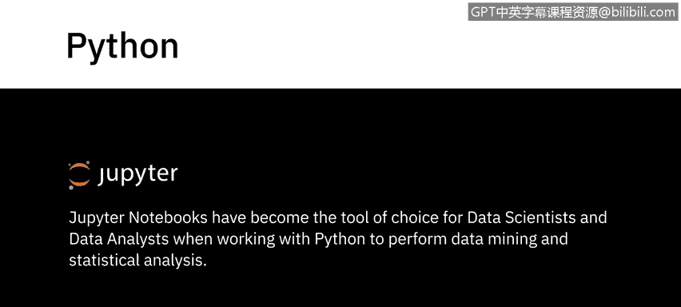
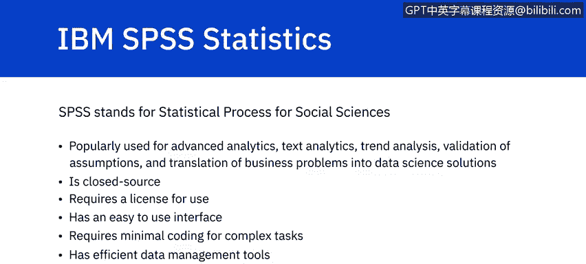
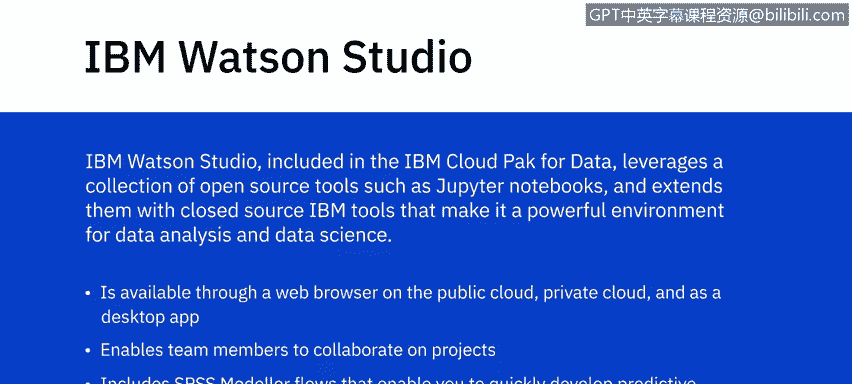
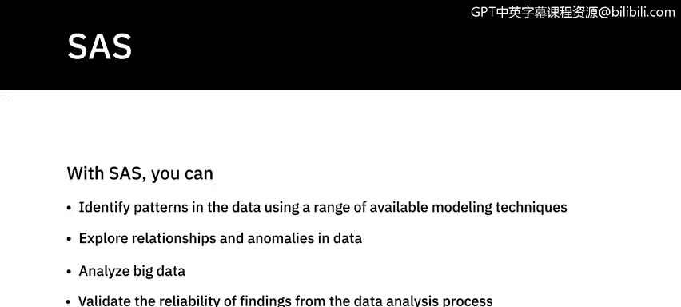
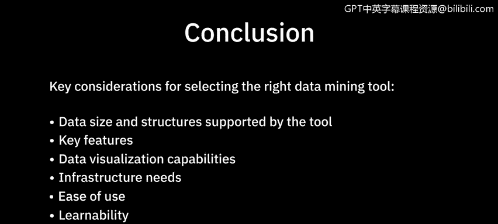

# 072：数据挖掘常用工具 🛠️

在本节课中，我们将学习数据挖掘领域一些常用的软件和工具，包括电子表格、R语言、Python、IBM SPSS Statistics、IBM Watson Studio 以及 SAS。

## 电子表格 📊

电子表格，例如 Microsoft Excel 和 Google Sheets，常用于执行基础的数据挖掘任务。电子表格可用于存放从其他系统导出的数据，格式易于访问和阅读。

你可以使用**数据透视表**来展示数据的特定方面，这在需要筛选和分析海量数据时至关重要。它们也使比较不同数据集变得相对容易。

Excel 提供了多种插件，例如 **Excel 数据挖掘客户端**、**Excel Miner** 和 **Knowledge Miner for Excel**，这些插件允许你执行常见的挖掘任务，如分类、回归、关联规则、聚类和模型构建。

Google Sheets 也有一系列可用于分析和挖掘的插件，例如文本分析、文本挖掘和 Google Analytics。

## R 语言 📈

R 是统计学家和数据挖掘者用于执行统计建模和计算的最广泛使用的语言之一。R 内置了数百个专门为数据挖掘操作构建的库，例如回归、分类、数据聚类、关联规则挖掘、文本挖掘、异常值检测和社交网络分析。

一些流行的 R 包包括 `tm` 和 `twitterR`。`tm` 包为 R 中的文本挖掘应用提供了一个框架，提供了文本挖掘功能。`twitterR` 包则提供了一个挖掘推文的框架。

**RStudio** 是一个广泛使用的开源集成开发环境，用于处理 R 编程语言。

## Python 语言 🐍

像 **Pandas** 和 **NumPy** 这样的 Python 库常用于数据挖掘。

**Pandas** 是一个用于处理数据结构和分析的开源模块。它可能是 Python 中最流行的数据分析库之一。它允许你以任何格式上传数据，并提供了一个简单的平台来组织、排序和操作这些数据。

使用 Pandas，你可以执行基本的数值计算，如**均值、中位数、众数和极差**，计算统计数据，回答关于数据相关性和数据分布的问题，以可视化和定量的方式探索数据，并借助其他 Python 库（如 Matplotlib）实现数据可视化。

**NumPy** 是 Python 中用于数学计算和数据准备的工具。NumPy 提供了一系列用于数据挖掘的内置函数和能力。

**Jupyter Notebooks** 已成为数据科学家和数据分析师使用 Python 进行数据挖掘和统计分析时的首选工具。

## IBM SPSS Statistics 📊

SPSS 代表 **Statistical Package for the Social Sciences**。虽然其名称暗示了最初在社会科学领域的用途，但它现在广泛用于高级分析、文本分析、趋势分析、假设验证以及将业务问题转化为数据科学解决方案。

SPSS 是闭源软件，需要许可证才能使用。SPSS 拥有易于使用的界面，对于复杂任务只需最少的编码。它包含高效的数据管理工具，并因其深入的分析能力和准确的数据结果而广受欢迎。

## IBM Watson Studio ☁️

包含在 **IBM Cloud Pak for Data** 中的 **IBM Watson Studio**，利用了一系列开源工具（如 Jupyter Notebooks），并通过闭源的 IBM 工具进行了扩展，使其成为一个强大的数据分析和数据科学环境。

它可以通过公共云、私有云上的网页浏览器以及桌面应用程序使用。Watson Studio 使团队成员能够在项目上进行协作，项目范围可以从简单的探索性分析到构建机器学习和 AI 模型。它还包括 **SPSS Modeler flows**，使你能够快速为业务数据开发预测模型。

## SAS Enterprise Miner 🔍

**SAS Enterprise Miner** 是一个用于数据挖掘的综合性图形化工作台。它提供了强大的交互式数据探索能力，使用户能够识别数据内部的关系。

SAS 可以管理来自各种来源的信息，挖掘和转换数据，并分析统计数据。它为技术背景较弱的用户提供了图形用户界面。

使用 SAS，你可以利用一系列可用的建模技术识别数据中的模式，探索数据中的关系和异常，分析大数据，并验证数据分析过程中发现的可靠性。

SAS 因其语法而非常易于使用，也易于调试。它能够处理大型数据库，并为用户提供高安全性。

## 总结 📝

本节课中，我们一起学习了几种当今可用的数据挖掘工具。选择最适合你需求的工具，将取决于该工具支持的数据规模和结构、提供的功能、数据可视化能力、基础设施需求、易用性和学习曲线。

通常，结合使用多种数据挖掘工具来满足所有需求是相当常见的做法。