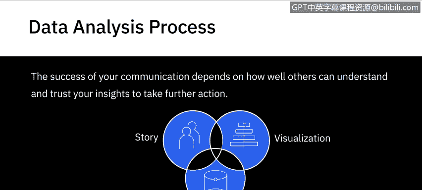
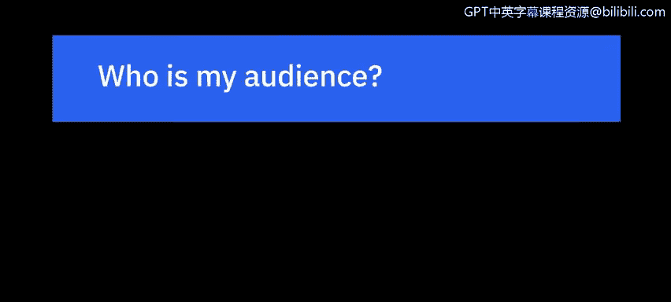
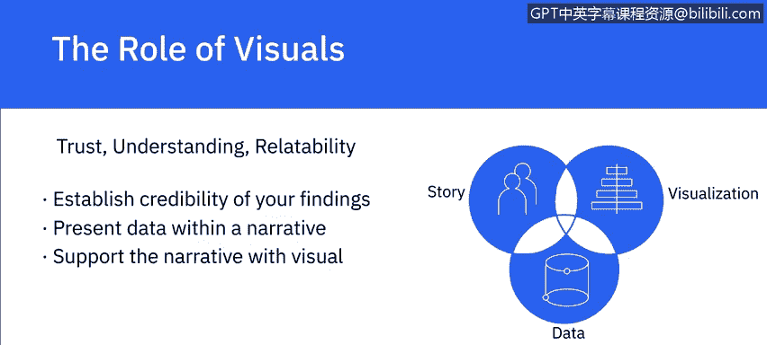

# 073：沟通与分享数据分析结果概述 📊

在本节课中，我们将学习如何有效地沟通和分享数据分析的发现。数据分析过程始于理解待解决的问题和期望达成的目标，终于以能够影响决策的方式呈现分析结果。数据项目通常是跨部门协作的成果，涉及具备多领域技能的人员，其发现最终会融入更广泛的业务计划中。沟通的成功与否，取决于他人能否理解并信任你的见解，从而采取进一步行动。

## 理解你的受众 👥

上一节我们介绍了沟通在数据分析中的重要性，本节中我们来看看如何为沟通做准备。作为数据分析师，你需要通过清晰的可视化数据和结构化的叙述来讲述数据故事。在开始沟通之前，你需要重新与你的受众建立联系。

以下是开始前需要问自己的几个关键问题：
*   **我的受众是谁？**
*   **什么对他们重要？**
*   **什么能帮助他们信任我？**

你的受众通常是一个多元化的群体，他们代表不同的业务职能，在组织中扮演运营或战略角色，受问题影响的程度也各不相同。

## 构建你的演示内容 🏗️

理解了受众之后，下一步就是围绕他们已有的信息水平来构建你的演示内容。你需要决定哪些信息以及多少信息对于帮助受众更好地理解你的发现是至关重要的。

以下是构建内容的核心原则：
*   **避免信息过载**：演示不是数据倾倒。仅包含解决业务问题所必需的信息。过多信息会让受众难以理解你的核心观点。
*   **建立共同起点**：通过向受众展示你对业务问题的理解来开始你的演示。这有助于赢得他们的注意并建立初步信任。
*   **使用业务语言**：使用你所在组织的业务领域语言，是建立你与受众之间联系的另一个重要因素。

## 组织叙事与建立可信度 📝

设计沟通的下一步，是为实现最大影响力而构建和组织你的演示。你需要引用所收集的数据，并建立其可信度。

以下是组织叙事和建立可信度的步骤：
*   **揭示数据黑箱**：对于受众而言，作为你一切沟通基础的数据就像一个黑箱。你必须解释数据来源、假设和验证过程。
*   **坦诚关键假设**：不要掩盖分析过程中做出的任何关键假设。
*   **逻辑分类信息**：根据你掌握的信息（例如定性和定量信息）将其组织成逻辑类别。
*   **选择叙事方法**：有意识地选择自上而下或自下而上的叙事方法。两者都可能有效，具体取决于你的受众和使用场景，但需保持方法的一致性。

## 选择沟通格式与可视化 📈

确定哪种沟通格式对你的受众最有用至关重要。他们需要带走一份执行摘要、一份事实清单还是一份完整报告？受众将如何使用你呈现的信息，这应决定你选择的格式。

见解必须以能激发行动的方式解释。如果受众没有领会到见解的重要性或对其效用不确信，那么该见解就无法驱动任何价值。

以下是关于可视化的要点：
*   **可视化胜过文字**：一段100字的论述，其创造清晰心理图像的效果通常不如一幅视觉图表。
*   **用图表讲故事**：数据可视化、图形和图表是通过图形化描绘事实和数字来讲述故事的绝佳方式。
*   **展示模式与结论**：无论是展示比较、关系、分布还是构成，你都有工具可以帮助你展示关于假设的模式和结论。

## 总结 📋

本节课中我们一起学习了有效沟通数据分析结果的核心要素。数据通过其讲述的故事产生价值。你的受众必须能够信任你、理解你并与你的发现和见解产生共鸣。通过**建立发现的可信度**、**在叙事中呈现数据**并**通过视觉印象加以支持**，你可以帮助你的受众获得有价值的见解，从而推动决策和行动。