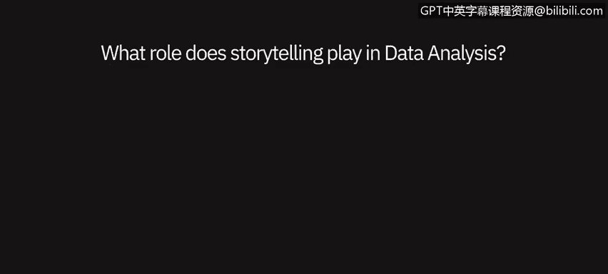
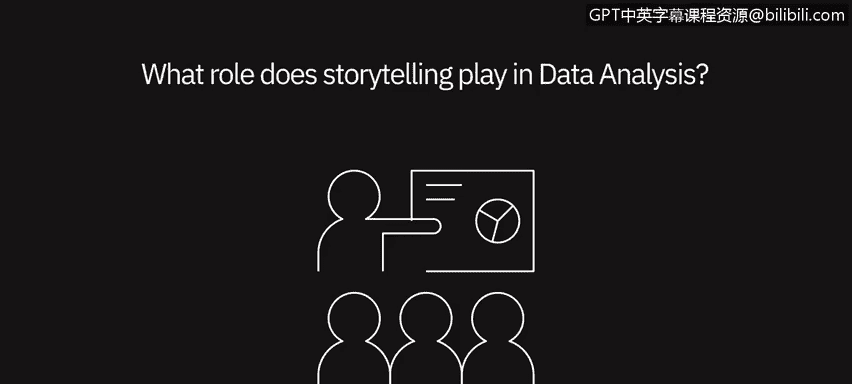

# 074：数据分析中的叙事视角 📖

在本节课中，我们将聆听数据专业人士分享叙事在数据分析师工作中的角色与重要性。通过他们的观点，你将理解为何讲好数据故事是数据分析过程中不可或缺的一环。

---

## 叙事在数据分析中的核心作用

上一节我们探讨了数据分析的基本流程，本节中我们来看看如何通过叙事让数据结果产生更大影响。多位数据专家强调了叙事能力的至关重要性。

叙事在数据分析师的工作中作用重大，其重要性怎么强调都不为过。精通数据叙事能力非常关键。人类天生通过故事来理解世界。因此，如果你想说服任何人依据数据采取行动，首要任务就是讲述一个清晰、简洁且引人入胜的故事。

对于数据分析师而言，在处理任何数据集时构建一个故事，也能帮助自己更好地理解底层数据集及其运作方式。

在讲述一个清晰、连贯、简单的故事，与确保传达数据中可能存在的所有复杂性之间，总需要取得平衡。找到这种平衡可能颇具挑战性，但确实至关重要。

---

## 沟通：从数据到价值的关键桥梁

理解了叙事的重要性后，我们来看看它如何成为沟通数据价值的桥梁。无论你的分析多么出色，如果无法有效传达，其价值将无法实现。

无论你发现了多少或多么精彩的信息，如果找不到方法将其传达给你的受众——无论是消费者、总监还是高管级别的人员——那么这些信息就毫无用处。

你必须找到沟通的方法。通常，最好的方式是通过可视化或讲故事，让他们理解这些信息如何能发挥作用。

可以说，叙事是一项必不可少的技能。它就像交付过程中的“最后一公里”。许多人可以通过短期培训掌握技术方面，然而，从数据中提取价值并进行沟通的能力却非常稀缺。

考虑到长期职业发展，懂得如何用数据讲述一个引人入胜的故事非常关键。

---

## 让数据产生共鸣：叙事的力量

仅仅展示数字是不够的，本节我们将探讨如何通过叙事建立情感连接，使你的呈现真正打动受众。

叙事对数据分析绝对至关重要。这是你实际传达信息的方式。每个人都可以展示数字，但如果没有一个故事围绕其中，没有一个令人信服的行动理由，那么你呈现的内容最终将无法引起受众的共鸣。

斯坦福大学进行过一项研究，让人们进行提案展示。在这些提案中，他们既展示了简单的关键绩效指标、数字和统计数据，同时也讲述了一个故事。

事后测试听众记住了每场演示中的哪些内容，结果发现，是那些故事让他们印象深刻。故事中当然仍包含事实和数字，但正是通过故事，你才能将观点深入人心。

与故事、理解、数据建立情感连接，才是促使人们采取你希望和需要他们采取的行动的真正方式。

---

## 课程总结

本节课中，我们一起学习了叙事在数据分析中的核心作用。我们了解到，叙事不仅是向他人传达数据见解的关键技能，也是分析师自身理解数据的重要工具。有效的叙事需要在简洁明了与呈现数据复杂性之间找到平衡，并通过建立情感连接，使数据结果产生共鸣并驱动行动。掌握数据讲故事的能力，是数据分析师从执行技术分析迈向创造实际价值的关键一步。