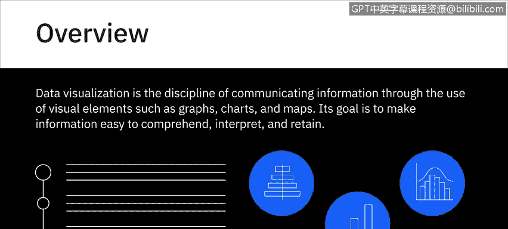
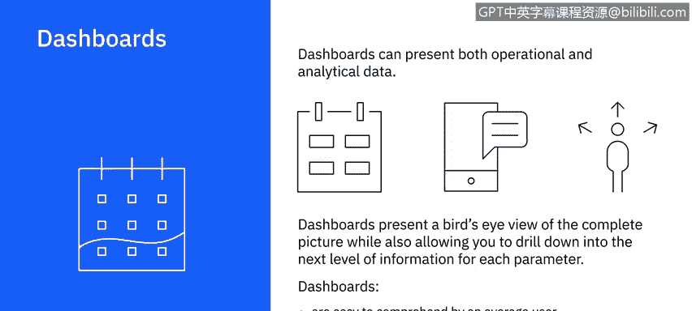

# 075：数据可视化入门 📊

在本节课中，我们将学习数据可视化的基本概念、目的以及如何选择合适的图表类型来有效传达信息。我们还将了解仪表板的作用及其在业务分析中的应用。

---

数据可视化是一门通过使用图形、图表和地图等视觉元素来传达信息的学科。其目标是使信息易于理解、解释和记忆。想象一下，你需要查看数千行数据来得出结论，而将其与总结相同数据发现的可视化表示进行比较。使用数据可视化，你可以提供隐藏在数据中的关系、趋势和模式的摘要，这些信息如果仅从数据转储中解读，即使不是不可能，也会非常困难。

为了使数据可视化具有价值，你必须选择最能有效地向受众传达你的发现的视觉化方式。为此，你需要从问自己一些问题开始。

*   **我想建立什么关系？**
*   **我是否想比较一个整体中各子部分的相对比例？** 例如，不同产品线在公司总收入中的贡献。
*   **我是否想比较多个值？** 例如，过去三年售出的产品数量和产生的收入。
*   **或者，我是否想分析单个值随时间的变化？** 在这个例子中，可能意味着某一特定产品在过去三年中的销售情况如何变化。
*   **我需要让受众看到两个变量之间的相关性吗？** 例如，天气条件与滑雪胜地预订量之间的相关性。
*   **我想检测数据中的异常吗？** 例如，查找可能扭曲研究结果的值和数据。

“我想回答什么问题”不仅仅是数据可视化设计和过程中的一个总体性问题。对于你可视化的每一个数据集和信息，你都需要能够为你的受众回答这个问题。你还需要考虑可视化是否需要是静态的还是交互式的。例如，交互式可视化可以允许你更改值并实时查看对相关变量的影响。因此，请考虑受众的关键收获、他们的信息需求以及他们可能提出的问题，然后规划能够清晰且有力地传达你信息的可视化方案。

上一节我们介绍了选择合适可视化方案前需要思考的问题，本节中我们来看看一些基本的图表类型示例。

以下是你可以用于可视化数据的一些基本图表类型示例：

*   **条形图** 非常适合比较相关的数据集或整体的各个部分。例如，在此条形图中，你可以看到10个不同国家的人口数量以及它们之间的比较。
    *   **公式/代码示例**：`图表类型 = 条形图`，用于比较分类数据。
*   **柱状图** 并排比较数值，可以非常有效地显示随时间的变化。例如，显示你网站的页面浏览量和用户会话时间如何逐月变化。
    *   **注意**：尽管除了方向之外相似，但条形图和柱状图并不总是可以互换使用。例如，柱状图可能更适合显示负值和正值。
*   **饼图** 显示一个实体分解为其子部分的情况，以及子部分之间的比例关系。饼图的每一部分代表一个静态值或类别，类别的总和等于100%。
    *   **示例**：在一个包含社交媒体、原生广告、付费影响者和现场活动四个营销渠道的营销活动中，你可以看到每个渠道产生的潜在客户总数。
*   **折线图** 显示趋势。它们非常适合显示数据值如何随连续变量变化。例如，你的产品或多种产品的销售额如何随时间变化，其中时间是连续变量。折线图可用于理解数据中的趋势、模式和变化，也可用于比较具有多个系列的不同但相关的数据集。
    *   **公式/代码示例**：`图表类型 = 折线图`，用于显示随时间变化的趋势。

数据可视化也可用于构建仪表板。仪表板将来自多个数据源的报告和可视化内容组织并显示在单个图形界面中。你可以使用仪表板来监控日常进度或业务功能甚至特定流程的整体健康状况。

仪表板可以呈现运营数据和分析数据。例如，你可以有一个营销仪表板，从中实时监控当前营销活动的覆盖范围、产生的查询和销售转化情况。作为同一仪表板的一部分，你还可以看到此活动的转化率与过去一些成功运行的活动的转化率相比如何。

仪表板是一个很好的工具，可以呈现整体情况的概览，同时也允许你深入查看每个参数的下一级信息。仪表板易于普通用户理解，使团队之间的协作变得容易，并允许你使用仪表板随时生成报告。你几乎可以立即看到数据和指标变化的结果，这可以帮助你在进行中从多个角度评估情况，而无需重新开始规划。

---

本节课中我们一起学习了数据可视化的核心价值在于清晰传达信息。我们探讨了如何通过提问来选择合适的图表类型，如条形图、柱状图、饼图和折线图，并了解了仪表板如何整合多源数据以提供实时、全面的业务洞察。记住，有效的可视化始于明确的信息目标和受众需求。