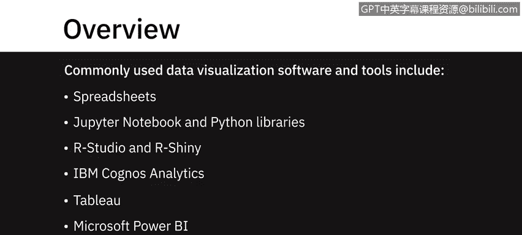
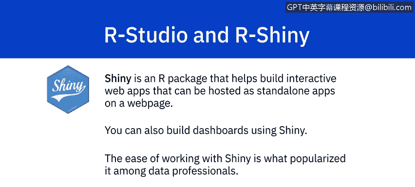
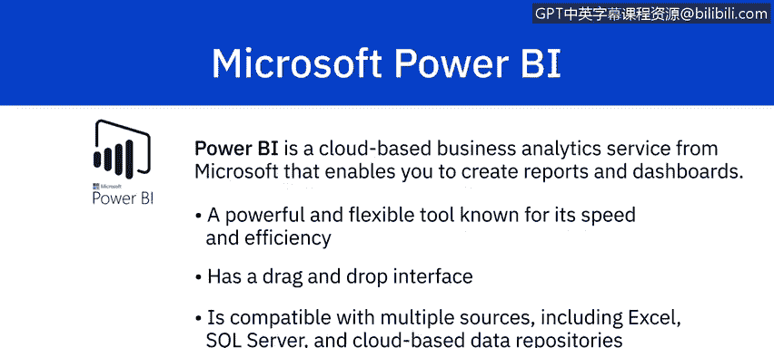
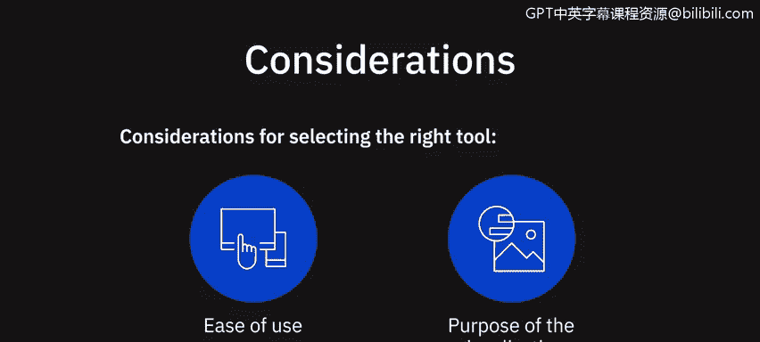

# 076：数据可视化与仪表盘软件介绍

在本节课中，我们将学习一些最常用的数据可视化软件和工具。这些工具包括电子表格、Jupyter Notebook 和 Python 库、RStudio 和 R Shiny、IBM Cognos Analytics、Tableau 以及 Microsoft Power BI。其中一些是端到端的数据分析解决方案，另一些则专门用于数据可视化，涵盖了从免费开源工具到商业解决方案的广泛选择。

---

## 📈 电子表格：Excel 与 Google Sheets

电子表格，例如 Microsoft Excel 和 Google Sheets，可能是最常用于创建数据集图形表示的软件。

电子表格易于学习，并且有大量在线文档和视频教程可供参考。Excel 提供了多种图表类型，从基本的条形图、折线图、饼图和数据透视表，到更高级的选项，如散点图、趋势线、甘特图、瀑布图和组合图。使用组合图，你可以将多种图表类型结合在一起。

Excel 还会根据你的数据集，推荐最佳的视觉呈现方式。为了使图表更具表现力，你可以添加图表标题、更改元素颜色以及为数据添加标签。

Google Sheets 也提供类似的图表类型用于可视化，尽管 Excel 比 Google Sheets 拥有更多基于公式的内置选项。与 Excel 一样，Google Sheets 可以帮助你选择合适的可视化方式。你只需高亮显示想要可视化的数据并点击图表按钮，就会获得一系列最适合你数据的推荐图表。

当底层数据发生变化时，Excel 和 Google Sheets 中的图表和报告都会自动更新。在需要多用户协作的场景下，Google Sheets 通常比 Excel 更受青睐。

---

## 🐍 Python 与 Jupyter Notebook

上一节我们介绍了基础的电子表格工具，本节中我们来看看更灵活的可编程工具。Jupyter Notebook 是一个开源的 Web 应用程序，为探索数据和创建可视化提供了绝佳的方式。你不需要是 Python 专家也能使用 Jupyter Notebook。

Python 提供了大量用于数据可视化的库，以下是其中几个核心库：

*   **Matplotlib**：这是一个广泛使用的 Python 数据可视化库。它提供不同类型的 2D 和 3D 绘图，并具有以多种不同方式创建绘图的灵活性。使用 Matplotlib，你只需几行代码就能创建高质量的交互式图形和图表。作为一个开源工具，它拥有庞大的社区支持和跨平台兼容性。
*   **Bokeh**：Bokeh 提供交互式图表，以其在处理大型或流式数据集时的高性能交互性而闻名。Bokeh 在应用交互、布局和不同样式选项以实现可视化方面提供了灵活性。它还可以转换使用其他 Python 库（如 Matplotlib、Seaborn 和 ggplot）编写的可视化。
*   **Dash**：Dash 是一个用于创建基于 Web 的交互式可视化的 Python 框架。使用 Dash，你可以用 Python 代码构建高度交互的 Web 应用程序。虽然了解 HTML 和 JavaScript 会有所帮助，但这并非必需。Dash 易于维护，支持跨平台且适配移动端。

---

## 📊 R 语言与 RStudio

除了 Python，R 语言也是数据科学领域的重要工具。使用 RStudio，你可以创建从基础到高级的各种可视化。

以下是 RStudio 支持的可视化类型：
*   **基础可视化**：直方图、条形图、折线图、箱线图、散点图。
*   **高级可视化**：热力图、马赛克图、3D 图形、相关图。

**Shiny** 是一个 R 语言包，可帮助你构建交互式 Web 应用程序。这些应用程序可以作为一个独立的应用程序托管在网页上。它们能无缝显示 R 对象，如图表和表格，并且可以设置为实时应用，供任何人访问。你也可以使用 Shiny 构建仪表盘。Shiny 易于使用的特性使其在数据专业人士中广受欢迎。

---

## 🏢 商业智能 (BI) 平台

前面介绍的工具更偏向于分析和编程，接下来我们看看功能更集成、面向业务用户的商业智能平台。

### IBM Cognos Analytics

IBM Cognos Analytics 是一个端到端的分析解决方案。Cognos 提供的一些可视化功能包括：
*   导入自定义可视化。
*   提供时间序列数据建模和基于相应可视化中呈现的数据进行预测的**预测功能**。
*   根据你的数据**推荐可视化**方案。
*   **条件格式设置**，允许你查看数据分布并突出显示异常数据点。例如，突出显示超过特定阈值的高销售额和低销售额。

Cognos 以其卓越的可视化效果以及利用其地理空间能力将数据叠加到物理世界而闻名。

### Tableau

Tableau 是一家生产交互式数据可视化产品的软件公司。使用 Tableau 产品，你可以通过拖拽手势，以仪表盘和工作表的形式创建交互式图形和图表。

Tableau 还提供了以“故事”形式发布结果的选项。你可以在 Tableau 中导入 R 和 Python 脚本，并利用其远优于其他语言的可视化功能。Tableau 的可视化功能易于使用且直观。

Tableau 兼容多种数据源，包括 Excel 文件、文本文件、关系数据库以及云数据库源，如 Google Analytics 和 Amazon Redshift。

### Microsoft Power BI

Power BI 是微软提供的一项基于云的业务分析服务，使你能够创建报告和仪表盘。它是一个强大而灵活的工具，以其速度、效率以及易于使用的拖放界面而闻名。

Power BI 兼容多种数据源，包括 Excel、SQL Server 和基于云的数据存储库，这使其成为数据专业人士的绝佳选择。

Power BI 提供了安全地协作和共享自定义仪表盘及交互式报告的能力，甚至在移动设备上也可以。Power BI 的仪表盘由单个页面上的许多可视化元素组成，帮助你讲述数据故事。这些被称为“磁贴”的可视化元素被固定到仪表盘上。仪表盘是交互式的，这意味着一个磁贴的变化会影响其他磁贴。

---

## 🤔 如何选择工具？

在决定使用哪种工具时，你需要考虑易用性以及可视化的目的，结合可用工具及其提供的可视化能力进行权衡。请记住：**只要你能想象出来，你就能创建出来。**

---

## 📝 课程总结

在本节课中，我们一起学习了多种主流的数据可视化与仪表盘软件。我们从最基础的电子表格（Excel, Google Sheets）开始，了解了它们便捷的图表功能。接着，我们探索了更灵活的可编程环境，包括 Python 的 Jupyter Notebook 及其核心可视化库（Matplotlib, Bokeh, Dash），以及 R 语言的 RStudio 和 Shiny 包。最后，我们介绍了功能强大的商业智能平台：IBM Cognos Analytics、Tableau 和 Microsoft Power BI，它们提供了端到端的分析解决方案和卓越的交互式仪表盘构建能力。理解这些工具的特点将帮助你在实际工作中根据具体需求选择最合适的可视化方案。