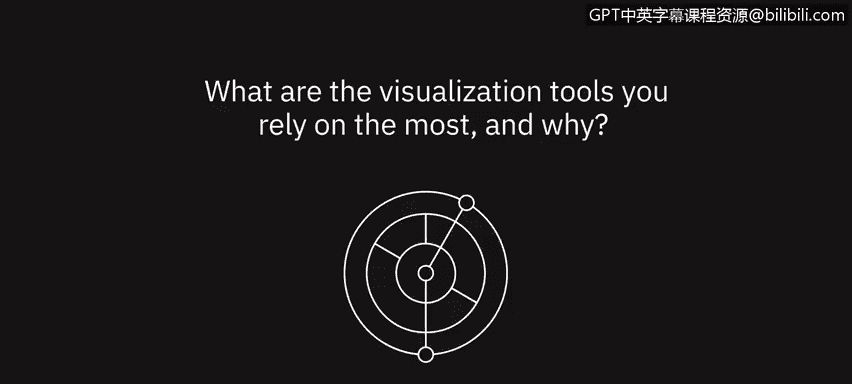
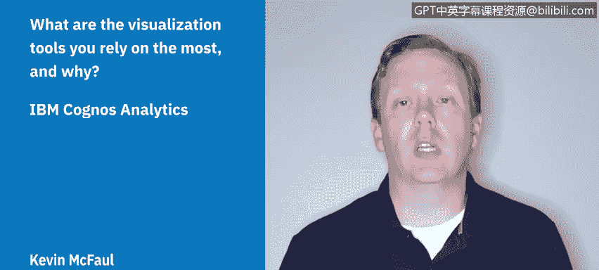

# 077：数据专家的可视化工具观点 🛠️

在本节课中，我们将了解几位数据专家在日常工作中最依赖的可视化工具及其原因。通过他们的分享，你可以了解到不同工具的特点和适用场景，为选择适合自己的工具提供参考。

---

上一节我们介绍了数据可视化的重要性，本节中我们来看看专业人士在实际工作中如何使用这些工具。

一位专家表示，他日常最依赖的可视化工具是 **Cognos Analytics**。

他选择这个工具有几个原因。首先，它能让他快速导入电子表格或连接数据库，并对数据进行可视化。无论是他自己决定要查看哪些字段，还是借助其 AI 助手来探索新数据集中的潜在价值，都非常便捷。

此外，他还可以利用其报告工具进行更复杂或更深入的分析，并构建和安排报告的分发。例如，如果希望销售团队每周一早上都能收到销售渠道或销售机会报告，只需设置一次，系统便可在每周日晚上自动发送。

更重要的是，该工具可以整合多个数据源，并帮助用户建立数据关联，最终将所有信息呈现在一个高度交互的单一仪表板上。用户可以进行动态筛选和排序，并轻松与组织内其他成员共享，避免了每个人都重复构建相同视图的麻烦。

---

接下来，另一位专家分享了她最常用的工具。

在可视化工具方面，她最依赖的是 **Looker**。这是一个数据可视化工具，构建在她公司内部数据库之上。

她提到，Looker 与她过去使用过的 **Tableau** 类似，都非常易于使用。这类工具（如 Looker 和 Tableau）的最大优点在于，能让组织内的每个人，无论是否是数据专业人士，都能轻松查看自己的数据，并进行基本的聚合或排序操作。

---

除了商业智能工具，编程语言在探索性数据分析中也扮演着关键角色。

一位专家指出，他进行探索性数据分析时非常依赖 **R 语言**。近年来，他深刻体会到使用 R 进行基础数据分析和可视化的高效性，尤其是使用 **tidyverse** 这一系列软件包。这些包能帮助用户轻松加载数据、在不同层级进行聚合，并快速实现可视化。

---

对于许多用户而言，一些广为人知的工具因其易用性和丰富的资源而成为首选。

**Tableau** 和 **Power BI** 是显而易见的选择。它们易于上手，且非常实用。

随着越来越多的公司和用户开始使用这些工具，其内置的模板和库也日益丰富。

---

最后，一位专家强调了基础工具在数据准备阶段的重要性。

他会说，最常用的可视化工具可能就是 **Excel**。在深入分析之前，他会利用 Excel 的条件格式和映射规则等功能来检查数据，确保其清洁、合理，并为后续分析做好充分准备。

---

本节课中我们一起学习了多位数据专家对可视化工具的看法。我们了解到，工具的选择取决于具体需求，从强大的商业智能平台（如 Cognos Analytics、Looker、Tableau、Power BI）到灵活的编程语言（如 R），再到基础的数据准备工具（如 Excel），各有其用武之地。掌握这些工具的特点，将帮助你在数据分析工作中更有效地探索和展示数据。