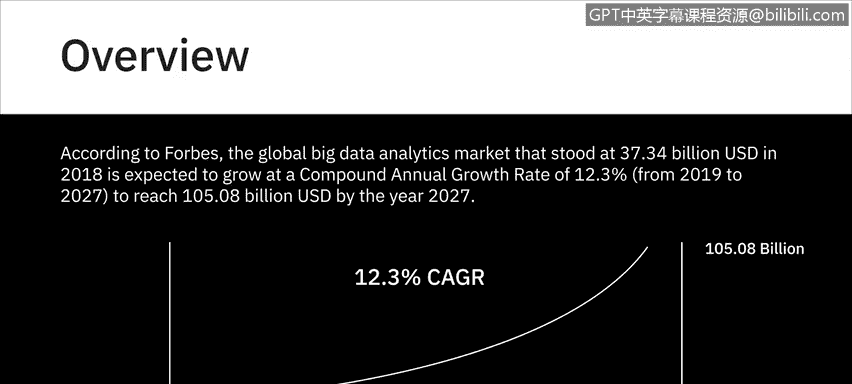
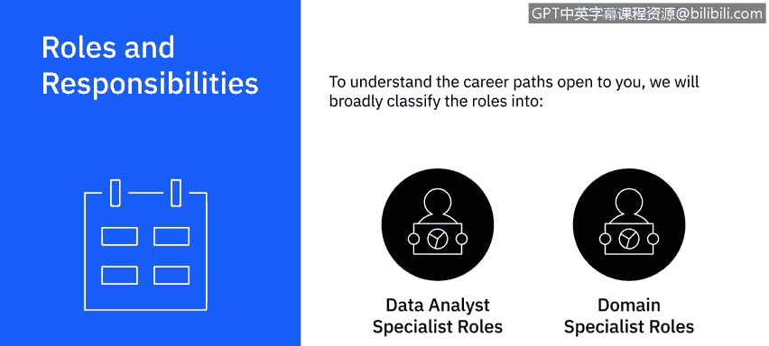
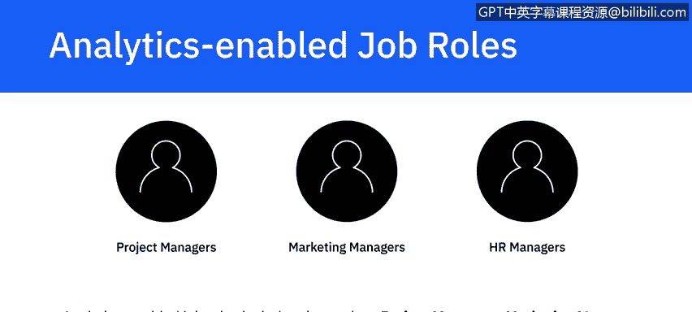
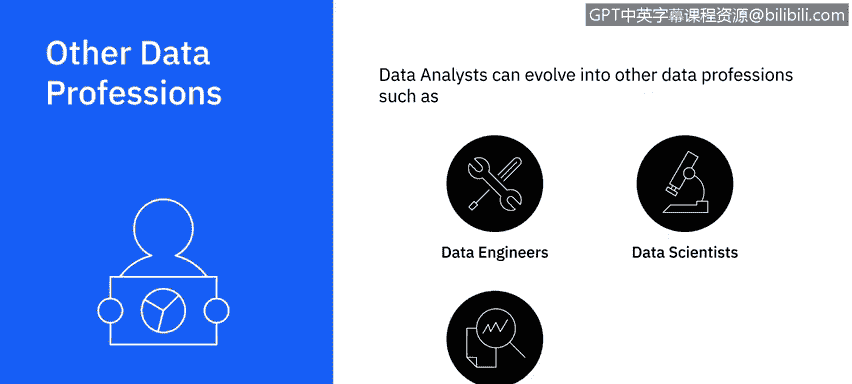
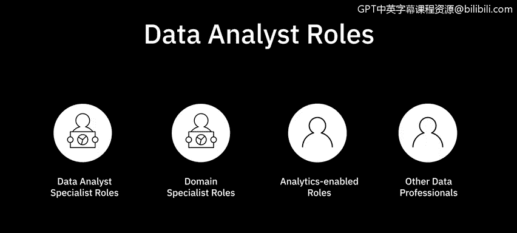

# 078：数据分析领域的职业机会 📊

在本节课中，我们将探讨数据分析领域的广阔职业前景。我们将了解不同行业对数据分析师的需求，分析主要的职业发展路径，并讨论如何规划你的职业生涯。

---

数据分析师的职位空缺遍布工业界、政府和学术界。每个行业，无论是银行金融、保险、医疗保健、零售还是信息技术，都需要熟练的数据分析师。这些职位在大型企业和初创公司中同样受到追捧。

根据《福布斯》的数据，全球大数据分析市场在2018年达到**373.4亿美元**，预计在2019年至2027年间将以**12.3%** 的复合年增长率增长，到2027年达到**1050.8亿美元**。目前，市场对熟练数据分析师的需求远大于供给，这意味着公司愿意支付更高的薪酬来聘请优秀的数据分析师。

为了理解向你开放的职业道路，我们将广泛地把数据分析相关角色分为两大类：**数据分析专家角色**和**领域专家角色**。

---

### 数据分析专家职业路径 🛤️

数据分析专家角色适合那些希望专注于技术层面并在其职能领域内成长的分析师。在这条路径上，你可以从助理或初级数据分析师开始职业生涯，逐步晋升为分析师、高级分析师、首席分析师和首席分析师。

这些角色之间的界限、晋升所需的经验年限以及需要积累的经验性质，可能因行业、组织规模和团队规模而异。

以下是不同团队规模下的典型发展模式：

*   **在较小的团队中**，你可能会在短时间内获得数据分析所有环节的经验，从数据收集一直到将发现结果可视化并呈现给利益相关者。
*   **在较大的团队和组织中**，角色通常根据活动进行划分。这意味着在进入下一个阶段之前，你可能会在流程的某个特定阶段积累经验。这有助于你在进入下一环节前，先磨练好当前环节的技能。

在你的职业发展过程中，从助理数据分析师成长为首席或首席数据分析师，你需要持续提升技术、统计和分析能力，从基础水平达到专家水平。你需要展示自己有能力使用更广泛的工具和平台，处理数据分析流程的不同方面，以及应对多样化的用例。

在技术技能方面，你可能从只掌握一种查询工具和编程语言、一种数据仓库或有限的几种可视化工具开始。随着经验的积累，你需要学习并展示自己能够使用越来越多的工具、语言、数据仓库和新技术。

你的沟通技巧、演示技巧、利益相关者管理技巧和项目管理技巧都需要逐步磨练和提升。

作为首席或首席分析师，你可能还需要负责在团队中建立流程，为团队应使用的软件和工具提出建议，提升团队技能，并扩展团队以纳入更多人才。在一些组织中，这些职责可能由经理级别的人员承担，他们通过晋升来管理数据分析师团队。

---

### 领域专家（职能分析师）职业路径 🎯

领域专家，也称为职能分析师，是在特定领域（如人力资源、医疗保健、销售、财务、社交媒体或数字营销）获得专长并被视作该领域权威的分析师。他们可能不是技术能力最强的人。这些角色的头衔包括人力资源分析师、市场分析师、销售分析师、医疗保健分析师或社交媒体分析师。

---

### 数据分析赋能型职位 🚀

此外，还有数据分析赋能型职位。这些角色包括项目经理、市场经理和人力资源经理等。在这些工作中，数据分析技能能带来更高的效率和效果。随着越来越多的组织依赖数据做决策，相当一部分数据分析师职位空缺都属于数据分析赋能型。

---

### 横向发展与技能拓展 🔄

作为一名数据分析师，你也有机会探索和学习新技能，从而进入其他数据专业领域，如数据工程或数据科学。

以下是两个可能的横向发展示例：

*   **转向数据工程**：如果你从初级数据分析师起步，并且非常喜欢使用数据湖和大数据仓库，你可以进一步获取这些技术的专业知识，将职业生涯发展为大数据工程师。
*   **转向业务分析**：如果业务方面更让你兴奋，你可以类似地探索所需技能，横向转入业务分析或商业智能分析领域。

---

### 总结与展望 🌟

虽然数据分析师的职业前景非常广阔，但好消息是，你有大量资源可以帮助你成长。要想在数据分析师的旅程中取得成功，你需要做的就是抓住你想要追求的机会或出现在你面前的机会，并在此过程中不断学习。

本节课中，我们一起学习了数据分析领域的职业机会。我们了解到市场需求旺盛，职业路径主要分为技术专家和领域专家两条主线，并且数据分析技能可以赋能多种传统职位。最后，我们还探讨了向数据工程或业务分析等相邻领域横向发展的可能性。记住，持续学习和抓住机会是职业成长的关键。