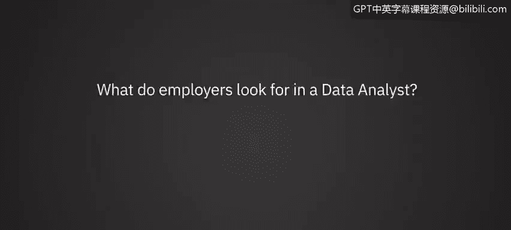
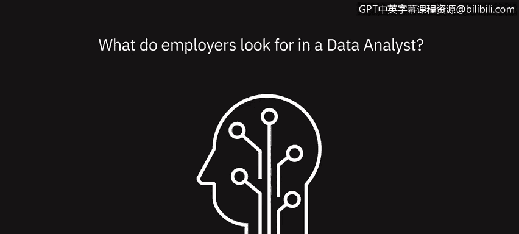

# 080：雇主在数据分析师身上看重什么？👔

在本节课中，我们将聆听数据专业人士的分享，了解雇主在招聘数据分析师时最看重哪些素质和技能。通过他们的视角，我们可以更清晰地规划自己的职业发展路径。

---

## 概述：雇主的核心诉求

多位数据领域的专家指出，雇主对数据分析师的期望远不止于技术能力。他们寻求的是具备诚信、清晰沟通能力、数字敏感度、持续学习意愿以及强大问题解决能力的综合型人才。

---

## 诚信至上：数据准确性的基石 🧭

上一节我们概述了雇主的多元诉求，本节中我们首先来看看被反复强调的首要品质：诚信。

一位招聘经理分享了一个经典的面试问题：“如果必须二选一，你是选择按时交付，还是确保答案正确？” 他始终在寻找会回答“我必须确保信息准确无误”的候选人。

**核心观点**：错过截止日期，其危害远小于公司基于错误信息做出数百万美元的决策，或因报告不准确而导致他人失业。因此，**诚信**远比单纯守时更重要。

---

## 清晰沟通：让分析产生价值 💬

仅仅拥有出色的分析能力是不够的。如果无法将复杂的发现清晰地传达给外部利益相关者，那么分析的价值将大打折扣。

因此，**清晰沟通**的能力是雇主高度寻求的技能。你需要能够将数据洞察转化为易于理解的故事和行动建议。

---

## 技术能力与思维模式

除了软技能，雇主对技术硬实力和特定的思维模式也有明确要求。以下是他们普遍关注的几个方面：

**1. 数字敏感度与统计知识**
雇主显然会寻找对数字敏感的分析师。这包括理解复杂分析、掌握**假设检验（如A/B测试）** 的能力，并能解读测试结果及其业务含义。

**2. 核心工具技能**
随着数据量的增长，**强大的SQL技能**正变得越来越重要。它是查询和处理数据的基石。

**3. 成长型思维与快速学习能力**
数据分析行业变化迅速，因此雇主看重候选人的**成长型思维**和学习的意愿。这体现在能否快速掌握新的编程语言（如Python或R）或工具（如R Studio）。

**4. 超越期望的主动性**
一位雇主提到，他们寻找的是注重细节且有些“超额完成”特质的人。这类人不满足于只完成眼前的任务，他们渴望走得更远，拥有更高的抱负。

**5. 跳出框架思考与解决问题**
雇主需要能**跳出框架思考**的人才。如果指令是“做A、B、C”，优秀的分析师不仅会完成，还会进一步思考，提供替代方案。当遇到问题时，他们不会停滞不前，而是会主动**排查故障**，并提出可能的解决方案。

---

## 动态适应与“懂数据” 🤔

在快速变化的工作环境中，静态的技能组合是不够的。雇主还特别看重以下几项动态能力：

**1. “懂数据”的能力**
“懂数据”意味着多层含义：能从容应对各种格式的数据；能思考为了解决手头的问题，需要什么样的数据。这项技能至关重要。

**2. 解决问题的能力**
**解决问题**是另一项关键技能。当问题摆在面前时，数据分析师应知道如何利用手头任何格式的数据来攻克它，进行分析并呈现能够解决问题的洞察。

**3. 动态适应性**
分析师需要非常**动态和适应性强**。如果突然面对一个与以往截然不同的数据集，他们必须能够快速适应这种变化。

**4. 快速掌握技术技能**
这指的是快速学习新工具或范式的能力。例如，在一个环境中使用一种SQL范式，在另一个环境中能迅速切换到另一种；或者从熟悉的Python快速上手R Studio。

---

## 总结：优秀数据分析师的画像 🎯

本节课中，我们一起学习了雇主眼中优秀数据分析师应具备的素质。总结如下：

*   **品质基础**：**诚信**是立身之本，确保数据准确性高于一切。
*   **价值传递**：**清晰的沟通**能力是将分析转化为商业价值的关键桥梁。
*   **硬核实力**：需要具备**数字敏感度**、**强大的SQL技能**以及**编程能力**（如Python）。
*   **思维模式**：拥有**成长型思维**、**注重细节**、具备**主动性**并能**跳出框架思考**和**解决问题**。
*   **动态能力**：能够快速**“懂数据”**、**解决问题**、**适应变化**并**快速学习**新技能。

成为一名受雇主青睐的数据分析师，是一个技术能力、业务思维与个人品质共同发展的过程。希望本讲内容能为你指明努力的方向。