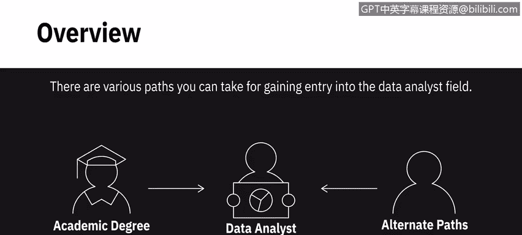
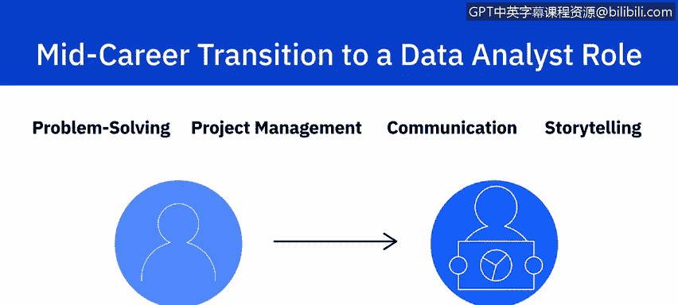
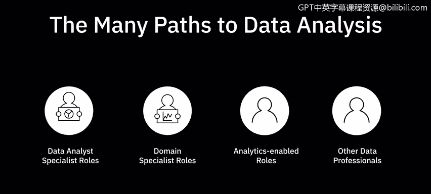

# 081：数据分析的多种入门路径 🛣️

在本节课中，我们将探讨进入数据分析领域的多种途径。无论您是否拥有相关学术学位，都有机会开启数据分析师的职业生涯。我们将分析不同背景的学习者如何规划学习路径，并成功进入或转行至这一领域。

---

## 学术学位路径 🎓

最直接的入门路径之一是获得相关学术学位。拥有数据分析、统计学、计算机科学、管理信息系统或信息技术管理等领域的学位，能为您提供一个坚实的起点和显著优势。

## 在线培训项目路径 💻

如果您没有相关学术学位，可以选择参加在线培训项目来获取所需的知识和技能。以下是主要的在线学习平台及其特点：

*   **平台示例**：Coursera、edX、Udacity 等。
*   **课程形式**：这些平台提供由世界顶尖领域专家设计和讲授的、包含多门课程的综合专项课程。
*   **学习内容**：课程涵盖数据分析师所需的技术技能、职能技能和软技能，例如**统计学**、**电子表格**、**SQL**、**Python**、**数据可视化**、**问题解决**、**叙事呈现**等。
*   **实践价值**：课程通常包含实践作业和项目，让您体验知识和技能在真实世界中的应用，这些项目甚至可以成为您作品集的一部分。

因此，即使没有学术资质，通过这些课程的学习，您也能获得入门级机会，并随着经验积累不断成长。

---

## 转行进入路径 🔄

上一节我们介绍了通过学位或在线课程直接入门的路径。本节中，我们来看看如果您已在其他行业工作数年，希望转行进入数据分析领域，应如何规划。

数据分析领域广阔，成功的转行需要周密的计划。首先，建议您深入研究目标岗位所需的知识技能、现有的工作机会以及职业发展前景。

您可以利用在线资源、论坛和人际网络，与业内人士交流，获取对真实工作场景的洞察。

根据您当前的工作背景，可以考虑以下两种转行策略：

*   **从非技术岗位转行**：如果您目前从事非技术工作，可以考虑走**领域专家**或**职能分析师**的路径。例如，如果您在销售部门，可以从定位并培养自己成为销售分析师开始。您拥有行业经验优势，再补充学习**统计学**和**编程**等其他领域技能即可。
*   **从技术岗位转行**：如果您已有技术背景，您将能更快掌握数据分析师角色所需的工具和软件。同时，您很可能对所在领域或行业有深刻理解。至于问题解决、项目管理、沟通和叙事呈现等其他技能，您可能已在现有工作中有所应用。您可以通过培训、在线课程、实践社区和论坛来进一步提升这些技能。

---

## 总结与展望 ✨

本节课中，我们一起学习了进入数据分析领域的多种路径：无论是通过学术学位打下基础，还是借助在线课程获取技能并积累项目经验，亦或是从其他岗位成功转行，关键在于保持好奇心和持续学习的态度。

数据分析是一个快速发展的领域。只要您充满好奇、乐于学习新事物并对这个领域感到兴奋，您就能够开辟前进的道路，而无需过分担忧自己可能缺少的所谓“正式资质”。