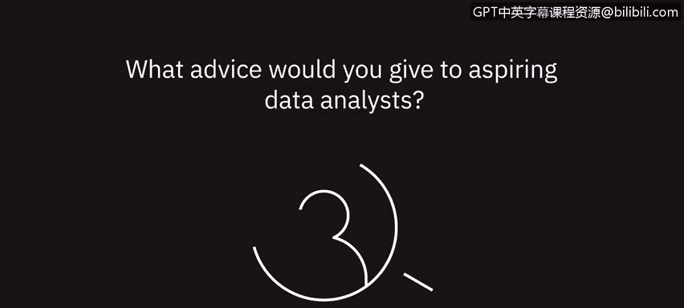

# 083：给未来数据分析师的建议 💡

## 概述

在本节课中，我们将聆听数据专业人士给未来数据分析师的建议。这些建议涵盖了学习路径、技能发展、职业规划以及如何将日常经验转化为专业优势。

---

## 给未来数据分析师的建议

上一节我们介绍了课程背景，本节中我们来看看专业人士分享的具体建议。

### 持续学习，保持耐心

一位专业人士建议，要保持学习，不要气馁。关于分析学的知识浩如烟海，一个人终其一生也无法学完。因此，不要试图一次性掌握所有知识，而是应该循序渐进。

**核心建议**：确保每周、每月、每年都在持续学习新东西。这种持续学习的态度将对你的职业生涯大有裨益。

### 构建“T”型知识结构

我职业生涯中得到的一条非常有用的建议是，将你的职业生涯视为一个大写的字母“T”。

**公式**：`知识结构 = 广泛的知识面（T的顶部） + 精深的专业技能（T的底部）`

T的顶部代表你应该在多个不同领域拥有广泛的知识，尽管这些知识不一定需要非常深入。你至少应该对A/B测试、机器学习、数据可视化、SQL、Python、R等有所了解。

而T的底部则意味着你应该至少在一个领域进行深入、严谨的学习。在我刚才提到的领域中，应该有一个是你真正深入理解并精通的。

### 善用每一份经历

要利用你拥有的每一份工作经历来积累优势。这意味着你可以从任何事情中学到东西。

以下是你可以思考和实践的方向：

*   查看家庭预算或询问父母是否可以看看家庭账本。
*   如果你在快餐店工作，可以观察客流量、营业额等数字，并与经理探讨这些数字的含义以及接下来的计划。

### 准备你的案例

当你与潜在雇主交谈时，准备好你的案例。这些案例不一定非得是工作经验，也可以是你的生活经验。

**核心思路**：告诉我你在个人生活或职业中是如何运用分析思维的，以及这与我们正在做的工作有何关联。这将会极大地帮助你。

### 建立专业作品集

我给未来数据科学家的一个建议是，建立一个能展示你数据科学或数据分析技能的专业作品集。

你可以通过以下方式来实现：

*   在线寻找有趣的数据集并进行分析。
*   在你的工作中寻找机会，即使你目前的工作不是数据分析师。寻找可以处理数字的机会，这自然会引导你积累起优秀的作品集或成功的数据分析项目案例。

### 追随你的热情

我给未来数据分析师的建议是追随你的热情。找一份能满足你需求并在工作中给你带来快乐的工作。

没有比每天早晨醒来都讨厌去上班更糟糕的事情了。数据分析师职位遍布各个行业和部门，有非常多的选择。没有必要仅仅为了有一份工作而接受它。找到真正能激发你热情、让你每天早晨有动力起床的事情。

---

## 总结

本节课中，我们一起学习了数据专业人士给未来数据分析师的宝贵建议。我们了解到，成功的路径包括**持续学习**、构建**T型知识结构**、从**所有经历中学习**、准备好展示个人能力的**案例**、积极建立**专业作品集**，以及最重要的——**追随你的热情**来选择职业。这些建议为踏入数据分析领域提供了清晰而实用的行动指南。