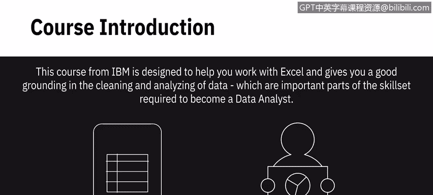
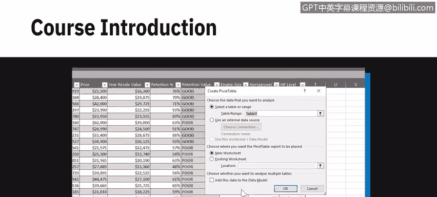
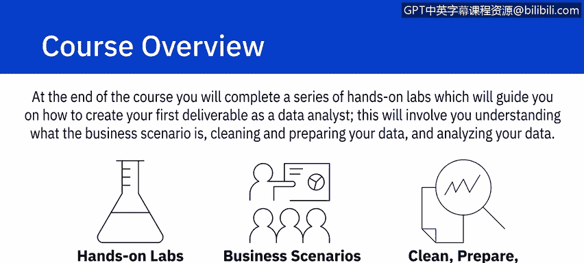
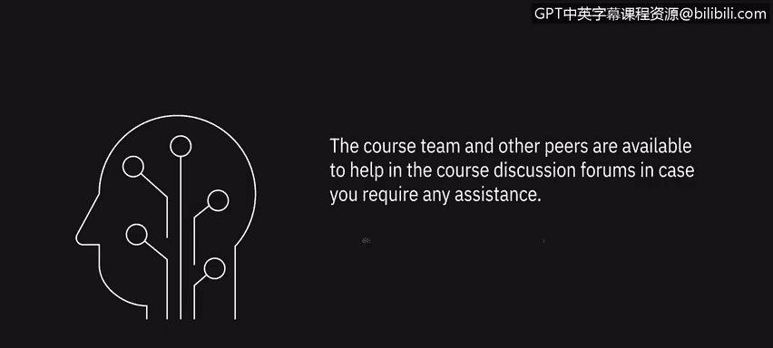

# 001：《数据分析Excel基础》｜课程介绍 📊

在本节课中，我们将要学习IBM数据分析师专业证书第二门课程《数据分析Excel基础》的整体介绍。这门课程旨在帮助你掌握使用Excel电子表格进行数据分析的核心技能，为成为一名数据分析师打下坚实基础。

## 课程目标与内容概述 🎯

这门IBM课程旨在帮助你熟练使用Excel，并为你提供数据清洗和分析方面的扎实基础。这些技能是成为数据分析师所需技能组合的重要组成部分。

你将不仅学习使用电子表格进行数据分析的技术，还会在整个课程中通过多个动手实验进行实践。

## 课程模块详解 📚

以下是本课程五个核心模块的详细介绍。

### 模块一：电子表格基础

在模块一中，你将学习电子表格的基础知识，包括电子表格术语、界面以及在工作表和工作簿中的导航方法。

### 模块二：数据处理基础

上一节我们介绍了电子表格的基础操作，本节中我们来看看数据处理的核心功能。在模块二中，你将学习选择数据、输入和编辑数据、复制与自动填充数据、格式化数据，以及使用函数和公式。

### 模块三：数据清洗与整理

掌握了基础数据处理后，数据质量至关重要。在模块三中，你将学习使用电子表格清洗和整理数据，包括数据质量和数据隐私的基础知识、删除重复和不准确的数据、删除空行、消除数据不一致和空格，以及使用快速填充和分列功能。

### 模块四：数据分析技术

数据准备就绪后，便可进行分析。在模块四中，你将学习使用电子表格分析数据，包括筛选数据、排序数据、使用常见的数据分析函数、创建和使用数据透视表，以及创建和使用切片器与时间线。

### 模块五：实战项目与成果交付

在模块五中，你将在课程结束时完成一系列动手实验，这些实验将指导你如何创建作为数据分析师的第一个交付成果。这将涉及理解业务场景、清洗和准备数据以及分析数据。

## 课程特色与学习方法 🔄

在整个课程中，你将跟随两个不同的业务场景，每个场景使用其自己的数据集。这些不同的场景和数据集将用于课程视频和动手实验中。

## 学习成果 📈

完成本课程后，你将能够：
*   理解电子表格如何作为数据分析工具使用。
*   理解何时使用电子表格作为数据分析工具及其局限性。
*   创建电子表格并解释其基本功能。
*   使用Excel执行数据整理和数据清洗任务。
*   使用Excel电子表格中的筛选、排序和数据透视表功能分析数据。
*   执行一些中级的数据整理和数据分析任务来解决业务场景。

## 支持与帮助 🤝

课程团队和其他学员可在课程讨论论坛中提供帮助，以防你需要任何协助。

让我们开始观看下一个视频，你将在其中获得对电子表格的介绍。

---

本节课中我们一起学习了《数据分析Excel基础》课程的整体框架、学习目标、各模块核心内容以及最终你将掌握的能力。准备好开始你的Excel数据分析之旅吧！