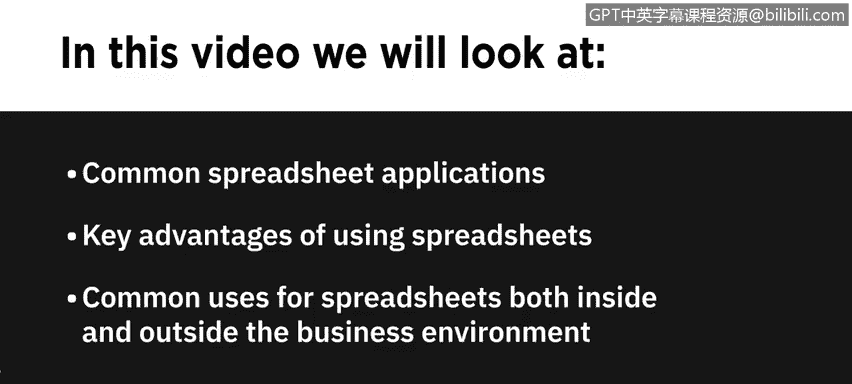
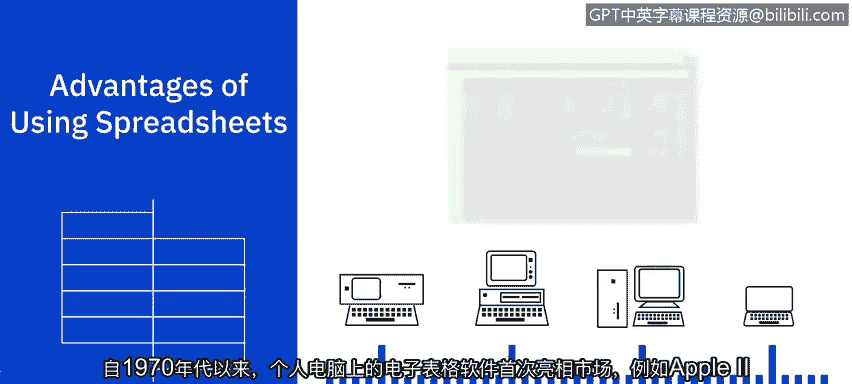
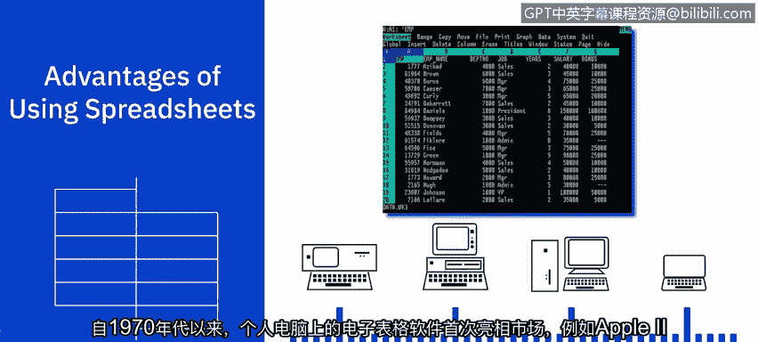
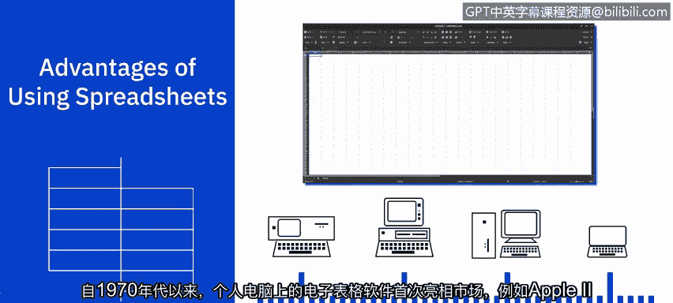
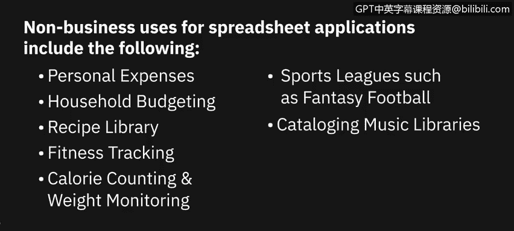
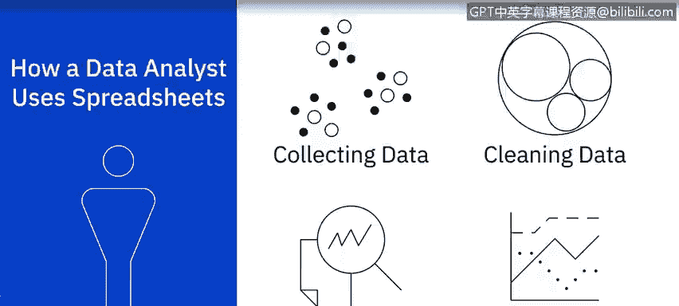
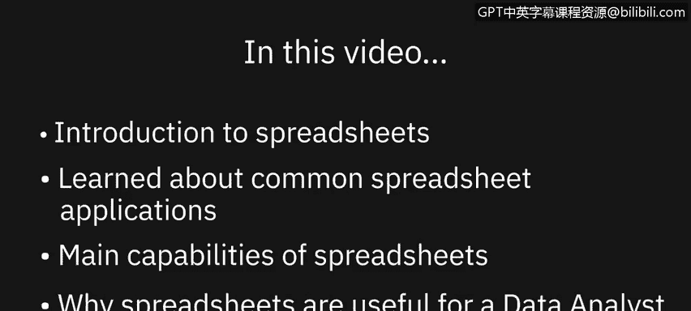

# 002：电子表格入门 📊

在本节课中，我们将介绍电子表格的基本概念，列举常见的电子表格应用程序，了解其核心功能，并探讨为何电子表格是数据分析师的有用工具。

---

## 常见的电子表格应用程序

市场上有多种电子表格应用程序可供选择。其中一些更为知名和常用，有些是免费的，而另一些则需要付费。

目前，最常用且功能最全面的电子表格应用程序是 **Microsoft Excel**。其桌面版作为Office套件或部分Microsoft 365订阅的一部分需要付费，但也存在一个名为 **Excel for the web**（亦称Excel在线版）的网页版精简版本。在线版对拥有Microsoft账户的用户免费，但不提供桌面版的所有高级功能。

其次是 **Google Sheets**，它提供了许多（尽管不是全部）Excel的功能，并且对拥有Google账户的用户免费。这是一个基于网页的应用程序，能很好地与Google表单、Google Analytics和Google Data Studio等其他Google应用集成。

此外还有 **LibreOffice Calc**，这是一个完全免费、开源的桌面电子表格应用程序。它提供的功能比Excel或Google Sheets更基础，但仍包含许多数据分析所需的工具，如图表、条件格式和数据透视表。

其他电子表格应用程序还包括：功能全面的网页版应用 **Zoho Sheet**（可与Google Sheets媲美）、**OpenOffice Calc**、面向Salesforce的 **Quip**、主要用于项目管理的 **Smartsheet**，以及随苹果设备（如Mac电脑）附带的 **Apple Numbers**（也可通过App Store在其他苹果设备上获取）。

因此，您有多种电子表格应用程序选项，从功能全面到基础版，从云端应用到桌面应用，从付费版本到免费版本。您可以根据自己的需求和预算来决定使用哪一款。

---

## 电子表格的核心功能

上一节我们了解了有哪些电子表格软件，本节中我们来看看电子表格的核心功能。电子表格相对于手动计算方法具有多项优势。

例如，一旦正确编写了公式，您就可以确保计算是准确的，并且计算将自动为您执行。

电子表格还有助于保持数据的组织性和易于访问性。您的数据可以轻松地进行格式化、筛选和排序以满足需求。如果在数据输入或计算中出错，您可以轻松地编辑、撤销或使用错误检查工具来纠正这些错误。

最后，您可以在电子表格中分析数据，并创建图表、图形和报告，以帮助可视化您的数据分析结果。

自20世纪70年代个人电脑电子表格软件（如Apple II上的VisCalc）首次出现在市场上以来，电子表格在功能和特性方面已经取得了长足的进步。它们已从简单的表格和相对基础的计算，发展成为用于分析、管理和可视化海量数据集的强大工具。

---

## 电子表格的典型用途

以下是电子表格应用程序最常见的商业用途：

*   **数据录入与存储**
*   **比较大型数据集**
*   **建模与规划**
*   **图表制作**
*   **识别趋势**
*   **业务流程流程图**
*   **跟踪业务销售**
*   **财务预测**
*   **统计分析**
*   **损益会计**
*   **预算编制**
*   **法务审计**
*   **薪资与税务报告**
*   **开具发票**
*   **日程安排**

除了商业用途，其他典型用途还包括：

*   **个人开支管理**
*   **家庭预算**
*   **食谱库**
*   **健身追踪**
*   **卡路里计数与体重监测**
*   **体育联赛（如梦幻足球）管理**
*   **音乐库编目**
*   **联系人列表、购物清单和圣诞贺卡清单**

---

## 电子表格在数据分析中的应用

作为数据分析师，您可以将电子表格用作数据分析任务的工具，具体包括：

*   **数据收集与获取**：从一个或多个来源收集和获取数据。
*   **数据清理**：清理数据以移除重复项、不准确之处、错误并解决缺失值，从而提高数据质量。
*   **数据分析**：通过筛选、排序和解释数据，以确定可以从数据中获取哪些有用信息。
*   **数据可视化**：帮助您向关键业务利益相关者及组织内任何其他相关方讲述数据分析发现的故事。

---

## 总结

本节课中，我们一起学习了电子表格的入门知识。我们了解了一些常见的电子表格应用程序、电子表格的主要功能以及为何电子表格可能是数据分析师的有用工具。

在下一个视频中，我们将探讨电子表格的基础知识，包括常见的电子表格术语。