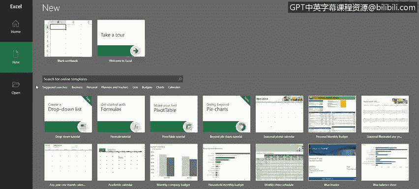
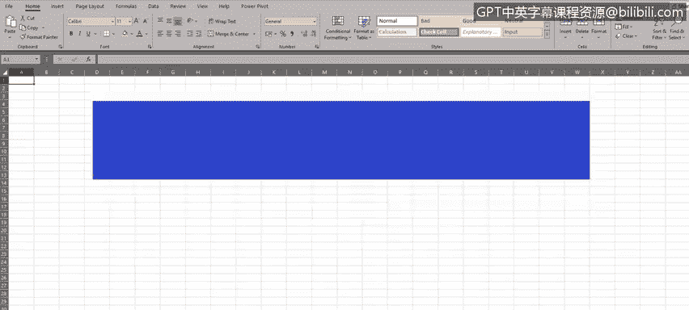
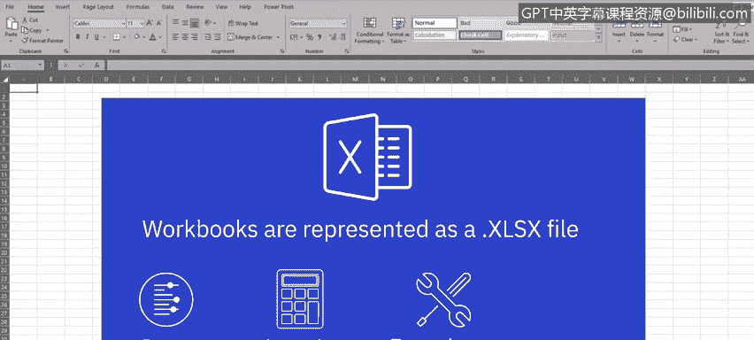
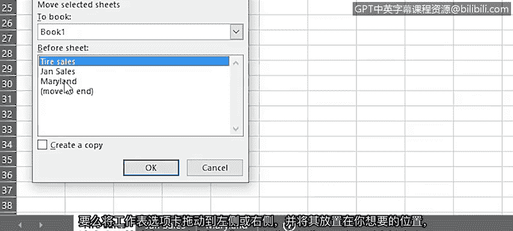
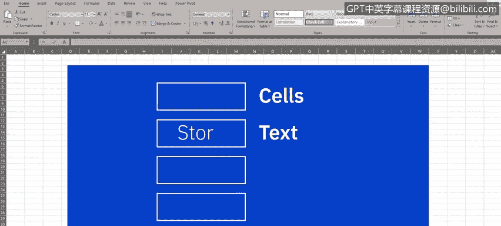
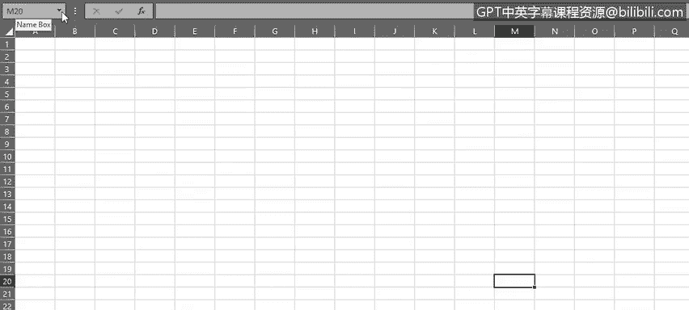
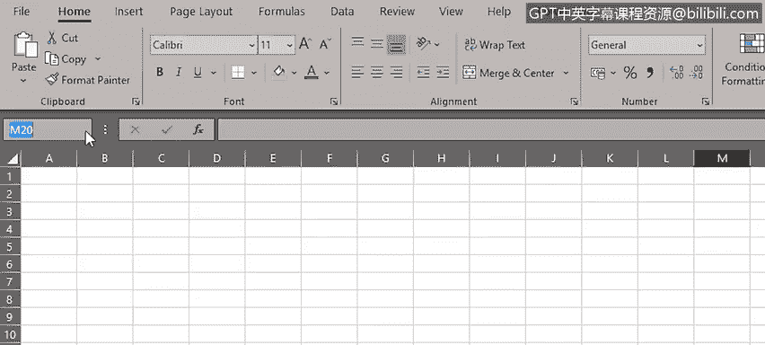
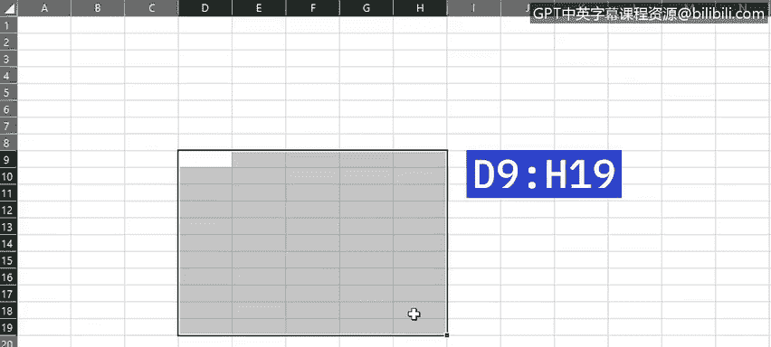
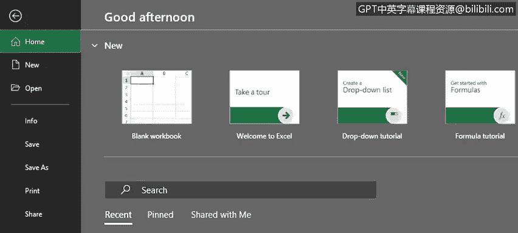
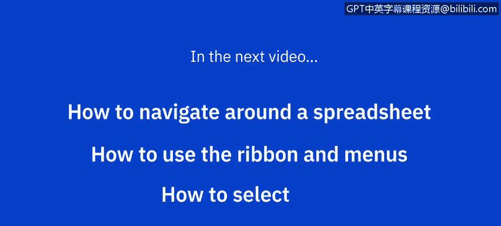

# 003：电子表格基础（第一部分）

在本节课中，我们将开始学习使用电子表格应用程序的基础知识。我们已经了解了可用的电子表格软件以及为何电子表格是数据分析师的有用工具。接下来的内容将基于Excel桌面版进行讲解，但其中大多数任务同样适用于Excel在线版及其他应用程序（如Google Sheets）。

## 📚 基础术语介绍

首先，我们来了解一些基础的电子表格术语。

### 工作簿与工作表

打开Excel时，你可以选择创建一个新的空白工作簿或打开一个现有工作簿。我们选择“新建”一个“空白工作簿”。

*   **工作簿**是Excel中的最高层级组件，以 `.xlsx` 文件形式存在。因此，当你打开或创建一个工作簿时，实际上是在操作一个 `.xlsx` 文件。工作簿包含了你的所有数据、计算和函数，并由多个基础元素构成。
*   **工作表**是工作簿的组成部分，每个工作表在Excel中由一个标签页表示。默认情况下，每个标签页被命名为Sheet1、Sheet2等。为了使工作表标签更具意义，通常会对它们进行重命名，以更贴合工作表的目的，例如“一月销售”或某个区域、门店的名称。

以下是重命名工作表的方法：
*   右键单击标签页，选择“重命名”。
*   或者，直接双击工作表标签页的名称进行重命名。

工作表标签可以命名为任何符合你特定需求的名称，以便于理解该工作表所代表的内容。当前被高亮显示的工作表标签所对应的工作表，被称为**活动工作表**。

### 单元格、行、列与单元格引用

每个工作表都由大量称为**单元格**的矩形框组成。这些单元格用于存放你的数据，数据可以是文本、数字、公式或计算结果。

单元格按以下方式组织：
*   **列**：垂直排列，使用字母系统标识（例如，这是B列）。
*   **行**：水平排列，使用数字系统标识（例如，这是第7行）。

每个单元格由一个**单元格引用**表示，它本质上是列字母和行数字的组合。例如，如果我们点击工作表中心附近的某个位置，现在选中的是单元格 `M20`。这通常被称为**活动单元格**。活动单元格不仅通过单元格高亮的边框来指示，在工作表的左上角，你也会在一个小方框中看到其单元格引用（显示为 `M20`）。

**重要提示**：单元格引用总是先写列字母，后跟行数字，即 `M20`（第M列，第20行）。

### 单元格区域

工作簿的最后一个重要元素是**单元格区域**。它标识了一组被同时选中的单元格。这可能是同一行或同一列的多个单元格，也可能是多行多列的组合。

你可以通过以下方式选择单元格区域：
*   使用鼠标：选中第一个单元格，然后拖动以包含其他单元格。
*   使用键盘：`Shift` + 方向键。

这个单元格范围通常被称为**数组**，最常用作计算和公式中的引用。例如，如果你想对D9到D19单元格之间的所有值求和，你需要在公式中指定这个单元格区域。

**注意**：单元格区域使用冒号 `:` 分隔单元格引用来表示。
*   对于同一列的连续单元格：`D9:D19`
*   对于同一行的连续单元格：`D9:H9`
*   对于多行多列的矩形区域：`D9:H19`

我们将在后续课程学习计算和公式时看到这种表示法的应用。这些单元格区域甚至可以引用另一个工作表中的单元格，这通常被称为**三维引用**。

现在，我们可以关闭这个工作簿，无需保存。

## 🎯 本节总结

在本节视频中，我们学习了电子表格的一些基本术语和元素，包括**工作簿**、**工作表**、**单元格**、**行**、**列**、**单元格引用**以及**单元格区域**。

在下一节视频中，我们将讨论如何在电子表格中导航、如何使用功能区与菜单，以及如何选择数据。