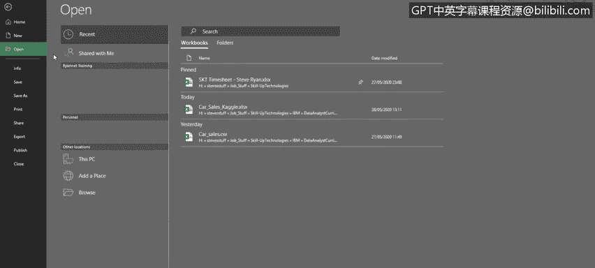
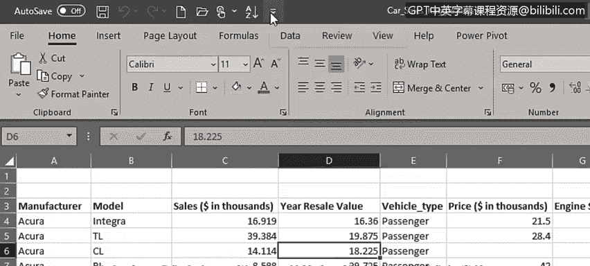
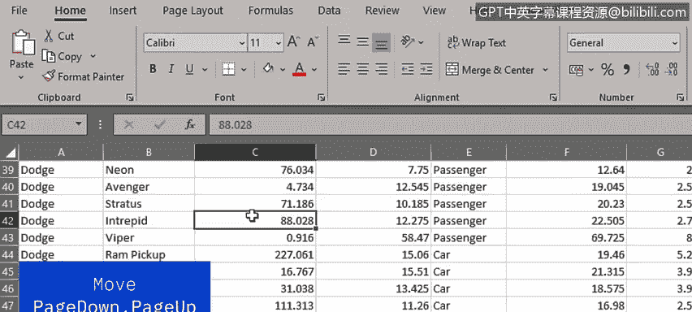
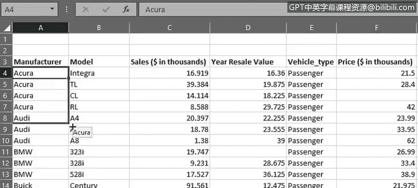

# 004：电子表格基础（第二部分）📊

在本节课中，我们将学习如何在Excel工作表中进行导航、熟悉功能区与菜单，并掌握选择数据的基本方法。这些是高效使用Excel进行数据分析的重要基础。

---

现在我们已经对工作表的基本构成元素有了初步了解，接下来看看如何在电子表格中移动、熟悉功能区与菜单，并学习如何在工作表中选择数据。

要打开示例文件，我们点击“文件”选项卡。这会打开后台视图，在这里你可以创建新工作簿，或打开、保存、打印工作簿。你也可以访问Excel选项。现在我们要打开示例文件，因此点击“打开”，然后从“最近使用的文件”列表中选择，或点击“浏览”找到所需的数据文件。

我们首先应该熟悉功能区与菜单。请注意，顶部的功能区包含多个选项卡。其中一些选项卡（如“开始”、“插入”、“视图”）你可能在其他Office产品中见过，而另一些（如“公式”、“数据”、“Power Pivot”）可能是新接触的。

为了给自己腾出更多工作空间，我们可以通过双击任意选项卡来隐藏功能区；要取消隐藏，再次双击即可。另一个选项是使用快捷键 **`Ctrl + F1`**。

功能区按按钮组进行组织，以便于查找。例如，在“开始”选项卡上，我们有“字体”、“对齐方式”、“数字”、“样式”等组。有些组（如“样式”和“单元格”）在全屏视图下包含了功能区上所有可用的按钮，但其他功能区组有更多选项，我们可以通过点击组右下角的小箭头图标来访问。例如，在“数字”组中就可以看到这个箭头。

接下来要指出的是屏幕顶部、功能区上方的“快速访问工具栏”。顾名思义，这里可以快速访问你最常使用的工具。可以看到工具栏中已有一些工具，如“保存”、“撤销”、“恢复”、“新建”和“打开”，但我们也可以根据需要添加其他工具。点击工具栏的下拉箭头，然后选择一个常用的工具（例如“升序排序”），它就会被添加进来。我们还可以添加“降序排序”按钮。

现在我们需要熟练地在工作表中移动。你可以简单地使用方向键一次向左、右、上、下移动一个单元格，但也可以使用 **`Page Down`** 和 **`Page Up`** 键更快地移动，这在数据行数很多时尤其有用。要在大数据表中更快地上下移动，可以使用垂直滚动条。

要左右移动，则使用水平滚动条。同样，在处理大型数据集时，这些滚动条非常有用。

还有一些有用的快捷键可以使用。例如：
*   **`Ctrl + Home`**：返回工作表的起始位置，即单元格 **`A1`**。
*   **`Ctrl + End`**：跳转到工作表中数据的末尾单元格。
*   **`Ctrl + ↓`**：跳转到当前列的末尾。
*   **`Ctrl + ↑`**：跳转回该列的顶部。

因此，快速找出工作表中数据行数的方法是：定位到数据的第一个单元格，然后按 **`Ctrl + ↓`** 查看最后一行数据。这里可以看到我们有160行数据。现在，如何返回顶部？按 **`Ctrl + Home`** 即可。

到目前为止，我们已经了解了如何在工作表及其数据中导航。现在我们需要看看如何选择数据。这非常重要，因为你经常需要选择数据来移动、复制它，或在公式中引用它。

最简单的选择是单个单元格，通常用鼠标或方向键完成。

下一步是选择多个相邻的单元格。这可以通过鼠标从一个单元格拖动到其他相邻单元格来实现，或者使用 **`Shift`** 键配合方向键来完成。

接下来是选择单列或单行，只需点击列顶部的字母或行左侧的数字即可。

然后，我们可以通过点击鼠标左键并按住拖动来选择多列或多行。如果你不习惯拖动，也可以先选择第一列，然后按住 **`Shift`** 键并按方向键来选择多列，对行的操作同理。

然而，如果你的数据位于不连续（即不相邻）的行或列中，可以先选择第一列，然后使用 **`Ctrl`** 键选择另一个不相连的列，例如这里的C列和F列。

你可能需要选择的最大范围是整个工作表，可以通过点击单元格区域的左上角来实现。但这会选中整个工作表，包括所有空行和空列。因此，如果你只想选择工作表中的数据区域，可以使用快捷键 **`Ctrl + A`**。

关于在单元格、行和列中选择数据的一个注意事项：在处理选中的单元格时，你可能会看到三种类型的十字形符号。

第一种是选择单元格时看到的大白色十字形，如单元格A4所示。这是我们本视频中一直在使用的“选择”十字形。

第二种是当你将鼠标悬停在单元格底部边缘时看到的、带有箭头的细黑色十字形符号。这是“移动”符号，用于将单元格数据移动到另一个位置。

最后一种是当你将鼠标悬停在单元格右下角时看到的细小黑色十字形。这是“填充柄”或“复制”符号，用于将单元格数据填充或复制到另一个位置。

---

在本节课中，我们一起学习了如何在电子表格中移动、熟悉了功能区与菜单，并掌握了在工作表中选择数据的方法。在接下来的视频中，我们将讨论如何输入数据、如何复制和粘贴数据，以及如何在电子表格中格式化数据。

