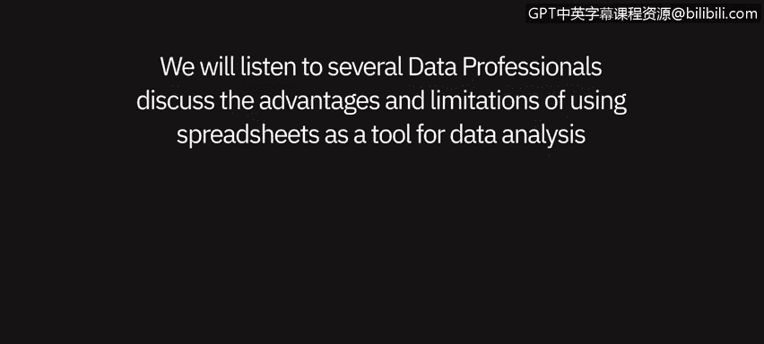
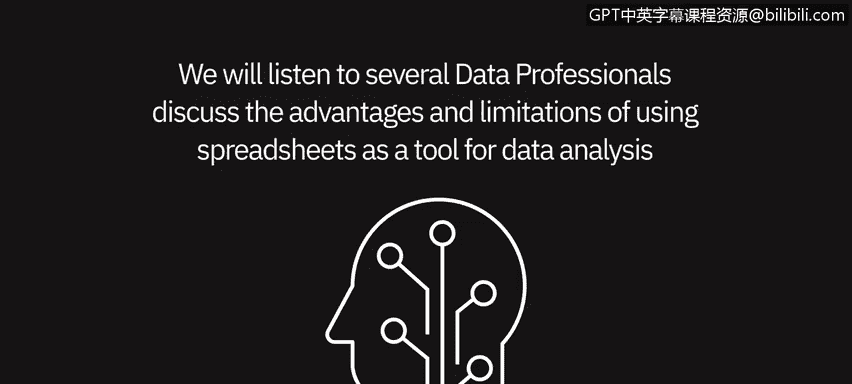
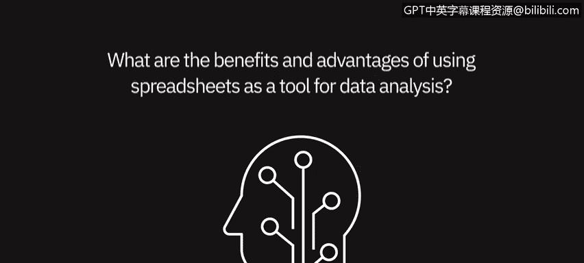
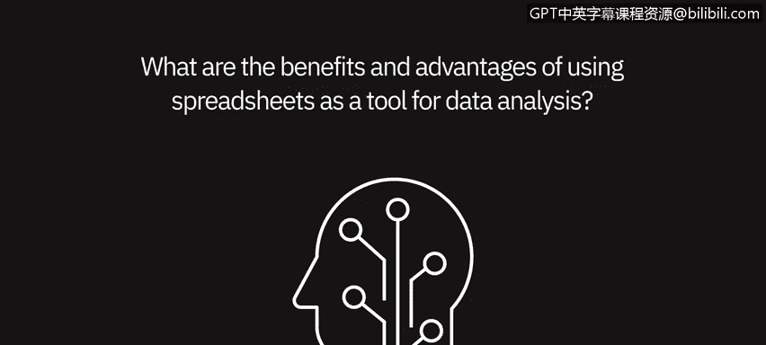
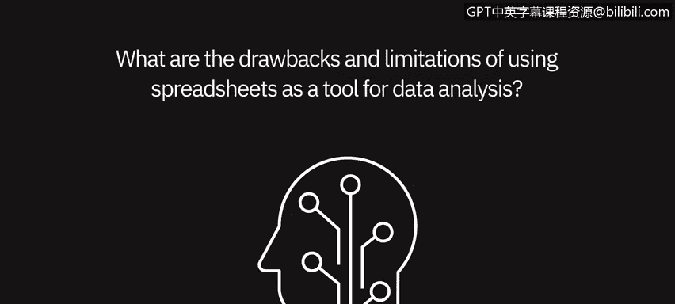

# 005：作为数据分析工具的电子表格 📊

在本节课中，我们将聆听几位数据专业人士的分享，共同探讨使用电子表格作为数据分析工具的**优势**与**局限性**。

---

## 概述

电子表格（如 Microsoft Excel）是数据分析领域最基础、最广泛使用的工具之一。它界面直观，功能强大，适合处理多种数据分析任务。本节我们将系统了解其核心价值与适用边界，帮助你更有效地在工作中运用它。

上一节我们介绍了数据分析的基本流程，本节中我们来看看电子表格在这一流程中扮演的具体角色。

---

## 电子表格的优势 ✅

多位专业人士肯定了电子表格在数据分析中的重要作用。其核心优势在于直观性、易用性和功能的全面性。

以下是使用电子表格进行数据分析的主要优点：

*   **数据呈现直观清晰**：所有数据都能以表格形式整齐地展现在眼前，数据的格式和内容一目了然，便于进行视觉检查。
*   **功能集成全面**：电子表格是一个“一站式”工具。日常使用的**数据透视表**、**图表**以及各种**公式函数**（如 `INDEX-MATCH`、`SUMIF`）都能在其中完成。例如，使用 `=INDEX(C2:C100, MATCH("目标", A2:A100, 0))` 可以快速从大量数据中精确查找信息。
*   **处理中小型数据高效**：对于数据量在零到两万行左右的数据集，电子表格是理想的选择。通过排序、筛选和创建数据透视表，可以将看似难以管理的大量数据变得清晰可控。
*   **普及度高，无需额外工具**：电子表格就像通用的沟通语言，无需安装其他复杂软件，即可完成分析、计算乃至报告生成的工作，极大提升了协作效率。

---

## 电子表格的局限性 ⚠️

尽管优势显著，但电子表格并非万能。在处理复杂或大规模数据时，它会暴露出一些固有的缺点。

上一节我们了解了电子表格的强大之处，本节中我们来看看它面临的挑战。

以下是使用电子表格进行数据分析时需要注意的局限性：

*   **可复现性差**：在表格中进行数据清洗（如过滤错误值、填补缺失值）时，操作步骤难以被精确记录和复现。这给团队协作或个人日后追溯分析过程带来了困难。
*   **容易陷入“分析瘫痪”**：由于功能选项过于繁多，如果不熟悉特定函数，可能会花费大量时间寻找解决方案，反而降低了效率，有时手动处理可能更快。
*   **公式稳定性问题**：复杂的公式组合（如多层嵌套的 `VLOOKUP`、`IF` 语句）有时会意外失效，需要重新构建，影响分析工作的稳定性。
*   **处理大数据集能力有限**：当数据行数超过十万至百万级别时，电子表格的运行会变得缓慢甚至崩溃，这时就需要转向数据库（如 Access）或其他专业工具。
*   **复杂分析与展示灵活性不足**：对于非常复杂的统计分析或需要高度定制化的交互式数据展示，电子表格的功能显得捉襟见肘。

---

## 总结

本节课中，我们一起学习了电子表格作为数据分析工具的**两面性**。

它的**优势**在于直观的界面、强大的内置功能以及对中小型数据集的便捷处理能力，是数据分析入门的绝佳工具。然而，其**局限性**也体现在较差的流程可复现性、处理大规模数据时的性能瓶颈以及复杂分析能力的不足上。

因此，作为一名数据分析师，关键在于根据具体的**数据规模**和**分析复杂度**，明智地选择使用电子表格，或是在适当的时候转向更专业的工具。掌握电子表格是基础，了解其边界则能让你走得更远。