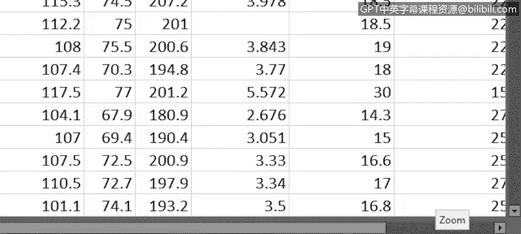
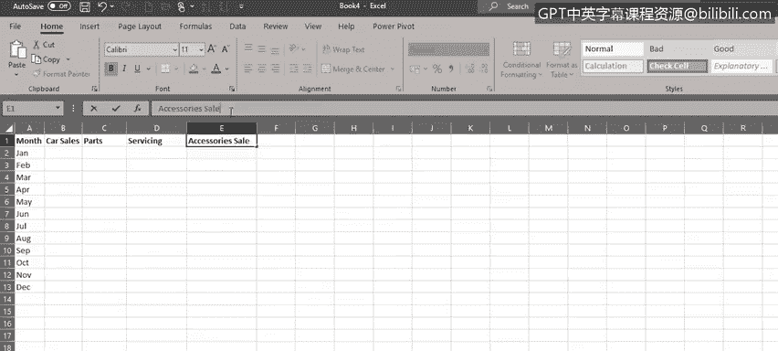

# 006：查看、输入与编辑数据

在本节课中，我们将学习如何在Excel中查看、输入和编辑数据。首先，我们会介绍一些实用的视图功能，然后讲解如何在工作表中输入数据，最后探讨如何对已有数据进行编辑。

---

## 🔍 查看数据

上一节我们学习了Excel的基本术语和导航方法，本节中我们来看看如何更有效地查看数据。

当工作表中包含大量数据时，放大查看特定区域会很有帮助。工作表右下角的**缩放滑块**可以实现这一功能。

以下是缩放操作的两种方法：
*   点击加号或减号按钮。
*   拖动滑块选择所需的缩放比例。

此外，在“视图”选项卡的功能区中，也有一些缩放控制选项：
*   **缩放**：可以选择预设的缩放级别或自定义比例。
*   **100%**：将工作表缩放回原始大小。
*   **缩放到选定区域**：可以先选择一个数据区域，然后仅放大该特定区域。

如果你想在放大的同时查看数据的多个区域，可以使用**拆分**按钮。这会将屏幕分割成多个部分，每个部分可以单独滚动。如果只需要两个部分，可以通过双击水平或垂直分割线来移除其中一个。

如果你的列有标题行，并且希望在向下滚动工作表时标题行始终可见，你需要使用**冻结窗格**功能。你可以选择仅冻结首行。如果这不符合需求，例如在本例中，你可以选择要冻结行下方的一行，甚至只是该行中的一个单元格，然后选择“冻结窗格”。对于列，如果你想冻结它们，也可以进行类似操作。你甚至可以同时冻结行和列。这里的技巧是，首先选择一个单元格，该单元格位于你想要冻结行的下一行，并且位于你想要冻结列的右侧一列。在本例中，这个单元格是 `C4`。现在，我们可以上下左右滚动工作表，同时仍然可以看到标题行以及“制造商”和“型号”列。

现在，如果你打开了多个工作簿，请注意我说的是工作簿而不是工作表，那么你可以使用“视图”->“切换窗口”在它们之间切换。更快的方法是使用 `Ctrl + F6` 快捷键。

---

## ✍️ 输入数据

了解了如何查看数据后，接下来我们学习如何向空白工作表中输入数据。

在Excel中打开新工作表最简单的方法是点击快速访问工具栏中的“新建”按钮，或者如果你更喜欢键盘快捷键，可以使用 `Ctrl + N`。

让我们在工作表顶部输入一些标题，这通常被称为**标题行**。请注意，在单元格中输入数据后按 `Enter` 键，下一个活动单元格是正下方的单元格，但这不是我们当前想要的。如果在单元格中输入数据后按 `Tab` 键，则会选择同一行中右侧的单元格作为活动单元格。

现在，我们将输入一些标题，并在每个条目后按 `Tab` 键。

注意，某些单元格中的文本稍长，它要么被下一个单元格部分隐藏，要么与之重叠。如果你想手动调整列宽，可以点击并按住两列之间的分隔线，然后左右拖动。如果你想自动调整，可以双击两列之间的分隔线。由于这些将是我们的列标题，让我们将它们加粗。

现在，让我们在“零件”和“配件”列之间添加一个新列。只需选中这两列中右侧的那一列，然后右键单击并选择“插入”，即可在选定列的左侧插入一个新列。我们将其命名为“维修销售”。

为了同时整理所有列宽，我们选中从A到E的所有列，然后双击任意列之间的分隔线。这将自动减小或增大每列的宽度，以适应该列中的数据。

好的，现在我们有了标题，让我们在A列中输入一些月份数据。如果我们在单元格 `A2` 中输入“Jan”并按 `Enter`，它会将我们带到下方的单元格，这正是我们当前想要的。然后我们可以在单元格 `A3` 中输入“Feb”，依此类推，直到在 `A13` 中输入“Dec”。

---

## ✏️ 编辑数据

输入数据后，有时可能需要修改。假设你需要更改几个标题，有几种方法可以编辑单元格中的现有数据。

以下是编辑单元格数据的几种方法：
*   选中单元格，然后直接开始重新输入。
*   选中单元格，然后按键盘上的 `F2` 键，将光标置于单元格末尾并进行更改。
*   直接在单元格上双击，将光标置于该位置并进行更改。
*   选中单元格，然后在编辑栏中点击以编辑单元格数据。

现在，让我们对“零件”和“配件”列标题进行同样的编辑操作。

---

## 📝 总结

在本节课中，我们一起学习了Excel中的一些视图选项，以及如何在单元格中输入和编辑数据。在下一个视频中，我们将学习如何复制和填充数据，以及如何设置工作表中单元格和数据的格式。

