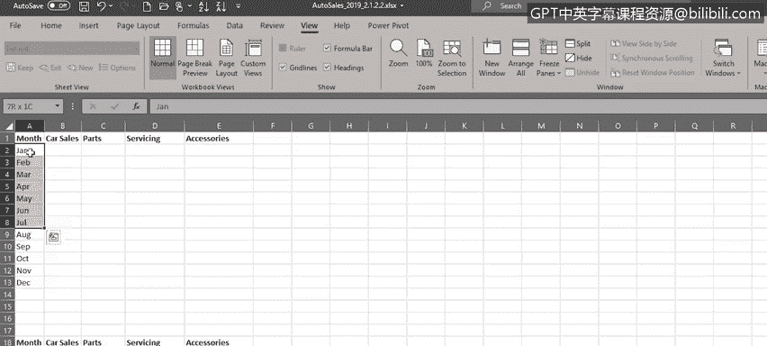
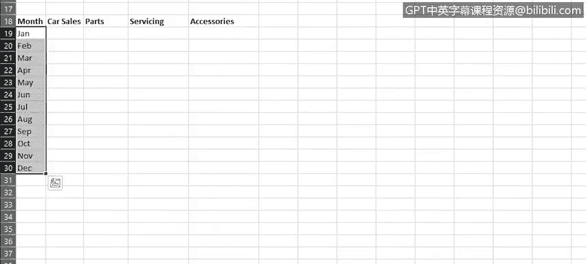
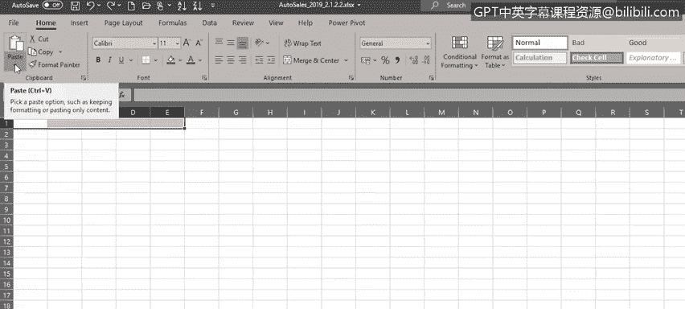
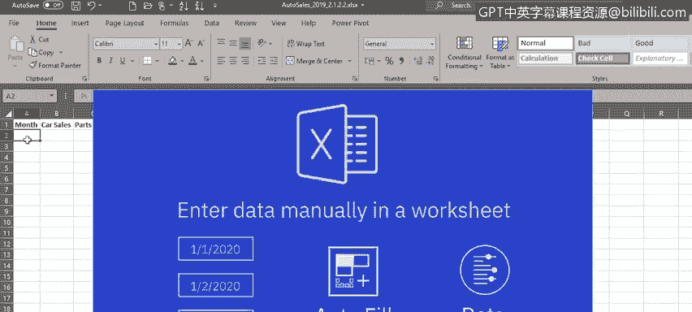
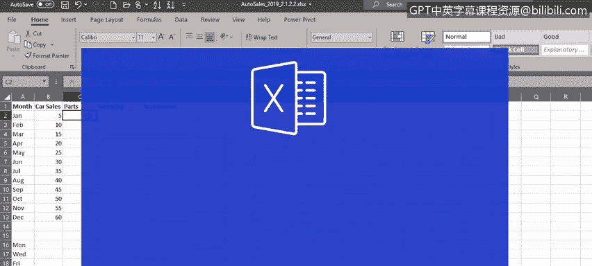

# 007：复制、填充与格式化单元格和数据

在本节课中，我们将学习如何在Excel中移动、复制和填充数据，以及如何格式化单元格和数据以满足分析需求。掌握这些基础操作能显著提升数据处理效率。

---

## 🔄 移动与复制数据

上一节我们介绍了Excel的视图功能与数据编辑。本节中，我们来看看如何移动和复制数据。

移动数据时，首先选中单元格区域（例如标题行A1:E1），将鼠标悬停在选区边缘直至出现移动指针，然后拖动至新位置。

若需复制数据，操作类似，但在拖动时需按住`Ctrl`键，此时会出现复制指针。

如果不习惯拖动操作，也可使用菜单命令或快捷键进行复制粘贴。

以下是具体步骤：

1.  选中A列部分数据并复制到剪贴板。
2.  选择新位置，粘贴已复制的数据。

数据可在不同工作表间移动或复制。例如，新建一个工作表，从`Sheet1`选中数据，使用`Ctrl+C`复制，切换到新工作表后使用`Ctrl+V`粘贴。

但请注意，默认粘贴操作会沿用目标位置的列宽设置。若想保留源数据的列宽，需在粘贴选项中选择“保留源列宽”。

---

## 🧩 使用自动填充功能

手动输入序列数据可能非常耗时。Excel的“自动填充”功能可根据序列或模式自动填充单元格，在处理日期等重复性数据时尤其有用。

例如，在单元格中输入月份（即使是缩写），然后拖动填充柄向下填充，自动填充功能会识别序列并完成填充。

对星期几的操作同理。在单元格中输入“Monday”，拖动填充柄，Excel会按顺序填充星期。

若要创建更复杂的模式，例如每隔一天，则需先输入序列的前两个值（如“Monday”和“Wednesday”），同时选中这两个单元格（A16和A17），再拖动填充柄，Excel将识别出“每隔一天”的模式并完成填充。

**核心概念是：使用自动填充时，务必选中所有能定义模式的单元格，以便Excel准确识别。**

对于数字模式，情况类似。若在单元格中输入“5”并向下填充，由于缺乏模式，Excel只会复制该数值。

但如果在B2和B3中分别输入“5”和“10”，然后选中这两个单元格并向下填充，Excel将识别出“每次递增5”的模式并完成填充。

---

## 🎨 格式化单元格与数据

格式化分为两部分：一是单元格本身的格式（如填充颜色、边框、加粗文本），二是单元格内数据的格式（如文本、数字、货币格式）。

让我们打开之前使用的汽车销售工作表进行实操。

以下是格式化单元格的步骤：

1.  选中标题行（A3:P3），可使用鼠标或快捷键`Ctrl+Shift+右箭头`。
2.  在“开始”选项卡的“样式”下拉菜单中，为单元格选择一种填充颜色，并点击“加粗”。
3.  选中“制造商”列的数据，应用另一种样式颜色并加粗。
4.  选中“型号”列的数据，应用第三种样式颜色，这次可改为“斜体”，并可调整字体大小和样式。
5.  最后，选中所有数据单元格，为其添加边框。

接下来，我们格式化单元格内的数据。

C列和D列的销售数字可格式化为只显示一位小数：选中数据，点击“减少小数位数”按钮。

检查数据时，发现B129和B130单元格本应显示型号（如“9.5”和“9.3”），却被错误识别为日期。这是因为从CSV文件导入时，这两个值被判定为日期而非数字。

**解决方法**：将这两个单元格的格式设置为“文本”，然后重新输入正确的值“9.5”和“9.3”。

最后，将F列（价格，单位为千美元）格式化为货币。选中F列，在数字格式下拉列表中选择“更多数字格式”，然后选择“货币”选项，并指定正确的货币符号和格式。

---

## 📝 课程总结

本节课中，我们一起学习了在Excel中移动、复制和填充数据的多种方法，并掌握了如何对单元格本身及其内部的数据进行格式化，以满足不同的呈现和分析需求。

在下一视频中，我们将开始学习公式基础，了解如何执行简单计算，以及如何选择区域和复制公式。