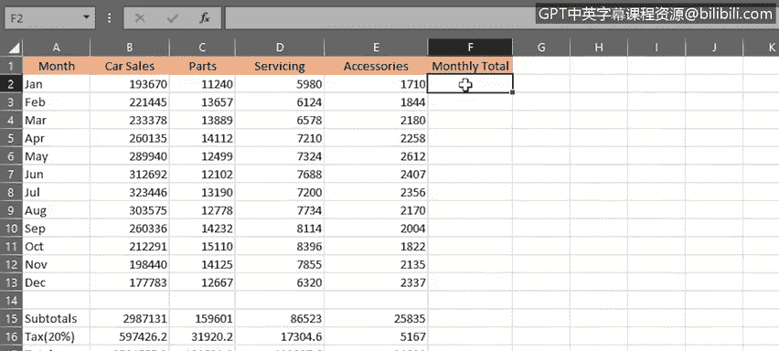
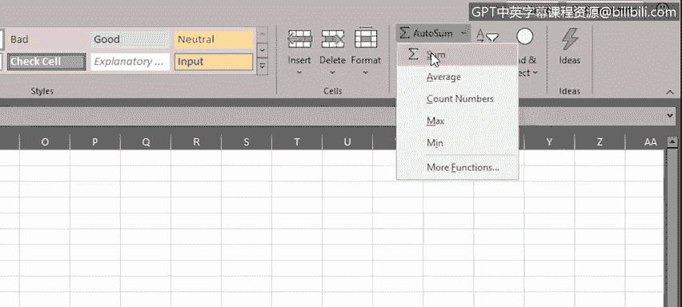
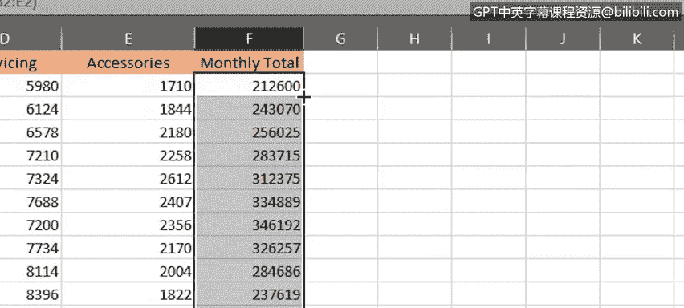

# 008：公式基础

在本节课中，我们将学习Excel公式的基础知识，包括公式的构成、如何进行基本计算、如何在公式中选择单元格范围，以及如何复制公式。掌握这些基础是进行高效数据分析的关键。

## 公式的构成

上一节我们介绍了数据的移动、复制、填充以及单元格和数据的格式化。本节中，我们来看看Excel公式的基本构成。

一个典型的公式由几个关键部分组成。

*   **等号**：以等号开始，告知Excel你正在该单元格中创建公式。
*   **函数**：执行计算的部分。例如，`SUM`函数用于对引用的单元格或单元格区域中的值进行求和。
*   **引用**：要包含在计算中的单元格或单元格区域，需要用括号括起来。
*   **运算符**：指定要执行的计算类型。常见的算术运算符包括：
    *   **加法**：`+`
    *   **减法**：`-`
    *   **乘法**：`*`
    *   **除法**：`/`
*   **常量**：可以直接输入到公式中且不会改变的数字或值，例如整数`5`、百分比`10%`或日期。

一个典型的公式可能如下所示：
`=SUM(B5*20)`
这个公式将取单元格`B5`中的值，然后乘以20。

## 进行基本计算

了解了公式的构成后，我们开始进行一些基本计算。

假设你需要计算一月份和二月份配件的销售额总和。

1.  首先输入等号`=`。
2.  然后输入要使用的函数，例如`SUM`。
3.  接着输入左括号`(`。
4.  选择你的单元格范围，例如`E2:E3`。你可以输入`E2,E3`。
5.  最后输入右括号`)`并按回车键。

如果你想将三月份的销售额也加进去，就需要将单元格范围扩展到包括`E4`，即输入`E2,E3,E4`作为范围。

然而，这种方式非常繁琐且不灵活。因此，有更好的方法：使用冒号`:`来表示连续范围。例如，`E2:E4`表示从`E2`到`E4`的单元格区域。对于整列，可以输入`E2:E13`。

更便捷的方法是使用鼠标选择范围：输入`=SUM(`后，直接用鼠标拖选所需单元格区域，然后按回车，Excel会自动为你补上右括号。

## 复制公式

完成一列的计算后，通常需要将公式应用到其他列。手动重复输入非常耗时，Excel提供了便捷的复制功能。

以下是复制公式的几种方法：

*   **使用填充柄**：选中包含公式的单元格，将鼠标移至单元格右下角的填充柄（小方块），当光标变为黑色十字时，按住鼠标左键拖动到目标单元格区域。这称为“自动填充”。
*   **双击填充柄**：当需要将公式快速填充至一长列数据底部时，双击填充柄，Excel会自动将公式复制到该列所有相邻的单元格中，这是一个节省时间的技巧。

在复制公式时，你会发现公式中的单元格引用会根据新位置自动调整。例如，原本引用`E2:E13`的公式，复制到旁边一列后，会自动变为引用`F2:F13`。这种引用称为“相对引用”。

## 使用自动求和

对于求和这类常见计算，Excel提供了一个更快捷的工具：自动求和。

1.  选中要放置求和结果的单元格。
2.  在“开始”选项卡的“编辑”组中，点击“自动求和”按钮（Σ）。
3.  Excel会自动插入`SUM`函数并推测求和范围。
4.  按回车键确认即可。

“自动求和”按钮旁的下拉箭头还提供了其他常用函数，如平均值、计数、最大值、最小值等。其键盘快捷键是 `Alt` + `=`。

## 总结

本节课中，我们一起学习了Excel公式的基础知识。我们了解了公式的基本构成，包括等号、函数、引用、运算符和常量。我们练习了如何进行简单的计算，并掌握了通过选择范围和利用填充柄、双击填充柄以及自动求和功能来高效复制公式的方法。这些是使用Excel进行数据分析的基石。

在下一视频中，我们将学习数据分析师常用的一些函数，并探索更多高级功能。