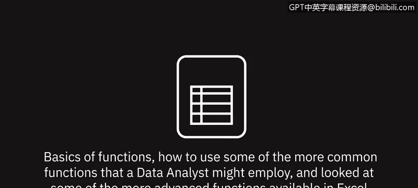
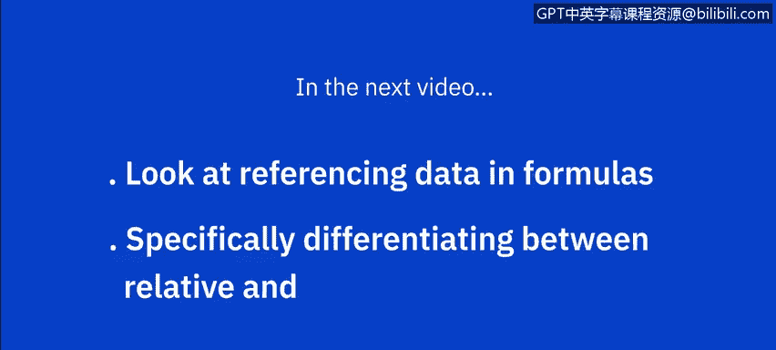

# 009：函数入门

在本节课中，我们将学习Excel函数的基础知识。首先，我们会介绍一些常用的统计函数，然后探索更多数据分析师可能使用的高级函数。通过本课，你将掌握如何利用函数简化计算并提升数据分析效率。

---

## 📈 常用统计函数

上一节我们学习了公式基础、基本计算以及如何选择范围和复制公式。本节中，我们来看看如何使用常见的统计函数。

以下是几种常用的统计函数及其应用示例：

*   **平均值**：计算选定范围内数值的平均值。
    *   公式示例：`=AVERAGE(B2:B13)`
*   **最小值**：返回选定范围内的最低值。
    *   公式示例：`=MIN(B2:B13)`
*   **最大值**：返回选定范围内的最高值。
    *   公式示例：`=MAX(B2:B13)`
*   **计数**：计算选定范围内包含数值的单元格数量。
    *   公式示例：`=COUNT(B2:B13)`
*   **中位数**：返回选定范围内数值的中间值。如果数值个数为奇数，则返回正中间的值；如果为偶数，则返回中间两个值的平均值。
    *   公式示例：`=MEDIAN(B2:B13)`

操作时，可在“开始”选项卡的“编辑”组中使用“自动求和”下拉列表快速选择这些函数，然后根据需要调整单元格范围，并使用填充柄将公式复制到其他列。

---

## 🔍 探索更多函数类别

你已经了解了自动求和和一些常见的统计函数，但Excel还提供了400多个其他函数。现在，让我们探索其中一些类别。

在“公式”选项卡的“函数库”组中，可以找到按类别分组的函数下拉列表：

*   **最近使用的函数**：列表会根据你的使用情况自动更新。
*   **财务函数**：用于财务计算，例如`ACCRINT`（应计利息）和`RATE`（利率）。
*   **逻辑函数**：包含布尔运算符函数，如`AND`、`IF`、`OR`。
*   **文本函数**：用于处理文本，例如`CONCAT`（连接文本，是旧函数`CONCATENATE`的更新版）、`FIND`、`SEARCH`。
*   **日期与时间函数**：例如`NETWORKDAYS`（工作日天数）、`WEEKDAY`、`WEEKNUM`。
*   **查找与引用函数**：例如`AREAS`、`HLOOKUP`、`SORTBY`、`VLOOKUP`。
*   **数学和三角函数**：包含实用的数学函数如`POWER`（乘幂）、`SUMIF`（条件求和）、`SUMPRODUCT`（数组乘积和），以及三角函数如`COS`（余弦）、`SIN`（正弦）、`TAN`（正切）。
*   **其他函数**：提供更多类别，如“统计”、“工程”、“信息”等。

---

## 🔎 如何查找所需函数

如果你在这些列表中难以找到想要的函数，可以通过搜索功能来查找。

点击“公式”选项卡上的“插入函数”按钮，然后可以浏览可用类别列表，或选择“全部”并从字母顺序列表中查找。 Alternatively，你也可以直接输入函数名称并点击“转到”进行搜索，然后从返回的结果中选择所需函数。

---

## 📝 课程总结

本节课中，我们一起学习了函数的基础知识，包括如何使用数据分析师常用的一些函数，并浏览了Excel中可用的更多高级函数类别。

在下一视频中，我们将探讨公式中的数据引用，特别是相对引用与绝对引用的区别，以及公式中的错误处理。