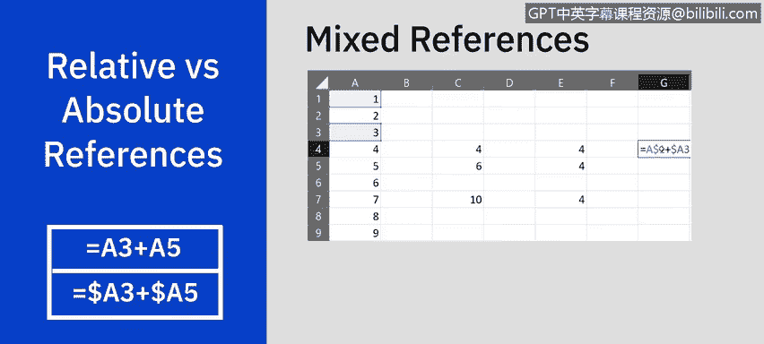
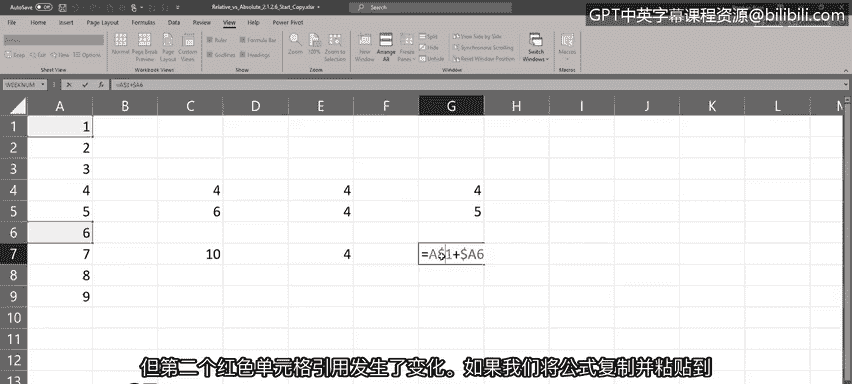
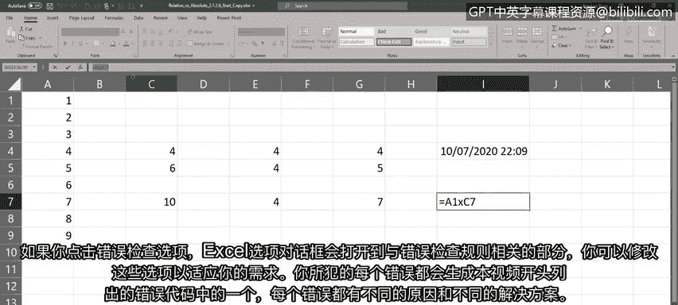
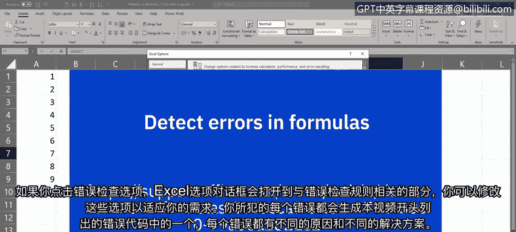

# 010：在公式中引用数据

在本节课中，我们将学习Excel公式中引用数据的核心概念。我们将重点探讨相对引用、绝对引用和混合引用的区别与用法，并了解如何处理Excel中常见的公式错误。掌握这些知识对于高效、准确地构建和复制公式至关重要。

## 🔗 理解引用类型：相对、绝对与混合引用

上一节我们介绍了函数的基本使用，本节中我们来看看如何在公式中引用单元格。理解相对引用和绝对引用的区别是创建公式的关键。默认情况下，Excel中的单元格引用都是相对引用。“相对”一词意味着，当你引用一个单元格时，实际上引用的是该单元格相对于公式所在单元格的位置。

这就是为什么在本课程中，当我们使用复制粘贴或填充柄将公式从一个单元格复制到另一个单元格时，无需修改单元格引用，因为Excel默认你使用的是相对引用。当公式被复制时，单元格引用会自动更改为匹配目标单元格的相对位置。

既然我们已经知道相对引用是Excel的默认设置，那么如何让单元格引用在复制时不发生改变呢？为此，你需要使用绝对引用。与相对引用相反，绝对引用在复制包含此类引用的公式时，引用的单元格保持不变。

最后，在某些情况下，你可能希望单元格引用标识符的一部分是绝对的，而另一部分是相对的。例如，你可能希望行标识符是绝对的，而列标识符是相对的，反之亦然。这被称为混合引用。一个例子是公式 `=$A1 + A$3`，其中 `$A1` 具有相对列和绝对行，而 `A$3` 具有绝对列和相对行。

与相对和绝对引用不同，当你复制包含混合单元格引用的公式时，任何相对单元格引用都会改变，而任何绝对单元格引用在复制的公式中保持不变。

## 📝 引用类型使用示例

以下是三种引用类型的具体使用示例。

### 相对引用示例
首先，让我们看一个在公式中使用相对引用的例子。例如，如果我们在单元格E4中输入公式 `=A1 + A3`。请注意A1和A3单元格被高亮显示，这表示公式中相对引用的单元格。

如果我们使用填充柄将公式复制到正下方的单元格，可以看到结果发生了变化。查看复制的公式，你会发现蓝色和红色的单元格引用已经相对于工作表上的位置发生了改变。公式在复制后变为 `=A2 + A4`，即每个单元格引用都向下移动了一个单元格。

如果我们将公式复制粘贴到C7，结果同样会改变。复制的公式中，蓝色和红色的单元格引用也再次发生了变化。

### 绝对引用示例
现在，让我们看一个如何在公式中使用绝对引用的例子。要使单元格引用变为绝对引用，只需在公式中的列和/或行标识符前加上美元符号 `$`。

例如，如果我们在单元格E4中输入公式 `=$A$1 + $A$3`。当我们使用填充柄复制公式时，可以看到这次结果保持不变。查看复制的公式，蓝色和红色的单元格引用没有改变，公式仍然是 `=$A$1 + $A$3`。

同样，如果我们将公式复制粘贴到E7，结果也保持不变，单元格引用同样没有变化。

### 混合引用示例
最后，我们来看一个如何在公式中使用混合引用的例子。如果我们在单元格G4中输入公式 `=A$1 + $A3`。

如果我们使用填充柄将公式复制到下方的单元格，可以看到结果发生了变化，但这次的结果与之前的例子不同。查看复制的公式，第一个蓝色的单元格引用保持不变，但第二个红色的单元格引用发生了变化。

如果我们将公式复制粘贴到G7，同样的事情会发生，结果改变。在复制的公式中，第一个蓝色的单元格引用保持不变，而只有红色的单元格引用发生了变化。

## ⚠️ 处理Excel公式错误

由于编写公式的复杂性，尤其是更复杂的公式，难免会出现语法或数据选择上的错误，从而导致公式错误。错误通常通过在应显示结果的单元格中显示错误代码来标识。

当你看到单元格中出现多个井号 `#` 时，这并不算真正的错误。它只是意味着列宽不足以显示整个单词或值，或者包含了负的日期或时间值。例如，输入 `Ctrl+;`，然后空格，再输入 `Ctrl+Shift+;`，会输入当前日期和时间。但如果单元格太窄，就会显示多个井号。调整列宽后，就能看到单元格内容了。

然而，如果我们在单元格I7中输入公式 `=5 x 5`，按下回车后，会看到 `#NAME?` 错误。这个错误是因为试图使用 `x` 作为乘法运算符，而实际上应该是星号 `*`。请注意单元格左上角的小绿色三角形。当你选中该单元格时，会出现一个感叹号，提示你错误的原因。在这种情况下，它显示“公式包含无法识别的文本”。

点击感叹号旁边的下拉错误按钮，你会看到几个选项。第一行也提供了关于错误性质的线索，这里显示“无效名称错误”，所以可能是输入了错误的单元格引用、值或函数名。

以下是处理错误的选项：
*   **关于此错误的帮助**：点击此选项会打开一个帮助窗格，提供与此错误相关的具体信息。
*   **显示计算步骤**：点击此选项会打开一个对话框，显示当前语法并标出错误，你可以尝试评估错误。
*   **忽略错误**：如果你确定错误提示不正确，可以选择忽略错误。
*   **在编辑栏中编辑**：如果你想编辑公式，点击此选项，光标将聚焦在编辑栏中，以便你尝试更正公式错误。
*   **错误检查选项**：点击此选项会打开Excel选项对话框，定位到与错误检查规则相关的部分，你可以修改这些选项以满足需求。

你犯的每个导致本节开头所列错误代码的错误，都有不同的原因和解决方案。如需了解更多关于这些错误及其典型解决方案的信息，请访问提供的链接。

## 📚 课程总结

本节课中，我们一起学习了在公式中引用数据。我们重点区分了相对引用、绝对引用和混合引用，并掌握了它们的使用方法。此外，我们还了解了Excel中常见的公式错误及其处理方法。掌握这些引用技巧是构建灵活、准确电子表格的基础，对于数据分析工作至关重要。